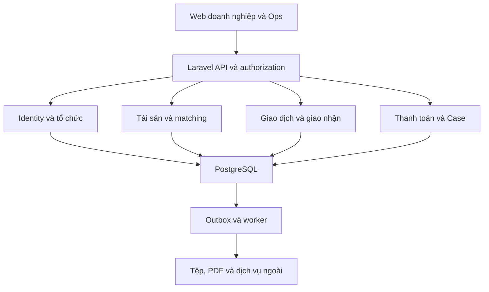

# ECont — Kế hoạch lập trình website

> Phiên bản 1.0 · Ngày 16/09/2026 · Trạng thái: kế hoạch triển khai đề xuất, chưa phải báo cáo phần mềm đã hoàn thành.

## 1. Mục đích và tài liệu chuẩn

Tài liệu này chuyển **ECont_SRS_v1_0.pdf**, 67 trang, thành kế hoạch xây dựng website có thể chia backlog, lập trình và nghiệm thu. Quy tắc làm việc của agent nằm tại [agent.md](agent.md).

Nguồn nghiệp vụ là SRS phiên bản 1.0, mã `ECONT-SRS-001`. SRS có 67 yêu cầu chức năng, 24 quy tắc BR, 16 yêu cầu NFR, 12 use case, 28 kịch bản nghiệm thu AC và 9 nhóm màn hình UI. Trong đó **63 FR là P0**, bốn FR là P1: `FR-AST06`, `FR-OFR06`, `FR-REQ05`, `FR-CAR04`.

`ECont - Flow(2).docx` là nguồn lịch sử. Khi khác với SRS đã chuẩn hóa, không lấy công thức hoặc luồng cũ để thay ngược SRS.

### Thứ tự áp dụng trong dự án

1. Quyết định mới được chủ dự án xác nhận và ghi nhận rõ phạm vi.
2. SRS cùng các thay đổi nghiệp vụ được chấp thuận.
3. ADR ghi quyết định kỹ thuật và tài liệu API/schema của phiên bản đang triển khai.
4. `plan.md` và `agent.md`, trong phạm vi không mâu thuẫn các nguồn trên.

Chưa có repository hoặc môi trường triển khai được cung cấp. Các đường dẫn, lệnh và cấu trúc bên dưới là **hợp đồng cần tạo khi khởi tạo dự án**, không có nghĩa những thành phần đó đã tồn tại. Không triển khai hay thu phí thật chỉ từ kế hoạch này.

## 2. Kết quả sản phẩm cần bàn giao

Website phải cung cấp ba không gian dùng chung backend:

| Không gian | Người sử dụng | Kết quả cần đạt |
| --- | --- | --- |
| Doanh nghiệp | Quản trị DN, nhân viên, đại diện A/B | Quản lý nguồn cung, nhu cầu, giao dịch, chứng từ, phí, chat và hỗ trợ |
| Vận hành | Ops, quản trị nền tảng | Xác minh DN, review Offer/Request, ghi nhận approval, xử lý Case và cấu hình |
| Tài chính | Người đối soát và người duyệt theo quyền | Theo dõi khoản thu, chênh lệch, thu hộ, hoàn tiền và xuất báo cáo |

Luồng thành công phải chạy xuyên suốt:

`Xác minh DN → Offer/Request được duyệt → matching → B giữ chỗ → A/B chấp nhận cùng thỏa thuận → hãng tàu duyệt qua Ops → đủ nghĩa vụ tiền → phát phiếu điều phối → kiểm tra thực tế → A/B xác nhận cùng biên bản → COMPLETED`.

Phải đồng thời chạy được luồng từ chối, hết hạn, thiếu tiền, tiền đến muộn, sai container, sửa phiên bản, hủy, hoàn phí và khiếu nại. Một bản demo chỉ có màn hình và dữ liệu giả không đáp ứng P0.

### 2.1 Giới hạn MVP

- Container khô `20GP`, `40HC`; alias `40HQ` chuẩn hóa thành `40HC`. Không đổi `40GP` thành `40HC`.
- Một Offer tương ứng một container; một Request cần một container.
- Hãng tàu làm việc bên ngoài ứng dụng; Ops nhập bằng chứng và quyết định. Không cần tài khoản carrier trong MVP.
- Vị trí nhập tay; ảnh được Ops kiểm tra thủ công; có thiết kế adapter cho P1.
- B tự thuê xe và chịu cước A→B. ECont không điều hành đội xe, không mua bán container, không cung cấp ví/escrow.
- Tài chính đối soát chuyển khoản là kênh P0 khả dụng khi chưa chọn cổng thanh toán. Handler webhook vẫn phải có contract và kiểm thử bằng sandbox; không tuyên bố đã kết nối ngân hàng thật.
- Không coi biên bản nội bộ là e-DO, EIR của depot, hóa đơn thuế hoặc chứng nhận an toàn.

### 2.2 Phân biệt môi trường

| Môi trường | Được phép | Điều kiện |
| --- | --- | --- |
| Local/test | OTP giả lập, routing fixture, payment sandbox, carrier giả lập | Hiển thị nhãn demo; dữ liệu biệt lập; adapter không phát sinh tiền thật |
| Staging | Kiểm thử tích hợp được cấp quyền, dữ liệu tổng hợp | Secret riêng, email/SMS sandbox, không nhận chứng từ thật không cần thiết |
| Production/pilot | Dịch vụ và carrier được xác nhận, dữ liệu vận hành hợp lệ | Chốt các câu hỏi SRS Q01–Q10; cấu hình thật; mock bị vô hiệu hóa |

Thiếu credential không chặn phát triển bằng adapter giả lập. Nhưng không được mở carrier, đánh dấu tiền đã nhận, gửi OTP thật hoặc công bố tuyến/giá là đã xác minh nếu chưa có nguồn tương ứng.

## 3. Kiến trúc và công nghệ đề xuất

### 3.1 Quyết định mặc định

| Thành phần | Lựa chọn | Lý do và giới hạn |
| --- | --- | --- |
| Frontend | React, TypeScript, Vite | SPA cho nghiệp vụ; không cần thêm tầng SSR cho dashboard nội bộ |
| UI | Tailwind CSS, bộ component truy cập được | Dùng một design system; tự kiểm tra bàn phím, form và trạng thái |
| Form và server state | React Hook Form, Zod; TanStack Query | Tách validation phục vụ UX khỏi validation có thẩm quyền ở server |
| Backend | Laravel 13, PHP 8.4 | REST API, authorization policies, validation, transactions, queue và scheduler |
| Database | PostgreSQL 18 | CSDL giao dịch chính; khóa hàng, unique index và ràng buộc FK |
| Session/auth | Laravel Sanctum SPA session; module xác thực hỗ trợ MFA | Cookie phiên; không lưu bearer token dài hạn trong localStorage |
| Queue/cache | Redis, Laravel queue | Tác vụ nền và cache; không dùng Redis làm nguồn duy nhất quyết định giữ container |
| Realtime | Laravel broadcasting/Reverb hoặc adapter tương đương | Private channels; kiểm tra membership và người tham gia, không chỉ channel name |
| Tệp | S3-compatible private object storage | File bất biến theo version; quét tệp trước khi dùng; local dùng dịch vụ tương thích |
| PDF | Template HTML và renderer server được kiểm thử | Font Việt nhúng, phân biệt nháp/phiếu/biên bản hoàn tất, lưu hash và version |
| Kiểm thử | PHPUnit; Vitest; Playwright | Một framework PHP thống nhất; integration dùng PostgreSQL thật |
| Chạy local | Docker Compose, reverse proxy | Cùng dịch vụ DB/queue/storage giữa các thành viên; seed demo có kiểm soát |
| CI | Pipeline của repository | Lint, typecheck, tests, build, migration check, dependency/secret checks |

Laravel 13 hỗ trợ PHP 8.3–8.5 theo tài liệu chính thức; PHP 8.4 là baseline của kế hoạch. Major frontend và Node LTS phải được kiểm tra tương thích ở G0, ghi trong ADR và khóa bằng lockfile. Không dùng tag `latest` cho build phát hành. Tham chiếu kỹ thuật ở mục 18.

Đây là lựa chọn cho dự án mới. Nếu đã có repository với stack ổn định và đáp ứng SRS, đánh giá trước khi đổi; không rewrite chỉ vì khác bảng trên.

### 3.2 Kiến trúc module



Backend là **modular monolith**: một ứng dụng triển khai được, ranh giới module rõ. Không tách microservices, Kafka hoặc nhiều cơ sở dữ liệu trước khi có nhu cầu đo được.

| Module | Sở hữu nghiệp vụ |
| --- | --- |
| Identity | User, Company, Membership, verification, consent, MFA, authorization |
| Catalog | Carrier, size/type, depot, địa bàn, cấu hình có phiên bản |
| Assets | ContainerAsset, location history, custody, hạn và nguồn chứng từ |
| Listings | Offer, Request, Booking, review và khả dụng |
| Matching | Eligibility, route snapshot, score, quote, Trust projections |
| Transactions | Reservation, allocation, agreement, state transitions, deadlines |
| CarrierApprovals | Hồ sơ gửi ngoài, decision, scope, expiry/revocation |
| Finance | PaymentOrder, payment events, allocations, suspense, refunds |
| Handover | DispatchPermit, inspection, handover versions và confirmations |
| Support | Case, resolution, đánh giá, moderation |
| Communications | Conversation, message, inbox, email/SMS và realtime |
| Platform | Evidence, audit, outbox/inbox, reporting và job operations |

Controller chỉ chuyển request thành command/query. Use case application quản lý transaction boundary; policy kiểm tra quyền; domain service tính quy tắc; infrastructure adapter gọi nhà cung cấp. Không đặt công thức tiền hoặc chuyển trạng thái trong React/controller/job rải rác.

## 4. Cấu trúc repository cần tạo

| Đường dẫn | Nội dung |
| --- | --- |
| `plan.md`, `agent.md` | Kế hoạch và quy tắc làm việc, đặt ở root |
| `docs/requirements/ECont_SRS_v1_0.pdf` | Bản SRS được đưa vào repository nếu chính sách lưu trữ cho phép |
| `docs/requirements/traceability.csv` | FR → use case → API/UI → test → trạng thái |
| `docs/adr/` | ADR đánh số: stack, auth, tenancy, khóa dữ liệu, snapshot, tiền, tệp |
| `docs/api/openapi.yaml` | Contract của API hiện có, không ghi endpoint dự kiến là đã chạy |
| `docs/runbooks/` | Khởi động, backup/restore, job lỗi, tiền về muộn, revoke permit |
| `docs/qa/` | Test plan, fixtures, AC evidence và báo cáo performance |
| `apps/api/app/Modules/` | Các module Laravel; không thêm tầng abstraction nếu không có lợi ích |
| `apps/api/database/migrations/` | Migration có FK, indexes, checks và kế hoạch nâng cấp |
| `apps/api/tests/` | Unit, feature, integration, concurrency, contract tests |
| `apps/web/src/features/` | Frontend theo domain; routes/components/api/hooks/schemas trong từng feature |
| `apps/web/src/shared/` | UI primitives, API client, formats, error handling, auth context |
| `apps/web/tests/` | Component và accessibility tests cần thiết |
| `tests/e2e/`, `tests/performance/` | Playwright, dữ liệu và kịch bản tải |
| `infra/compose/`, `infra/proxy/` | Compose và cấu hình reverse proxy |
| `scripts/`, `Makefile` | Bootstrap, checks, seed demo và vận hành local |

Mỗi module cần README ngắn về quyền sở hữu dữ liệu và entrypoints khi ranh giới không rõ. Không sinh hàng loạt lớp rỗng chỉ để đủ thư mục.

## 5. Thiết kế dữ liệu và các bất biến

### 5.1 Nhóm bảng tối thiểu

| Nhóm | Bảng/thực thể cần thiết |
| --- | --- |
| Danh tính | `users`, `companies`, `memberships`, `company_verifications`, `consent_records`, `delegations` |
| Danh mục | `carriers`, `container_types`, `depots`, `service_areas`, `configuration_versions` |
| Nguồn cung | `container_assets`, `asset_locations`, `custody_events`, `offers`, `offer_reviews` |
| Nhu cầu | `bookings`, `booking_lines`, `container_requests`, `request_reviews` |
| Ghép nối | `route_snapshots`, `match_snapshots`, `quotes`, `quote_lines` |
| Cam kết | `reservations`, `transactions`, `agreement_versions`, `agreement_acceptances` |
| Carrier | `carrier_submissions`, `carrier_approvals`, `approval_evidence_links` |
| Tiền | `payment_orders`, `payment_events`, `payment_allocations`, `suspense_entries`, `refund_orders`, `refund_attempts`, `adjustments` |
| Giao nhận | `dispatch_permits`, `inspections`, `handover_records`, `handover_confirmations` |
| Hỗ trợ | `cases`, `case_resolutions`, `case_evidence_links`, `ratings`, `trust_snapshots` |
| Hạ tầng | `evidence_files`, `audit_events`, `outbox_events`, `inbox_events`, `idempotency_records`, `notifications`, `conversations`, `messages` |

Tên bảng là đề xuất; tên nghiệp vụ và semantics phải theo SRS. Tránh đặt bảng SQL là từ khóa `case`. Các dữ liệu nhỏ không nhất thiết tách bảng nếu JSON schema có version đáp ứng truy xuất và validation.

### 5.2 Ràng buộc phải thực thi ở CSDL

- `container_number` chuẩn hóa và unique toàn nền tảng. Trùng mã không cho người dùng thường biết chủ thể khác đang quản lý.
- Một Offer mở trên Asset. Định nghĩa tập trạng thái mở gồm `DRAFT`, `UNDER_REVIEW`, `CHANGES_REQUIRED`, `AVAILABLE`, `HELD`, `ALLOCATED`; trạng thái kết thúc không thuộc tập này. Đây là cụ thể hóa kỹ thuật cần ghi ADR.
- Một reservation/allocation hoạt động trên Asset và trên Request; dùng trạng thái reservation `HELD`, `ALLOCATED`, `RELEASED` tách khỏi trạng thái Transaction.
- Unique `(user_id, company_id)` cho Membership; A/B trong transaction phải khác company.
- Unique `(agreement_version_id, company_id)` và `(handover_record_id, company_id)`; policy xác minh đúng bên giao dịch, không chỉ dựa vào unique.
- Unique `(provider, provider_event_id)` cho callback; không mặc định các provider có cùng namespace ID.
- Unique `(consumer_name, event_id)` cho inbox; unique khóa phát hành phiếu/PDF theo loại tài liệu và version.
- Check số tiền nguyên không âm ở thu/hoàn; **saving được phép âm**. `share_alpha` nằm trong `[0,1]`.
- FK cho mọi liên kết nghiệp vụ; không cascade-delete payment, approval, agreement, audit hoặc hồ sơ đã giao nhận.

Ví dụ migration SQL cho ràng buộc giữ chỗ; phải chạy trong integration test trước dùng:

```sql
CREATE UNIQUE INDEX reservations_one_active_asset
ON reservations (asset_id)
WHERE allocation_state IN ('HELD', 'ALLOCATED');

CREATE UNIQUE INDEX reservations_one_active_request
ON reservations (request_id)
WHERE allocation_state IN ('HELD', 'ALLOCATED');
```

Không dùng `expires_at > now()` trong predicate index. Thời gian hết hạn không tự đổi tập dữ liệu của index; worker/use case phải chuyển `allocation_state` rõ ràng. Partial unique index và khóa hàng là cơ chế PostgreSQL phù hợp cho thiết kế này; xem [PostgreSQL Partial Indexes](https://www.postgresql.org/docs/current/indexes-partial.html) và [Explicit Locking](https://www.postgresql.org/docs/current/explicit-locking.html).

### 5.3 Transaction boundary khi giữ chỗ

1. Xác thực user, membership, Request thuộc B và B khác A.
2. Nạp idempotency record theo actor, company, endpoint và key; payload khác cùng key trả `IDEMPOTENCY_MISMATCH`.
3. Bắt đầu DB transaction; khóa theo thứ tự được thống nhất: booking line → Request → Asset → Offer → Reservation hiện hành. Các luồng khác dùng cùng thứ tự; retry deadlock có giới hạn.
4. Kiểm tra lại status, review version, windows, vị trí, route snapshot, carrier, capacity booking và quyền của cả hai DN.
5. Nếu có hold đã hết hạn, chỉ giải phóng khi Transaction vẫn cho phép; không giải phóng giao dịch đã phân bổ hoặc đang giao thực tế.
6. Tạo Transaction `NEGOTIATING`, Reservation `HELD`; cập nhật Offer/Request `HELD`; lưu snapshot và deadline.
7. Ghi audit và outbox event trong cùng transaction; commit.
8. Trả kết quả; worker gửi notification sau commit. Unique violation được chuyển thành lỗi nghiệp vụ 409, không trả stack trace.

Không giữ DB lock trong khi gọi maps, SMS, ngân hàng hoặc renderer PDF. Snapshot phải được chuẩn bị trước; dưới lock chỉ kiểm tra nó còn đúng version/TTL. Nếu cần gọi ngoài lại, thoát transaction và thử lại với dữ liệu mới.

**Capacity booking:** một Request chỉ cần một cont nhưng nhiều Request có thể cùng booking. Khóa `booking_line` và kiểm tra tổng đã giữ, phân bổ và hoàn tất không vượt quantity đã xác minh. Giao dịch hoàn tất vẫn chiếm quantity booking; giải phóng reservation không tự hoàn trả capacity đã sử dụng. Không tự đoán quantity khi hồ sơ thiếu.

### 5.4 Phiên bản và snapshot

Các đối tượng sau bất biến sau chấp nhận: quote/line items, agreement, scope approval, bộ bằng chứng handover, policy và formula version áp dụng. Lưu `version`, `content_hash`, `created_by`, `created_at` và quan hệ với bản trước.

- Sửa thỏa thuận trước chấp nhận đủ hai bên: tạo version mới, mất hiệu lực các acceptance cũ.
- Sửa trường thuộc phạm vi approval: ON_HOLD, thu hồi permit, xin lại approval và đối soát chênh lệch nếu đã thu tiền.
- Approval chỉ được dùng khi evidence và scope khớp phiên bản hiện hành theo SRS; không tự suy rằng approval cũ vẫn dùng được.
- Sửa handover trước hoàn tất: tạo version mới và yêu cầu cả hai xác nhận lại.
- Sau COMPLETED: đính chính/Case/adjustment riêng; không sửa ngược sự kiện hoặc xóa chữ ký thao tác cũ.

### 5.5 Tiền, idempotency và hoàn tiền

Lưu VND bằng số nguyên; tỷ lệ bằng decimal/basis points; PHP/SQL không dùng float cho số tiền. API biểu diễn `amount_vnd` bằng chuỗi số nguyên để không mất chính xác ở JavaScript; frontend format từ giá trị chính xác, không tự tái tính tiền phải trả.

Tiền vào cần phân biệt **event nhận được**, **khoản thu được đối soát**, **phân bổ vào nghĩa vụ**, **tiền thừa/chưa rõ**, **yêu cầu hoàn** và **hoàn đã thực hiện**. Ảnh biên lai chỉ là bằng chứng người dùng cung cấp.

Khi đề nghị/duyệt hoàn, khóa khoản thu và số dư có thể hoàn; tính cả khoản hoàn đang chờ xử lý để hai người không giữ cùng một số dư. Gọi provider sau commit với refund reference/idempotency key ổn định. Timeout → tra cứu cùng reference; không lập lệnh hoàn mới. Kết quả thất bại chắc chắn mới được xử lý retry theo chính sách; kết quả chưa rõ phải giữ nghĩa vụ đang chờ.

Số dư có thể hoàn = tiền đã thu hợp lệ − tiền đã hoàn − tiền đang được giữ cho lệnh hoàn chưa có kết quả cuối. Tổng hoàn không vượt khoản đã thu. Adjustment tạo bản ghi mới, không sửa event gốc.

## 6. Trạng thái và các cổng kiểm soát

### 6.1 Transaction

| Từ | Đến | Điều kiện phải kiểm tra lại ở server |
| --- | --- | --- |
| `NEGOTIATING` | `PENDING_CARRIER` | A/B chấp nhận cùng agreement version; reservation còn hiệu lực |
| `PENDING_CARRIER` | `AWAITING_PAYMENT` | Approval đúng scope, evidence và hiệu lực; giá cuối đã được chấp nhận |
| `AWAITING_PAYMENT` | `READY_FOR_PICKUP` | Đủ nghĩa vụ hai bên, không hold, approval hợp lệ, permit đã phát thành công |
| `READY_FOR_PICKUP` | `INSPECTION` | Đúng người nhận được ủy quyền, cont, địa điểm và permit online |
| `INSPECTION` | `HANDOVER_PENDING` | Kết quả inspection được chấp nhận; khóa version biên bản |
| `HANDOVER_PENDING` | `COMPLETED` | Hai công ty xác nhận cùng version/hash; không hold; commit custody và event |

`REJECTED`, `EXPIRED`, `CANCELLED` là trạng thái kết thúc theo nguyên nhân. `ON_HOLD` là cờ riêng, không phải một chuỗi trạng thái thay thế. Hold sau COMPLETED là xử lý Case, không đổi transaction thành CANCELLED.

`Offer`, `Request`, `CarrierApproval`, `PaymentOrder`, `RefundOrder`, `HandoverRecord`, `Case` dùng enum tại SRS mục 4.4. Không tạo enum mới ở frontend để “dễ hiển thị”. API trả `status`, `hold_reason`, `allowed_actions`, `next_action`, `due_at`, `row_version`; nút UI chỉ là hỗ trợ, server vẫn kiểm tra.

### 6.2 Deadline và race condition

- Cấu hình demo theo SRS: thương lượng 30 phút, chờ hãng tàu 4 giờ liên tục, chờ thanh toán 2 giờ, nhắc xác nhận còn thiếu sau 30 phút.
- `due_at = min(TTL deadline, giới hạn khả thi áp dụng)`. Tất cả timestamp lưu UTC và hiển thị `Asia/Ho_Chi_Minh`.
- Chuyển `PENDING_CARRIER` nâng reservation thành `ALLOCATED`; worker hold 30 phút cũ không còn quyền giải phóng.
- Chờ bên thứ hai xác nhận quá hạn chỉ cảnh báo/hỗ trợ; không tự COMPLETED hoặc mở lại container.
- Worker và request người dùng phải lock/check cùng aggregate version; quyết định hết hạn và thanh toán/acceptance đến đồng thời không thể cùng thắng ở hai trạng thái mâu thuẫn.
- Payment đến sau hủy vào suspense và xử lý hoàn, không hồi sinh transaction.
- Trước COMPLETED, nếu không chứng minh được container đã quay về trạng thái an toàn để tái đăng thì tiếp tục giữ phân bổ.

## 7. Matching và giá phải giữ đúng SRS

### 7.1 Hard constraints trước score

Chỉ tính điểm sau khi đạt điều kiện: đúng loại/hãng, Offer AVAILABLE, DN hợp lệ, review còn hiệu lực, chưa phân bổ, tuyến và vị trí đã xác minh, trong Dmax, condition phù hợp và lịch khả thi. Maps lỗi/thiếu không được thay bằng `0 km`; địa chỉ công khai không phải tọa độ thật.

Với ký hiệu ở SRS mục 5.2:

```text
E = max(a0, b0, now + dispatch_lead_time)
Z = min(a1, b1 + p, arrival_by - tAB,
        cut_off - tAB - L - tBC - g,
        document_pickup_deadline)
feasible = E + p <= Z

D = 100 × max(0, 1 - d / Dmax)
T = 100 × min(1, (Z - E - p) / 120 phút)
C = 100 nếu GOOD; 60 nếu MINOR_DAMAGE được chấp nhận
M = 0.30D + 0.40T + 0.30C
```

`Dmax > 0`; chỉ tính T khi feasible. Mốc không áp dụng phải có lý do xác minh, không tự xóa khỏi công thức vì dữ liệu trống. Tie-break: M giảm, d tăng, thời điểm Offer được duyệt tăng, ID tăng. Trust và saving hiển thị riêng, không trộn trọng số.

### 7.2 Giá và tiết kiệm

```text
R_A0 = alpha × F_RU + extras_A
R_B0 = trucking_AB + (1 - alpha) × F_RU + extras_B
G_A = T_A - R_A0
G_B = T_B - R_B0
F_A = 0.25 × max(G_A, 0)
F_B = 0.15 × max(G_B, 0)
S_A = G_A - F_A
S_B = G_B - F_B
```

T_A là cước A→depot trả và phí thực sự tăng thêm; T_B là cước depot cấp→B và phí tăng thêm. Không nhầm hướng tuyến. F_A/F_B đã là phí nền tảng, không cộng một “phí ghép nối” cùng bản chất lần nữa.

Fixture bắt buộc: T_A=3.000.000; T_B=3.400.000; F_RU=1.200.000; alpha=0,5; trucking_AB=800.000; extras=0. Kết quả: A tiết kiệm 1.800.000, B 1.700.000; nếu ECont thu hộ RU thì A nộp 1.200.000 và B nộp 900.000; B trả nhà xe 800.000 bên ngoài.

Mỗi quote line có payer, collector, beneficiary, currency, tax metadata, nguồn, hiệu lực và điều kiện hoàn. Giá demo không kích hoạt thành giá production. Không mặc định VAT 10%; missing không phải zero; saving âm vẫn hiển thị. Alpha và tỷ lệ phí có phiên bản, không hồi tố snapshot đã ký.

### 7.3 Trust

Giữ công thức theo vai A/B tại SRS mục 5.3: A = 35% hoàn thành + 25% chính xác + 25% đúng giờ + 15% rating; B = 35% hoàn thành + 35% đúng giờ + 30% rating. Cửa sổ 180 ngày; tối thiểu 5 giao dịch hoàn tất và đủ dữ liệu tất cả thành phần mới công bố điểm.

Không đủ dữ liệu → `score: null`, nhãn “Chưa đủ dữ liệu”; không gán 0. Chỉ sự cố đã kết luận mới ảnh hưởng score. Rating chỉ công khai khi cả hai gửi hoặc hết 7 ngày; mỗi giao dịch mỗi bên một rating. Job tính lại lưu formula version, input snapshot và lý do.

## 8. API, xác thực và tích hợp

### 8.1 Contract

Prefix chuẩn `/api/v1`. Tất cả mutation nhạy cảm kiểm tra quyền, `expected_version`, idempotency khi phù hợp và trạng thái hiện tại. Error envelope thống nhất:

```json
{
  "error": {
    "code": "VERSION_CONFLICT",
    "message": "Nội dung đã thay đổi. Vui lòng tải phiên bản mới.",
    "field_errors": {},
    "correlation_id": "request-identifier"
  }
}
```

| Nhóm route đề xuất | Hành vi |
| --- | --- |
| `/auth/*`, `/me`, `/companies`, `/memberships` | Session, OTP, reset, MFA, ngữ cảnh doanh nghiệp |
| `/assets`, `/assets/{id}/locations`, `/assets/{id}/custody` | Dữ liệu tài sản và lịch sử theo quyền |
| `/offers`, `/offers/{id}/submit`, `/offers/{id}/reviews` | Nháp, gửi, review; không mass-assign status |
| `/requests`, `/requests/{id}/reviews`, `/requests/{id}/matches` | Nhu cầu, xác minh và kết quả có masking |
| `/reservations` | Hold nguyên tử, 201 hoặc 409; cùng key trả cùng kết quả |
| `/transactions/{id}/agreements/{version}/accept` | Chấp nhận đúng bản, đại diện đúng công ty |
| `/transactions/{id}/carrier-decisions` | Ops nhập evidence và phạm vi |
| `/payment-orders`, `/payment-orders/{id}/reconciliation` | Tạo nghĩa vụ và đối soát theo quyền |
| `/webhooks/payments/{provider}` | Xác thực chữ ký, dedup, lưu nhận bền vững; không tin phiên browser |
| `/refund-orders`, `/refund-orders/{id}/approve` | Đề nghị, duyệt và thực hiện tách biệt |
| `/transactions/{id}/dispatch-permits` | Chỉ phát khi đủ gate; tải/verify riêng |
| `/transactions/{id}/inspections` | Checklist, ảnh, accept hoặc Case |
| `/transactions/{id}/handover/{version}/confirm` | Suy party từ quyền đã xác minh, không tin `party=A` do client gửi |
| `/transactions/{id}/cancellations`, `/transactions/{id}/cases` | Hủy hoặc xử lý nghĩa vụ, không DELETE transaction |
| `/conversations`, `/messages`, `/notifications` | Private realtime và lịch sử |
| `/ops/*`, `/reports/*`, `/files/*` | Queue, cấu hình, báo cáo và tệp có quyền |

Mã lỗi tối thiểu: `OFFER_UNAVAILABLE`, `VERSION_CONFLICT`, `APPROVAL_INVALID`, `PAYMENT_NOT_SETTLED`, `TRANSACTION_ON_HOLD`, `PERMISSION_DENIED`, `IDEMPOTENCY_MISMATCH`. Thêm `BOOKING_CAPACITY_EXCEEDED` như mã kỹ thuật cho ràng buộc quantity đã có trong SRS; ghi contract và test.

### 8.2 Cookie session

Triển khai first-party SPA bằng Sanctum theo [tài liệu SPA authentication](https://laravel.com/docs/13.x/sanctum). Cấu hình stateful middleware, domain/origin, credentials và CSRF đúng môi trường; kiểm tra cả request từ trình duyệt, không chỉ API test.

Production ưu tiên một origin sau reverse proxy: route API/auth/CSRF về Laravel, static SPA về frontend. Local dùng proxy Vite theo cùng contract. Thực hiện bootstrap CSRF trước đăng nhập, rotate session khi đăng nhập, invalidate session khi đăng xuất/đổi mật khẩu theo chính sách. Không sửa lỗi 419 bằng tắt CSRF toàn ứng dụng. Quyền nội bộ Ops/Tài chính yêu cầu MFA trước thao tác nhạy cảm.

### 8.3 Adapter và job

| Port | Kết quả phải có | Fallback |
| --- | --- | --- |
| `RoutingProvider` | km, phút, source, calculated_at, confidence, status | Fixture trong demo; production thiếu dữ liệu thì chặn giữ chỗ phụ thuộc tuyến |
| `OtpProvider` | reference, expires_at, trạng thái gửi | Fake chỉ trong local/test; không tự VERIFIED trong production |
| `PaymentProvider` | order/refund reference, kết quả có xác thực | Manual reconciliation có bằng chứng; sandbox handler không là tích hợp thật |
| `CarrierApprovalGateway` | submission/evidence/decision/scope | Manual Ops là P0; API là P1 |
| `DocumentRenderer` | bytes, hash, template_version, status | Retry cùng document key; không cấp READY nếu permit chưa có |
| `FileScanner` | CLEAN/INFECTED/ERROR và scan metadata | ERROR → quarantine; không cho tải sử dụng nghiệp vụ |

Job cần có: outbox publish, notification delivery, reservation expiry, approval expiry/revocation handling, payment deadline checks, document generation, refund reconciliation, Trust recalculation, retention và reconciliation report.

Mỗi job kiểm tra version/status trước side effect, có retry/backoff hữu hạn, timeout, dedup key và hàng lỗi. Notification thất bại không rollback một giao dịch đã commit.

## 9. Frontend và các màn hình cần lập trình

### 9.1 Màn hình chính theo SRS

| UI | Route đề xuất | Chức năng và trạng thái cần có |
| --- | --- | --- |
| UI01 | `/app/dashboard` | Số liệu theo DN, queue việc cần làm, hạn, next action, dữ liệu cũ có timestamp |
| UI02 | `/app/offers/new`, `/app/offers/:id` | Form nhiều bước, ảnh theo góc, lưu nháp, review feedback, preview phần công khai |
| UI03 | `/app/requests/new`, `/app/requests/:id` | Booking, carrier/type, lịch, cut-off, yêu cầu hàng, Dmax, review |
| UI04 | `/app/requests/:id/matches` | Filters, score breakdown, Trust, chi phí, bản đồ vùng, chọn giữ chỗ và 409 |
| UI05 | `/app/transactions/:id` | Timeline, agreement version, approval, tiền, permit, inspection, handover và Case |
| UI06 | `/app/payments/:id` | Dòng phí, số phải nộp ECont, cước ngoài, reference, pending/partial/late/refund |
| UI07 | `/ops/work-queue`, `/ops/reviews/:id` | Phân công, ưu tiên, đọc chứng cứ, quyết định có lý do và version conflict |
| UI08 | `/app/transactions/:id/handover` | Mobile check-in, ảnh, checklist, report discrepancy, xác nhận đúng vai/version |
| UI09 | `/app/assets`, `/app/assets/:id` | Custody, vị trí và tuổi dữ liệu, hạn đã xác minh, gợi ý RU chỉ tạo nháp |

### 9.2 Các màn hình phụ vẫn thuộc P0

- Đăng ký, OTP, đăng nhập, quên mật khẩu, email verification, MFA và quản lý phiên.
- Hồ sơ doanh nghiệp, thành viên, lời mời, vai trò và ủy quyền giao nhận.
- Danh sách Offer/Request/giao dịch; bộ lọc, phân trang, rút tin và yêu cầu thay đổi.
- Chi tiết chat, inbox, báo cáo tin nhắn, moderation trong phạm vi Ops.
- Tạo/chi tiết Case, gửi bằng chứng, phản hồi, xem quyết định và yêu cầu xem xét lại.
- Tài chính: danh sách thu, manual reconciliation, suspense, duyệt/thực hiện hoàn, export.
- Quản trị: carrier/depot/loại cont, biểu phí có maker-checker, cấu hình, audit và job lỗi.
- Trang xác minh QR chỉ hiển thị tối thiểu; xem dữ liệu chi tiết phải có quyền.
- Trang không có quyền, không tìm thấy, phiên hết hạn và dịch vụ tạm lỗi.

### 9.3 Quy tắc UI

1. Mỗi trang có loading, empty, error, success và trường hợp quyền bị thu hồi. Form có lỗi tại trường, lỗi tổng thể và trạng thái đang gửi.
2. Không lạc quan hóa các thao tác giữ chỗ, paid, approval hoặc COMPLETED trước khi server xác nhận. Các cập nhật ít rủi ro có thể optimistic nếu có rollback UI rõ.
3. React giữ server state bằng query cache; invalidation theo mutation/event. Không lấy localStorage làm nguồn trạng thái giao dịch.
4. Chỉ hiển thị CTA từ `allowed_actions`, nhưng request vẫn bị server kiểm tra lại. Countdown chỉ hiển thị; server quyết định hết hạn.
5. Dữ liệu bí mật phải bị loại khỏi API Resource, WebSocket và export, không chỉ che bằng CSS.
6. Trước giữ chỗ chỉ vùng công khai; sau A đồng ý trao đổi mở pháp nhân theo consent; thông tin điều phối chi tiết chỉ mở khi đủ gate.
7. Tất cả form, bảng và PDF hỗ trợ tiếng Việt, timezone rõ và tiền VND thống nhất. Không dùng phần trăm matching như xác suất thành công.
8. Mobile từ 360 px, nút chính tối thiểu 44 px, label/keyboard/focus và trạng thái có chữ. Giữ nút báo sai lệch dễ tìm.
9. Nháp offline của inspection lưu theo user/company/transaction, có TTL và nhãn chưa gửi; xóa an toàn khi hoàn tất/đăng xuất. Không cache dài hạn chứng từ hoặc toàn bộ hồ sơ nhạy cảm trong service worker.

## 10. Kế hoạch thực hiện theo giai đoạn

Thực hiện theo phụ thuộc, không mặc định hoàn thành một số tuần cố định khi chưa biết năng lực và thời gian của đội. Có thể giao UI và API các hạng mục độc lập sau khi contract đã thống nhất. Mỗi giai đoạn phải có một phần chạy xuyên frontend, backend và CSDL để kiểm tra.

### G0 — Khởi tạo và chứng minh kiến trúc

**Đầu ra:** repository, môi trường local, ADR, CI tối thiểu, kết nối DB/storage/queue, OpenAPI skeleton, design tokens và seed demo.

- [ ] Đưa SRS, hai file chỉ dẫn vào dự án; lập traceability cho 67 FR với trạng thái `NOT_STARTED`.
- [ ] Pin PHP/Laravel/PostgreSQL và dependencies frontend, Node, renderer, image scanner; commit lockfiles.
- [ ] Tạo Compose, `.env.example`, scripts và Makefile theo mục 13.
- [ ] Tạo module boundaries, API envelope, audit/outbox/inbox/idempotency infrastructure.
- [ ] Chứng minh một protected route chạy từ SPA qua session/CSRF thật.
- [ ] Chứng minh private file không truy cập chéo công ty; job sau commit chạy được.
- [ ] Chạy migration và một test cạnh tranh PostgreSQL để xác nhận công cụ kiểm thử phù hợp.

**Gate:** người mới clone dự án khởi động được theo README; không có secret thật trong repository; trạng thái dịch vụ và phiên bản rõ.

### G1 — Danh tính, tổ chức và danh mục

**FR:** `FR-IAM01`–`FR-IAM06`; phần nền của `FR-OPS02`, `FR-OPS03`.

- [ ] Đăng ký, OTP, email, session, reset, MFA nội bộ.
- [ ] DN, xác minh, membership, lời mời, quyền, delegation, consent và suspension.
- [ ] Danh mục carrier/type/depot/khu vực và bảng cấu hình theo version.
- [ ] Policies cho list/detail/mutation/file/export/channel; không tin company_id từ client.
- [ ] UI phụ tài khoản và DN; navigation theo quyền.

**Gate:** AC01–02 đạt; doanh nghiệp chưa verified chỉ lưu nháp; thành viên mất quyền không còn thao tác qua API, worker hoặc realtime.

### G2 — Tài sản, Offer, Request và review

**FR:** `FR-AST01`–`FR-AST04`, `FR-OFR01`–`FR-OFR05`, `FR-REQ01`–`FR-REQ04`; phần file của `FR-OPS05`.

- [ ] Asset và custody; số cont/check digit; physical status khác condition; source và tuổi vị trí.
- [ ] Depot/hạn/booking/capacity đã xác minh; nhắc hạn.
- [ ] Offer/Request drafts, upload quarantine, review, sửa version, rút và hết hạn.
- [ ] UI02, UI03, UI09 và Ops review; masking của danh sách/ảnh/chứng từ.
- [ ] Private download và file metadata; review không tự trở thành RU approval.

**Gate:** AC03–05 và phần dữ liệu của AC06 đạt; không có nguồn cung chưa duyệt hoặc asset bị trùng quyền trên danh sách khả dụng.

### G3 — Matching, giá và gợi ý

**FR:** `FR-AST05`, `FR-MAT01`–`FR-MAT05`; giao diện Trust chưa đủ dữ liệu cho `FR-MAT06`.

- [ ] Routing adapter, snapshot/TTL, eligibility và time feasibility service.
- [ ] Công thức M=30/40/30, tie-break ổn định và score explanation.
- [ ] PriceCalculator, quote/line item version, tax metadata và thiếu dữ liệu.
- [ ] UI04 với filtering, pagination, candidate details và so sánh.
- [ ] Gợi ý repositioning cho A chỉ tạo draft Offer khi A chủ động chọn.

**Gate:** AC06–09 đạt; fixture chi phí ra đúng; không có đường/giá thì không dựng dữ liệu thành 0 để đi tiếp.

### G4 — Giữ chỗ, chat và thỏa thuận

**FR:** `FR-TXN01`–`FR-TXN06`, `FR-COM01`–`FR-COM04`.

- [ ] Unique allocation, row locking, idempotency và booking capacity.
- [ ] Timeout worker có version guard; giữ chỗ chuyển phân bổ khi đủ acceptance.
- [ ] Agreement snapshot/acceptances, consent mở pháp nhân và change request.
- [ ] Chat private realtime, message dedup, inbox, notification retry và moderation.
- [ ] UI05 timeline/next action/deadline; nguồn dữ liệu từ server.

**Gate:** AC10–12 và quyền COM đạt; test 100 yêu cầu đồng thời có đúng một hold; acceptance khác version không đi tiếp.

### G5 — Carrier, nghĩa vụ tiền và phiếu điều phối

**FR:** `FR-CAR01`–`FR-CAR03`, `FR-PAY01`–`FR-PAY04`, `FR-PAY06`, `FR-HND01`.

- [ ] Carrier submission/evidence/decision/scope và expiry/revoke.
- [ ] Payment orders theo từng payer, manual reconciliation, signed webhook sandbox và suspense.
- [ ] Quote đổi phải được chấp nhận; không tính trùng phí; tiền đến sau hủy không hồi sinh transaction.
- [ ] Permit private PDF, random verification token, expiry/revoke và job idempotent.
- [ ] UI06, carrier queue UI07 và tài chính; dữ liệu vận hành mở theo gate.

**Gate:** AC13–17 đạt; kiểm thử cả lỗi PDF và callback lặp; không có cách bỏ qua approval hoặc thiếu tiền để nhận container.

### G6 — Kiểm tra, bàn giao, hủy và hoàn tiền

**FR:** `FR-HND02`–`FR-HND06`, `FR-EXC01`–`FR-EXC05`, `FR-PAY05`.

- [ ] Người nhận/xe và delegation; inspection mobile, evidence và discrepancy Case.
- [ ] Local draft có TTL; xác nhận cuối online; server kiểm tra lại version/quyền.
- [ ] Hai bên xác nhận cùng handover hash; commit COMPLETED, custody và outbox một lần.
- [ ] Hủy/hold, thu hồi permit, kiểm tra hiện trạng trước release; completed không hủy ngược.
- [ ] Refund maker-checker, giữ số dư, retry khi kết quả chưa rõ và đối soát cuối.
- [ ] UI08 cùng màn hình Case/refund và PDF biên bản cuối.

**Gate:** AC18–24 đạt; mất mạng không báo thành công giả; hoàn đồng thời không vượt tiền đã thu; không tái đăng cont đang đi đường.

### G7 — Uy tín, vận hành và nghiệm thu MVP

**FR:** `FR-MAT06`, `FR-EXC06`, `FR-OPS01`–`FR-OPS06`; hoàn tất các phần hạ tầng đã mở ở giai đoạn trước.

- [ ] Rating theo cửa sổ và Trust theo vai trò, số mẫu, kết luận Case và formula version.
- [ ] Dashboard UI01, Ops queue, tariff maker-checker, audit tìm kiếm và export có quyền.
- [ ] Báo cáo thu/hoàn, completion, hủy, latency và tiết kiệm dự kiến có mẫu số.
- [ ] Quan sát job/queue, retention, backup/restore và runbooks.
- [ ] Chạy AC01–28, NFR theo mục 12; sửa các lỗi chặn trước pilot.
- [ ] Ghi trạng thái 63 FR P0 theo bằng chứng thực tế; bốn FR P1 để `DEFERRED`, không đánh dấu hoàn tất.

**Gate:** demo và bản release candidate đáp ứng Definition of Done tại mục 15. Pilot thật còn phụ thuộc Q01–Q10; staging dùng dữ liệu demo có thể nghiệm thu riêng.

### Sau MVP — P1

Chỉ bắt đầu theo nhu cầu đã xác nhận: `FR-AST06` IoT, `FR-OFR06` AI ảnh, `FR-REQ05` nhiều container, `FR-CAR04` carrier API. Mỗi mục có ADR, contract, test dữ liệu sai/đến muộn/không xác định và đánh giá quyền riêng tư. Không bật tự động vì framework đã có AI SDK.

## 11. Ma trận truy vết và quản lý backlog

| Nhóm | Giai đoạn chính | SRS / UI | AC trọng tâm |
| --- | --- | --- | --- |
| IAM01–06 | G1 | UC01; tài khoản/DN | AC01–02 |
| AST01–05 | G2–G3, G6 custody | UC02, UC09; UI02, UI09 | AC03–05, AC21–22 |
| OFR01–05 | G2 | UC02; UI02, UI07 | AC03–05, AC11, AC22 |
| REQ01–04 | G2–G3 | UC03; UI03, UI04 | AC06, AC08, AC10–11 |
| MAT01–06 | G3, G7 | UC03, UC05, UC11; UI04, UI06 | AC06–09, AC12, AC24–25 |
| COM01–04 | G4 | UC04, UC05, UC11; chat/inbox | AC02, AC11–12, AC24, AC28 |
| TXN01–06 | G4, G6 | UC04–05, UC09–10; UI05 | AC10–12, AC17, AC20–22 |
| CAR01–03 | G5 | UC06; UI05, UI07 | AC13–14, AC17–18 |
| PAY01–06 | G5–G6 | UC07, UC10, UC12; UI06 | AC09, AC15–17, AC22–23, AC27 |
| HND01–06 | G5–G6 | UC07–09; UI08 | AC17–21 |
| EXC01–06 | G6–G7 | UC10–11; Case/refund/rating | AC18, AC22–25 |
| OPS01–06 | G0–G7 | UC12; UI01, UI07 | AC26–28 |
| AST06, OFR06, REQ05, CAR04 | P1 | Mở rộng sau MVP | Bộ P1 của SRS mục 12.2 |

Các mã FR trong bảng được viết rút gọn, giữ tiền tố `FR-` trong backlog thực tế. Tạo mỗi work item theo mẫu:

```text
ID và tên:
FR / BR / UC / AC liên quan:
Mục tiêu người dùng:
Phạm vi và điều kiện không thuộc phạm vi:
API + schema + UI bị ảnh hưởng:
Quyền và masking:
Trạng thái, phiên bản và transaction boundary:
Ngoại lệ + idempotency/concurrency:
Tiêu chí chấp nhận có thể quan sát:
Test cần chạy và fixture:
Migration/rollout nếu có:
Người phụ trách và bằng chứng hoàn tất:
```

`traceability.csv` dùng các cột `requirement_id,priority,phase,use_cases,business_rules,api_routes,ui_routes,test_ids,status,evidence_ref`. Trạng thái: `NOT_STARTED`, `IN_PROGRESS`, `BLOCKED`, `VERIFIED`, `DEFERRED`. Có code nhưng thiếu chứng cứ test thì chưa `VERIFIED`.

## 12. Chiến lược kiểm thử

### 12.1 Các lớp kiểm thử

| Lớp | Nội dung |
| --- | --- |
| Unit | Check digit, time feasibility, matching, rounding/quote, eligibility, transitions và refund availability |
| API feature | Validation, policy, status guard, masking, acceptance version, các error codes |
| Integration PostgreSQL | Partial unique index, FK, row locks, rollback, ledger allocation, audit/outbox nguyên tử |
| Concurrency | 100 hold đồng thời; same-key khác payload; payment callback lặp; accept vs expiry; refund đồng thời; double handover |
| Contract | Maps/OTP/payment/renderer/scanner response, timeout, chữ ký sai, event sai thứ tự, payload thiếu |
| UI/component | Form validation, disabled actions, stale data, errors, keyboard/focus; không snapshot mọi thành phần để thay test nghiệp vụ |
| E2E | A/B/Ops/Tài chính riêng session; cả thành công và ngoại lệ; mobile 360 px; network interruption |
| Performance/recovery | Mốc NFR, restore CSDL+tệp, reconciliation sau restore và đo RPO/RTO |

Không dùng SQLite hoặc mock CSDL để tuyên bố đã kiểm tra PostgreSQL locking. Test cạnh tranh dùng nhiều connection/process thực, barrier đồng bộ và kiểm tra invariant cuối; không dùng một transaction test wrapper che mất các commit.

### 12.2 Kịch bản bắt buộc

- AC01–05: xác minh/quyền, mã container, file thiếu và review version.
- AC06–09: hard constraints, điểm 91, maps/vị trí cũ, giá fixture và missing/zero denominator.
- AC10–12: giữ chỗ đồng thời, TTL không mở lại cont đang giao, agreement khác version.
- AC13–17: approval sai/đến muộn, thiếu tiền, callback lặp/sai, revoke và PDF lỗi.
- AC18–21: sai cont, mất mạng, handover khác version, COMPLETED/custody một lần.
- AC22–25: hủy sau thu tiền, refund race, Case chưa kết luận không hạ Trust, blind rating.
- AC26–28: maker-checker, version conflict, export tenant và restore/retry.

### 12.3 Dữ liệu và mục tiêu NFR

Seed tối thiểu hai DN A/B verified, một DN chưa verified, một DN suspended, thành viên mất quyền, Ops và Tài chính riêng; cont cùng/khác carrier, condition khác, vị trí cũ, booking thiếu thời gian, approval các trạng thái, khoản thu đủ/thiếu/thừa/late và Case nhiều kết luận.

Đo trên cấu hình được ghi nhận, theo SRS:

- 100.000 Offer lịch sử, 5.000 Offer mở, 50.000 giao dịch, 100 người đồng thời trong 30 phút.
- API đọc p95 ≤ 2 giây; giữ chỗ p95 ≤ 3 giây; matching có route cache p95 ≤ 3 giây; lỗi ứng dụng < 1%, loại riêng 4xx nghiệp vụ dự kiến.
- PDF hồ sơ 12 ảnh đã tối ưu p95 ≤ 60 giây; thống kê riêng độ trễ provider.
- RPO ≤ 15 phút, RTO ≤ 4 giờ bằng diễn tập thật; không chỉ kiểm tra file backup tồn tại.
- Cảnh báo P0 nội bộ ≤ 5 phút từ lúc phát hiện; không có dữ liệu chéo tenant trong API/file/export/realtime.
- Availability mục tiêu production 99,5%/tháng; staging/demo quan sát liên tục 72 giờ. Không nói đã đạt SLA tháng từ bài chạy 72 giờ.

NFR10–12 và NFR14–16 kiểm bằng usability, thiết bị, timezone/money consistency, release process, truy vết tài liệu và hash tệp. Không đặt phần trăm coverage tùy ý làm bằng chứng duy nhất cho chất lượng.

## 13. Hợp đồng khởi động và lệnh phát triển

G0 phải tạo và tài liệu hóa các target dưới đây. Các lệnh là giao diện dự kiến; kiểm tra repository trước khi chạy. Không coi một target chưa tồn tại là dependency của người dùng.

| Target | Trách nhiệm cần thực hiện |
| --- | --- |
| `make bootstrap` | Kiểm tra prerequisites, tạo cấu hình local từ example nếu chưa có, cài dependencies theo lockfile, khởi động dịch vụ dev; không ghi đè secret/cấu hình cũ |
| `make up` / `make down` | Bật/tắt dịch vụ local, mặc định giữ volumes |
| `make migrate` | Chạy migration tiến trên DB local đã xác định; không reset data |
| `make seed-demo` | Seed idempotent vào local/test được đánh dấu; production phải từ chối |
| `make lint` | PHP formatter ở chế độ check, ESLint, static analysis được cấu hình |
| `make typecheck` | TypeScript và static checks phù hợp |
| `make test-unit` | Backend/frontend unit tests liên quan |
| `make test-integration` | PostgreSQL + queue/storage contract tests trong môi trường riêng |
| `make test-concurrency` | Nhiều connection/process và kiểm tra invariant |
| `make test-e2e` | Browser tests nhiều vai trò, dataset biệt lập |
| `make build` | Build frontend và xác thực backend artifact/dependencies |
| `make verify` | Tổng hợp checks cần cho PR; nêu rõ các suite được chạy |
| `make backup-local` / `make restore-test` | Backup local và phục hồi vào DB test riêng; không ghi đè production |

G0 phải tạo `.env.example` với các biến cần thiết và mô tả: `APP_ENV`, `APP_URL`, DB, Redis/queue, session/stateful origins, private storage, OTP/maps/payment adapters, webhook secrets, demo mode và observability. Placeholder phải rõ; secrets không được nằm trong frontend `VITE_*`.

## 14. CI và triển khai

### 14.1 Pull request

Pipeline kiểm tra lockfile, lint/typecheck, tests theo ảnh hưởng, build và migration trên CSDL disposable. PR thay auth, tiền, reservation, handover hoặc state machine phải chạy nhóm integration/concurrency tương ứng. PR chỉ chỉnh nội dung ít rủi ro không cần mở rộng toàn bộ test suite nếu không có gate bắt buộc.

Trước release candidate chạy đủ AC01–28, permission matrix, E2E, vulnerability/secret checks và phục hồi theo NFR. Việc kiểm tra dependencies phải phân tích rủi ro cụ thể, không tự nâng major toàn dự án chỉ để xóa cảnh báo.

### 14.2 Staging và production

1. Build artifact có commit SHA và dependency locks; tách config khỏi image.
2. Kiểm tra migration/backfill, backup và khả năng tương thích code cũ/mới; ưu tiên expand–migrate–contract với thay đổi phá vỡ schema.
3. Deploy staging, chạy smoke test nhiều vai trò và một giao dịch demo đầy đủ.
4. Bật worker, scheduler, realtime và health checks; kiểm tra private storage, public routing, TLS, secret và queue lag.
5. Ghi kết quả và release notes; chỉ mở pilot thật khi Q01–Q10 đã có owner/decision và quyền triển khai phù hợp.
6. Nếu có lỗi sau thu tiền/giao nhận, rollback code không được xóa hoặc replay mù dữ liệu. Đối soát event, permit và payment; ưu tiên forward fix cho schema/dữ liệu không đảo ngược an toàn.

Không tự publish website hoặc gửi email/SMS tới khách hàng thật nếu tác vụ hiện tại chỉ được giao lập trình/soạn tài liệu.

### 14.3 Dashboard vận hành

Theo dõi ít nhất API p95/error rate; queue lag và jobs failed; hold/allocation bị treo; approval sắp hết hạn; payment suspense và refund pending; PDF pending; số xác nhận một phía; cross-tenant denials; dung lượng và scan failure; backup/restore status. Mỗi alert có owner, correlation_id và runbook.

## 15. Definition of Done

### Một chức năng được hoàn thành khi

- [ ] Có mapping FR/BR/AC và xác định P0/P1.
- [ ] UI gọi API thực của phạm vi đó; backend có validation, authorization và masking.
- [ ] Schema/migration/index có dữ liệu thử và kiểm tra toàn vẹn liên quan.
- [ ] Có trạng thái lỗi/empty/loading phù hợp; không có nút giả cho luồng được tuyên bố hoàn tất.
- [ ] Version, audit, idempotency và transaction boundary được xử lý khi nghiệp vụ yêu cầu.
- [ ] Test có ý nghĩa đã chạy, ghi kết quả thật; phần chưa chạy được nêu rõ.
- [ ] OpenAPI, enum, traceability và runbook liên quan được cập nhật.

### MVP được nghiệm thu khi

- [ ] 63 FR P0 có bằng chứng, AC01–28 đạt; không còn lỗi chặn giao dịch, sai tiền hoặc rò rỉ dữ liệu.
- [ ] Có tối thiểu một demo thành công và các demo hủy/hoàn, carrier từ chối, sai cont, payment late và thiếu xác nhận.
- [ ] Có benchmark và restore report theo môi trường đo; không nhầm mục tiêu với kết quả.
- [ ] Ops và Tài chính xử lý được queue, Case, suspense, refund và job lỗi theo hướng dẫn.
- [ ] Các P1 chưa xây dựng được ghi `DEFERRED`; các tích hợp giả lập được nhận diện rõ.
- [ ] Tài liệu triển khai, `.env.example`, dữ liệu demo, quyết định còn mở và giới hạn đã biết đi cùng release.

## 16. Quyết định và rủi ro cần quản lý

| Vấn đề | Khi chưa chốt | Trước pilot thật |
| --- | --- | --- |
| Carrier, địa bàn, hồ sơ RU | Chỉ carrier demo/allowlist kiểm thử | Ops xác nhận quy trình và đầu mối thực tế |
| Phạm vi bảng cước cũ, giá RU, thuế | Không kích hoạt vào tariff thật | Tài chính có nguồn, thời hạn, payer/collector và quy tắc thuế |
| Mô hình thu hộ và hoàn | Manual/sandbox, chính sách demo theo SRS | Chốt trách nhiệm, tài khoản thu và các khoản không hoàn |
| Chuyển trách nhiệm/free time | Không coi handover là xóa detention | Approval và điều khoản carrier rõ |
| Hình thức xác nhận/chứng từ | Log thao tác/version/hash | Kiểm tra mẫu thỏa thuận và hình thức ký phù hợp |
| OTP/maps/payment provider | Adapter + fixtures có nhãn | Credential, contract, rate limit, chi phí và quan sát được xác minh |
| Quyền riêng tư/retention | Cấu hình thử nghiệm SRS và legal_hold | Phê duyệt thời hạn và quy trình xử lý dữ liệu |
| SLA hỗ trợ và nhân lực Ops | TTL demo, queue và cảnh báo | Có người nhận việc và kế hoạch ngoài giờ |

Không cần dừng toàn bộ dự án vì một vấn đề chỉ ảnh hưởng production. Ghi quyết định mở với owner, phạm vi ảnh hưởng và điều kiện chặn đúng giai đoạn. Không tự thay đổi SRS để né một tình huống khó triển khai.

## 17. Việc đầu tiên giao cho agent

Đọc `agent.md`, SRS và kế hoạch này; kiểm tra repository trước khi sửa. Nếu repository mới, thực hiện G0 rồi G1: scaffold Laravel API/React TypeScript, PostgreSQL/Redis/storage local, session/CSRF, Company/Membership, authorization, CI và một vertical slice xác minh doanh nghiệp. Chạy checks thực tế, cập nhật traceability và báo phần còn thiếu. Không tự tuyên bố hoàn thành matching, thanh toán hoặc carrier integration khi mới tạo adapter/mock.

Nếu repository đã tồn tại, báo chênh lệch so với baseline và triển khai lát cắt tiếp theo theo trạng thái thực tế; không tạo một ứng dụng song song bỏ qua code hiện có.

## 18. Tham chiếu kỹ thuật

Các quyết định triển khai trong tài liệu là đề xuất của dự án. Những nguồn sau dùng để kiểm tra khả năng và cách cấu hình công nghệ, truy cập ngày 16/09/2026:

- [Laravel 13 Release Notes](https://laravel.com/docs/13.x/releases): yêu cầu PHP và vòng đời hỗ trợ.
- [Laravel Sanctum](https://laravel.com/docs/13.x/sanctum): SPA session, stateful middleware và CSRF.
- [PostgreSQL Partial Indexes](https://www.postgresql.org/docs/current/indexes-partial.html): unique trên tập bản ghi theo điều kiện.
- [PostgreSQL Explicit Locking](https://www.postgresql.org/docs/current/explicit-locking.html): khóa hàng và hành vi đồng thời.
- [Vite Getting Started](https://vite.dev/guide/): khởi tạo frontend và yêu cầu runtime cần kiểm tra tại G0.

Khi triển khai ở thời điểm khác, kiểm tra lại tài liệu đúng version đã khóa. Không dùng snippets của phiên bản khác để sửa framework mà chưa xác minh.
