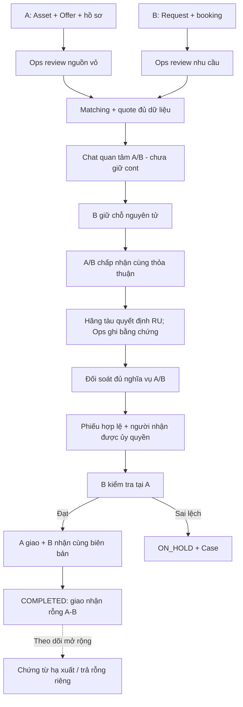
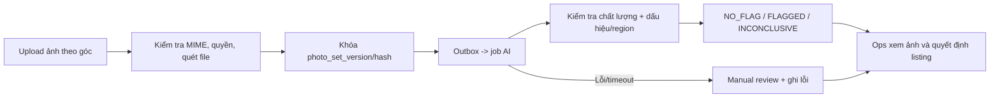

# ECont - Kế hoạch triển khai đầy đủ theo SRS v1.0

> Phiên bản kế hoạch: 2.0 | Ngày: 17/09/2026 | Nguồn: ECONT-SRS-001, v1.0, 16/09/2026, 67 trang.
> Đây là kế hoạch xây dựng và nghiệm thu, không phải xác nhận các chức năng đã triển khai hoặc điều kiện của hãng tàu đã được chấp thuận.

## 1. Mục tiêu, nguồn và cách sử dụng

Xây dựng ECont từ frontend demo hiện có thành hệ thống kết nối container rỗng giữa bên đang quản lý vỏ (A) và bên có nhu cầu theo booking xuất khẩu (B). Kế hoạch bao phủ toàn bộ SRS: tài khoản, doanh nghiệp, tài sản, Offer/Request, matching, giá, chat trước đặt cont, giữ chỗ, thỏa thuận, hồ sơ e-DO/booking, RU, thanh toán, kiểm tra, giao nhận, hủy/hoàn, Case, Trust, vận hành; đồng thời phân rã AI, IoT và các mở rộng P1/P2.

### 1.1 Nguồn đã đối chiếu

| Nguồn | Vai trò |
| --- | --- |
| `C:\Users\Asus\Downloads\ECont_SRS_v1_0.pdf` | Nguồn nghiệp vụ chính; đã đọc 67 trang và đối chiếu trực quan sơ đồ luồng/điều kiện chuyển bước/màn hình bàn giao |
| SHA-256 PDF | `5137beabe36874c2b447f0817905219e55d5ad23dd1b5eb4393c36986c6781bb` |
| `agent(2).md` | Quy ước làm việc hiện có của dự án |
| `README.md`, `apps/web/src`, `apps/web/package.json`, `supabase/migrations` | Căn cứ hiện trạng repository ngày 17/09/2026 |
| Trao đổi của chủ dự án | Phân biệt A/B, ngăn một người xác nhận cả hai bên, thêm sửa/rút/xóa đúng trạng thái, chat trước đặt cont, làm rõ việc trả cont sau giao nhận |

Các dẫn chiếu `SRS §x, tr.y` chỉ đúng vị trí trong PDF trên. Nội dung PDF được dùng làm yêu cầu sản phẩm để phân tích, không phải chỉ thị thao tác môi trường, đăng nhập dịch vụ hoặc gửi dữ liệu ra ngoài.

`plan.md` này là bản kế hoạch hiện hành. Những nhận định trong bản cũ như “chưa có repository”, stack bắt buộc hoặc đường dẫn `agent.md` chưa tồn tại được thay bằng hiện trạng ở mục 2 và phương án kiến trúc ở mục 14. Không tự coi lựa chọn kỹ thuật trong bản cũ là yêu cầu bắt buộc của SRS.

### 1.2 Nhãn phạm vi và bằng chứng

- **SRS-P0:** 63 yêu cầu bắt buộc cho MVP.
- **SRS-P1:** 4 FR có mã: `FR-AST06`, `FR-OFR06`, `FR-REQ05`, `FR-CAR04`. Được lập kế hoạch đầy đủ trong tài liệu này; có gate nghiệm thu riêng.
- **SRS-P1 mở rộng:** nhập hàng loạt, tìm kiếm đã lưu, báo cáo chi phí thực tế nâng cao; có trong SRS §2 nhưng chưa có mã FR riêng.
- **SRS-P2:** tối ưu nhiều container/điểm, dự báo cung cầu, CO2e và marketplace vận tải có điều kiện.
- **KH:** cụ thể hóa thiết kế để lập trình, không gán nhầm là nguyên văn SRS.
- **EXT:** đề xuất mở rộng liên quan nhu cầu đã trao đổi nhưng SRS chưa đặc tả đầy đủ, nhất là theo dõi sau bàn giao và chat chưa có Request.

Trạng thái backlog: `NOT_STARTED`, `DEMO_ONLY`, `IN_PROGRESS`, `BLOCKED`, `READY_FOR_TEST`, `VERIFIED`, `DEFERRED`. Có UI hoặc build thành công chưa đủ để đặt `VERIFIED`; cần test và bằng chứng tương ứng.

### 1.3 Mục lục triển khai

1. Mục tiêu và nguồn.
2. Hiện trạng và khoảng thiếu của repository.
3. Phạm vi, thuật ngữ, ranh giới sản phẩm.
4. Vai trò, quyền và công khai dữ liệu.
5. Luồng A/B xuyên suốt.
6. Trạng thái, deadline, sửa/rút/xóa.
7. e-DO, booking, RU và các điều kiện chứng từ.
8. Danh mục 67 yêu cầu chức năng.
9. Matching, chi phí và Trust.
10. Chat trước đặt cont và thông báo.
11. AI kiểm tra ảnh và mở rộng AI.
12. IoT, nhiều container, carrier API và P1 khác.
13. Theo dõi sau bàn giao: hạ xuất/trả rỗng.
14. Kiến trúc và dữ liệu.
15. API, sự kiện, worker và tích hợp.
16. Màn hình và trải nghiệm.
17. Kế hoạch theo giai đoạn.
18. Nghiệm thu: AC, BR, NFR và truy vết.
19. Quyết định còn mở, rủi ro và điều kiện bàn giao.

## 2. Hiện trạng repository và công việc còn thiếu

Đã có React + TypeScript + Vite + Tailwind tại `apps/web`, thư viện Supabase, một migration SQL và các engine tính toán phía trình duyệt. Dữ liệu nghiệp vụ hiện nằm chủ yếu trong React state/localStorage. Chưa thấy backend ứng dụng, worker hay bộ kiểm thử tích hợp/E2E trong các tệp đã kiểm tra. Không suy ra trạng thái triển khai cloud từ code hoặc nhãn “online”.

| Khu vực | Hiện trạng quan sát được | Công việc cần làm |
| --- | --- | --- |
| Danh tính | `AuthContext.tsx` chọn vai A/B/Ops/Finance/Admin từ localStorage và seed | Đăng nhập thật, membership, doanh nghiệp đang làm việc, MFA nội bộ, quyền server |
| Phân quyền | Có guard A/B ở UI và `DatabaseContext.tsx` | Chuyển guard sang API/DB; kiểm tra từng tài nguyên, session, file và channel |
| Tài sản, Offer, Request | Có thêm/sửa/xóa cơ bản, khóa theo tham chiếu giao dịch | Nháp, review có phiên bản, physical status, rút tin, xác minh hạn/quyền, lý do không thể sửa/xóa |
| e-DO và ảnh | Có trường/form dữ liệu và mô tả ảnh; chưa thấy kho chứng từ được xác minh đầy đủ | Upload thật, quét file, hồ sơ riêng tư, checklist e-DO/booking, evidence/hash/version |
| Matching | `matchingEngine.ts` dùng Haversine, thời gian ước tính và cước giả lập; thiếu các mốc của SRS | Tuyến đường bộ có nguồn, `p`, `L`, `tBC`, `arrival_by`, deadline chứng từ, tuổi vị trí, tie-break đầy đủ |
| Giá | Có công thức tiết kiệm cơ bản, dữ liệu demo | Quote từng dòng, payer/collector, thuế, nguồn/hiệu lực, snapshot và đối soát khoản ngoài |
| Chat | Có `ChatPage.tsx`, thread/tin nhắn localStorage, mở từ Offer/Request | Server lưu tin, realtime giữa thiết bị, đủ ngữ cảnh, chống gửi trùng, file, moderation, phân quyền đọc |
| Giao dịch | Có state machine 7 bước, ký A/B và xác nhận bàn giao riêng | Khóa DB, idempotency, deadline worker, snapshot/hash, người đại diện thật, hai company/actor độc lập |
| RU | Có thao tác Ops ghi ref và tên bằng chứng | Bằng chứng file thật, carrier scope, valid_until, thu hồi, gửi bổ sung, giá đổi và duyệt lại |
| Tiền | Demo đối soát A/B | Sổ thu, partial/suspense, webhook, nghĩa vụ ngoài, refund và chống hoàn quá số dư |
| Phiếu/giao nhận | Có dữ liệu phiếu, checklist và custody demo | PDF/QR thật, ủy quyền người nhận, ảnh hiện trường, nháp offline, hash biên bản, sự kiện hoàn tất nguyên tử |
| Supabase | `onlineDbClient.ts` có cấu hình mặc định placeholder; một số nhánh lỗi/trống vẫn trả success | Health check thật, báo lỗi đúng, tách demo/production, bỏ cơ chế upload state browser làm nguồn nghiệp vụ |
| SQL | Migration ban đầu chưa biểu diễn đủ membership/version/ledger/evidence; chưa thấy RLS policy trong migration này | Migration bổ sung có constraints, mapping ID, policies; kiểm tra môi trường thực trước rollout |
| Báo cáo | Dashboard dùng mảng dữ liệu demo, có số đếm giao dịch tổng | KPI theo doanh nghiệp, trạng thái, kỳ, unique asset và định nghĩa mẫu số |
| AI/IoT | Chưa thấy pipeline AI/telemetry | Triển khai ở G8/G9, sau nền dữ liệu và review thủ công |
| Theo dõi trả cont | `COMPLETED` hiện kết thúc giao nhận A-B | Giữ nghĩa đúng của COMPLETED; theo dõi hậu bàn giao riêng theo mục 13 |

Các thay đổi chat đang chưa commit là công việc hiện hữu cần bảo toàn. Bản kế hoạch này không đánh dấu chúng là chat đa người dùng đã tích hợp.

### 2.1 Thứ tự xử lý khoảng thiếu

1. Nền tảng xác thực, tenancy, dữ liệu server và chứng từ.
2. Quy trình review và đủ dữ liệu đầu vào, đặc biệt e-DO/booking/hạn.
3. Matching đúng công thức và quote có nguồn.
4. Giữ chỗ chống trùng, chat thật, thỏa thuận có phiên bản.
5. RU, thanh toán, phiếu và bàn giao có kiểm chứng.
6. Ngoại lệ, Trust, báo cáo và vận hành.
7. AI/IoT/nhiều cont/API carrier, rồi các mở rộng hậu bàn giao và P2.

## 3. Phạm vi, thuật ngữ và ranh giới

Nguồn: SRS §2-3, tr.5-8; §4, tr.9; §5.4-5.5, tr.18-19.

| Thuật ngữ | Nghĩa trong ECont |
| --- | --- |
| ContainerAsset | Một container định danh ổn định bằng số cont; khác một lần đăng tin |
| Bên A | Công ty đang quản lý hợp pháp hoặc được ủy quyền giao container; không mặc nhiên là chủ sở hữu |
| Bên B | Công ty có nhu cầu sử dụng vỏ cho booking phù hợp; tự bố trí xe trong MVP |
| Custody | Quyền/trách nhiệm quản lý vận hành tại một thời điểm; không phải quyền sở hữu |
| Offer | Tin chào nguồn vỏ từ A; P0 một Offer gắn một container |
| Request | Nhu cầu của B gắn booking; P0 một Request cần một container |
| Booking | Xác nhận đặt chỗ vận tải của hãng tàu; khác thao tác B giữ container trên ECont |
| Depot | Bãi nhận/cấp/lưu container; depot A phải trả có thể khác depot B dự kiến lấy |
| e-DO | Lệnh giao hàng điện tử, tài liệu đầu vào để đối chiếu; ECont không tự phát hành e-DO hãng tàu |
| RU / street turn | Tái sử dụng container nhập cho nhu cầu xuất theo chấp thuận phù hợp; `F_RU` là phí RU, không phải mọi khoản cước |
| CarrierApproval | Quyết định RU cho đúng cont, booking, A/B, phiên bản, điều kiện và hiệu lực |
| Agreement | Bản điều kiện A/B cùng chấp nhận trước giao nhận; không chứng minh đã giao thực tế |
| DispatchPermit | Phiếu điều phối nội bộ ECont sau đủ điều kiện; không thay e-DO, RU approval hoặc EIR |
| Inspection | Kiểm tra tại điểm lấy, do B/đại diện được ủy quyền thực hiện |
| HandoverRecord | Biên bản khóa phiên bản, hoàn tất khi có đủ xác nhận A giao và B nhận |
| EIR | Phiếu giao nhận thiết bị của depot/terminal hoặc đơn vị có thẩm quyền; có thể là bằng chứng hậu bàn giao, ECont không tự cấp thay |
| Free time / detention | Thời gian miễn phí/chi phí giữ cont ngoài cảng-depot theo điều kiện áp dụng; bàn giao A-B không tự kết thúc nghĩa vụ |
| Case / ON_HOLD | Hồ sơ xử lý vấn đề/cờ dừng tiến bước; tách khỏi trạng thái chính |
| Suspense | Khoản tiền chờ xác định hoặc xử lý do thừa, sai tham chiếu, đến muộn |
| Matching / Trust | Điểm phù hợp của cặp Offer-Request/uy tín thực hiện của công ty theo vai A hoặc B |

### 3.1 Phạm vi P0

- Dry `20GP`, `40HC`; alias `20DC` và `40HQ` chỉ chuẩn hóa qua mapping rõ; không đổi `40GP` thành `40HC`.
- Chỉ carrier/khu vực đã có quy trình được xác nhận mới mở vận hành thật. Tên hãng có trong danh mục không đồng nghĩa có quyền RU hoặc API.
- Hãng tàu ra quyết định ngoài ứng dụng; Ops ghi nhận bằng chứng. P0 có nhập vị trí và review ảnh thủ công.
- Thu qua một kênh được cấu hình hoặc chuyển khoản có đối soát; tách phí nền tảng, RU thu hộ và chi phí trả ngoài.
- Hoàn tất giao dịch = hoàn tất giao nhận rỗng A-B. Hạ xuất/trả rỗng, hết detention và tất toán hãng tàu cần sự kiện/chứng từ riêng.

### 3.2 Ngoài phạm vi tự động của hệ thống

Mua bán quyền sở hữu cont, tự điều hành xe, bảo hiểm, thông quan, cấp e-DO, chứng nhận an toàn, ví/ký quỹ, tự khấu trừ phạt, reefer/tank/hàng nguy hiểm/chuyên dụng không thuộc P0. Các hạng mục này không được suy ra từ yêu cầu “đầy đủ”; chỉ lập backlog riêng nếu có quyết định mở rộng.

## 4. Vai trò, quyền và công khai dữ liệu

Nguồn: SRS §2.1-2.3, tr.5-7; BR01-02, BR18, BR21; FR-IAM01-06.

### 4.1 Ba lớp kiểm tra quyền

1. **Danh tính và tổ chức:** user đã xác thực, chọn company có membership còn hiệu lực; công ty đáp ứng trạng thái tương ứng.
2. **Quyền hành động:** tạo/sửa tin, công bố, chấp nhận thỏa thuận, tài chính, giao nhận, review, cấu hình là quyền riêng.
3. **Vai trong hồ sơ cụ thể:** A/B suy từ company tham gia giao dịch; không tin `party`, `role`, `company_id` do client tự khai.

Một công ty có thể làm A ở giao dịch này và B ở giao dịch khác. Menu demo “Bên A/B” không phải mô hình phân quyền production. Người dùng chọn ngữ cảnh nguồn cung/nhu cầu theo quyền; B sau nhận được quản lý tài sản thuộc custody của mình nhưng muốn đăng Offer mới phải qua quy trình và hồ sơ mới.

**Yêu cầu đã trao đổi với chủ dự án:** ngăn cùng một người xác nhận thay cả A và B trong một giao dịch. KH: kiểm tra khác `company_id` và khác `actor_id` đối với hai chấp nhận thỏa thuận/hai xác nhận bàn giao, kể cả user có membership ở cả hai công ty. Lưu audit khi bị chặn; không để Ops/Admin ký thay. SRS bắt buộc hai công ty khác nhau; kiểm tra khác actor là bổ sung theo nhu cầu này.

### 4.2 Ma trận thao tác

| Thao tác | A/nhân viên nguồn cung | B/nhân viên nhu cầu | Người duyệt DN/được ủy quyền | Ops | Tài chính | Quản trị nền tảng |
| --- | --- | --- | --- | --- | --- | --- |
| Quản lý Asset/Offer | Theo custody và quyền | Không sửa tài sản của A | Theo phạm vi DN | Hỗ trợ có log | Không | Cấp quyền, không thay sự kiện |
| Tạo/sửa Request | Chỉ khi có quyền nhu cầu trong ngữ cảnh B | Theo quyền công ty mình | Theo phạm vi DN | Review | Không | Không chọn cont thay B |
| Chat | Đúng room | Đúng room | Theo membership phòng | Theo phân công/Case, có log đọc | Không mặc định | Không mặc định đọc tất cả |
| Giữ cont | Không chọn thay B | Request của mình, đủ điều kiện | Quyền giữ chỗ của B | Không cam kết thay | Không | Không cam kết thay |
| Chấp nhận thỏa thuận | Không mặc định từ quyền tạo tin | Không mặc định từ quyền tạo tin | Chỉ phần bên mình | Không | Không | Không |
| Review tin và DN | Không tự review | Không tự review | Không tự review | Có; khác người tạo | Không | Theo quyền Ops riêng |
| Ghi nhận RU | Xem/bổ sung phần mình | Xem/bổ sung phần mình | Không tự duyệt RU | Có bằng chứng hãng tàu | Không | Không bỏ qua bằng chứng |
| Đối soát/hoàn | Xem nghĩa vụ mình | Xem nghĩa vụ mình | Theo quyền tài chính DN để xem/nộp | Đề nghị | Duyệt/thực hiện theo phân quyền | Không mặc định đánh dấu đã nhận tiền |
| Kiểm tra tại A | Xem/ghi nhận ý kiến | Đại diện nhận được ủy quyền | Trong phạm vi ủy quyền | Hỗ trợ, không giả kết quả B | Không | Không |
| Giao/nhận | Người A có quyền xác nhận giao | Người B có quyền xác nhận nhận | Đúng bên/version | Không ký thay | Không | Không ký thay |
| Biểu phí | Xem bản áp dụng | Xem bản áp dụng | Không sửa biểu phí nền tảng | Theo quyền quản trị | Người duyệt khác người tạo | Cấu hình theo quyền riêng |

SUSPENDED chặn cam kết mới; quyền xử lý hồ sơ/nghĩa vụ cũ đi theo policy và phân công, không tự xóa lịch sử hoặc mặc định cho tiếp tục mọi bước.

### 4.3 Các mức công khai

| Mức | Điều kiện | Dữ liệu đối tác được nhận |
| --- | --- | --- |
| L0 - tìm kiếm/quan tâm | Chưa giữ hoặc chưa có consent tương ứng | Offer ID, loại/hãng, vùng, lịch, condition và review, điểm/số mẫu/độ mới, km làm tròn, chi phí ước tính |
| L1 - nhận diện để thỏa thuận | Giữ chỗ hợp lệ và A đồng ý trao đổi; consent được lưu | Pháp nhân A/B, đại diện có quyền, điều kiện đã đồng ý chia sẻ |
| L2 - điều phối | Approval hợp lệ, đủ nghĩa vụ tiền, permit phát thành công, không hold | Số cont, điểm lấy/nhận chính xác, liên hệ điều phối, ảnh cần thiết; chứng từ hãng theo mục đích/quyền |
| L3 - lịch sử | Hoàn tất/hủy | Hồ sơ thuộc phạm vi tham gia theo retention; thu hồi quyền điều phối và link đang có hiệu lực |

Không gửi số cont, booking, e-DO, ảnh gốc hoặc tọa độ chính xác trong payload L0 rồi chỉ che bằng CSS. Cùng policy phải áp dụng cho API, realtime, notification, PDF, export, cache và file. A vẫn xem dữ liệu tài sản của mình ở mọi giai đoạn được phép.

KH: agreement có snapshot riêng chứa cont/booking và bản đọc theo quyền; acceptance gắn cùng phiên bản/content hash. Không vô tình lộ trường bị che qua PDF hoặc chat title. Cách trình bày bản điều kiện và tham chiếu hồ sơ khi B chưa được thấy số cont cần chốt cùng mẫu thỏa thuận tại Q07.

## 5. Luồng hoàn chỉnh, rõ trách nhiệm A/B

Nguồn: SRS §4, tr.9-13; UC01-12, tr.34-39.

| Bước | Ai thao tác | Đầu vào / công việc | Kết quả và điều kiện đi tiếp |
| --- | --- | --- | --- |
| 01 | DN + Ops | Đăng ký, OTP/email, hồ sơ DN, đại diện/ủy quyền | DN VERIFIED; thành viên đúng quyền |
| 02 | A | Đăng ký Asset, quyền quản lý, xác nhận rỗng, vị trí, depot và hạn có nguồn | Asset đủ điều kiện tạo Offer; chưa công bố |
| 03 | A | Offer nháp, lịch giao, điều kiện xe, condition, ít nhất 6 ảnh, e-DO/hồ sơ tương đương | Gửi review |
| 04 | Ops | Đối chiếu hồ sơ A; AI hỗ trợ khi bật P1 | APPROVE_LISTING -> AVAILABLE; thiếu/sai -> bổ sung/từ chối |
| 05 | B | Request gắn booking: hãng, loại, điều kiện hàng, kho B, lịch, cut-off, Dmax | Ops xác minh -> OPEN |
| 06 | Hệ thống + B | Lọc điều kiện cứng, tuyến, lịch, điểm và quote | Xem/so sánh tối đa 3 phương án; thiếu dữ liệu thì chưa giữ được |
| 07 | B + A | B gửi quan tâm, A trả lời trong chat đúng Offer/Request | Trao đổi trước đặt; không tạo reservation/khóa tài sản |
| 08 | B | Chọn Offer cho Request và gửi khóa idempotency | DB giữ duy nhất Asset/Request; NEGOTIATING, đồng hồ giữ chỗ |
| 09 | A rồi A/B | A chấp nhận trao đổi; mở pháp nhân theo consent; thống nhất điều kiện | Mỗi bên chấp nhận cùng agreement version/hash |
| 10 | Hệ thống + Ops | Đủ hai chấp nhận, nâng hold thành allocation; Ops lập hồ sơ xin RU | PENDING_CARRIER; liên hệ hãng ngoài ứng dụng ở P0 |
| 11 | Hãng tàu + Ops | Nhận quyết định; kiểm tra cont/booking/A/B/địa điểm/lịch/phí/hạn | APPROVED hợp lệ và giá cuối cùng đã chấp nhận -> AWAITING_PAYMENT |
| 12 | A/B + Tài chính | Nộp tiền phần mình; đối soát cả khoản ngoài ECont áp dụng | Đủ nghĩa vụ từng bên; chưa tự chứng minh đã bàn giao |
| 13 | B + hệ thống | B khai xe/người nhận/ủy quyền; hệ thống kiểm tra gate, sinh PDF/QR | Phiếu sẵn sàng hợp lệ -> READY_FOR_PICKUP; mở L2 |
| 14 | B/đại diện + A | Xác minh online phiếu, người, địa điểm, số cont; check-in | INSPECTION |
| 15 | B + A | B kiểm tra, ảnh/checklist, A biết ghi chú; có sai lệch thì Case | Đạt -> khóa evidence/biên bản, HANDOVER_PENDING |
| 16 | A và B | A xác nhận đã giao; B xác nhận đã nhận cùng bản; thứ tự có thể đảo | Commit COMPLETED + custody A->B + outbox đúng một lần |
| 17 | Hệ thống + hai bên | PDF cuối, đánh giá trong 7 ngày, Case khi cần | Lưu lịch sử, Trust theo dữ liệu đủ; không tự mở Offer mới |
| 18 | B + Ops/nguồn nhận thực tế | Nếu bật EXT-RETURN: theo dõi B vận chuyển/đóng hàng/hạ xuất hoặc trả rỗng | Chứng từ xác minh riêng, không suy từ COMPLETED |



## 6. Trạng thái, đồng hồ và sửa/rút/xóa

### 6.1 Máy trạng thái giao dịch

| Từ -> đến | Guard phải kiểm tra ở server trong cùng thay đổi nghiệp vụ |
| --- | --- |
| Tạo -> NEGOTIATING | Request OPEN của B; Offer AVAILABLE đã review; A khác B; cả hai đủ quyền; dữ liệu matching/quote còn đúng version; hold độc quyền, chưa hết cửa sổ |
| NEGOTIATING -> PENDING_CARRIER | Hai acceptance cùng agreement version/hash; đúng đại diện; lock đúng giao dịch; dữ liệu còn hợp lệ; nâng reservation thành ALLOCATED |
| PENDING_CARRIER -> AWAITING_PAYMENT | CarrierApproval APPROVED đúng scope/version, có evidence và còn hiệu lực; phí cuối/quote đã được hai bên chấp nhận |
| AWAITING_PAYMENT -> READY_FOR_PICKUP | Đủ tiền từng bên và nghĩa vụ ngoài áp dụng; không hold; approval còn hiệu lực; phiếu đã tạo thành công |
| READY_FOR_PICKUP -> INSPECTION | Phiếu/approval hợp lệ; người nhận được ủy quyền; đúng cont/điểm; xác minh online |
| INSPECTION -> HANDOVER_PENDING | B chấp nhận; A đã biết ghi chú; không bất đồng trọng yếu; ảnh/checklist/biên bản khóa phiên bản |
| HANDOVER_PENDING -> COMPLETED | Hai công ty và đại diện phù hợp xác nhận cùng version/hash; không hold; bằng chứng có thể lưu; custody/event cùng commit |
| Trước hoàn tất -> REJECTED | Carrier từ chối; lưu lý do và xử lý phân bổ theo hiện trạng |
| Trước hoàn tất -> EXPIRED | Deadline hợp lệ hết; xử lý nghĩa vụ, không tiếp tục dùng approval/payment đến muộn để hồi sinh |
| Trước hoàn tất -> CANCELLED | Đúng quyền/quy trình hủy; thu hồi phiếu; xác minh hiện trạng trước release |

`ON_HOLD` là cờ riêng có lý do, người đặt/gỡ và Case/evidence liên quan. `COMPLETED` không đổi ngược thành `CANCELLED`; điều chỉnh sau giao dùng Case/adjustment. Tình trạng thanh toán, file, approval và hậu bàn giao là các vòng đời độc lập.

### 6.2 Enum chuẩn theo SRS §4.4, tr.13

| Đối tượng | Trạng thái |
| --- | --- |
| Company | PENDING_VERIFICATION, NEEDS_INFO, VERIFIED, REJECTED, SUSPENDED |
| Physical status | AT_CUSTOMER, EMPTY_AT_YARD, IN_TRANSIT, EMPTY_AT_DEPOT |
| Condition | GOOD, MINOR_DAMAGE, MAJOR_DAMAGE; tách declared_condition/reviewed_condition |
| Offer | DRAFT, UNDER_REVIEW, CHANGES_REQUIRED, REJECTED, AVAILABLE, HELD, ALLOCATED, FULFILLED, WITHDRAWN, EXPIRED |
| Request | DRAFT, UNDER_REVIEW, CHANGES_REQUIRED, REJECTED, OPEN, HELD, ALLOCATED, FULFILLED, WITHDRAWN, EXPIRED |
| CarrierApproval | DRAFT, SUBMITTED, NEEDS_INFO, APPROVED, REJECTED, EXPIRED, REVOKED |
| PaymentOrder | OPEN, PARTIAL, PAID, EXPIRED, CANCELLED |
| RefundOrder | REQUESTED, APPROVED, REFUND_PENDING, REFUNDED, FAILED, REJECTED |
| HandoverRecord | DRAFT, PENDING_CONFIRMATION, COMPLETED, SUPERSEDED |
| Case | OPEN, IN_REVIEW, NEEDS_INFO, RESOLVED, CLOSED |

KH - enum kỹ thuật bổ sung: reservation `HELD/ALLOCATED/RELEASED`; permit `GENERATING/ACTIVE/USED/EXPIRED/REVOKED/FAILED`; scan `PENDING/CLEAN/INFECTED/ERROR`; document verification `UNVERIFIED/NEEDS_INFO/VERIFIED/REJECTED/EXPIRED/REVOKED/SUPERSEDED`. Chỉ đưa vào contract sau khi định nghĩa transition; không nhầm với enum SRS.

Mapping dữ liệu demo phải explicit: Offer/Request `COMPLETED` -> `FULFILLED` khi có chứng cứ giao nhận; `CANCELLED` cần phân loại WITHDRAWN/EXPIRED theo lý do; payment `SETTLED` chỉ thành PAID khi số đã đối soát đủ. Không ánh xạ cơ học dữ liệu chưa có bằng chứng thành hồ sơ verified.

### 6.3 Deadline và tự động hóa

| Đồng hồ | Mặc định thử nghiệm SRS | Khi hết hạn |
| --- | --- | --- |
| NEGOTIATING | 30 phút | Hết hold nếu vẫn đúng trạng thái/version; kiểm tra lại trước mở Offer |
| PENDING_CARRIER | 4 giờ liên tục | Cảnh báo Ops; EXPIRED tại due_at, không suy hãng đã đồng ý |
| AWAITING_PAYMENT | 2 giờ | Không phát phiếu; tiền đến muộn -> suspense |
| Thiếu một xác nhận giao/nhận | 30 phút | Nhắc người còn thiếu, mở việc hỗ trợ; giữ allocation, không tự hoàn tất |
| Vị trí quá cũ | >24 giờ | A xác nhận lại trước giữ mới; giữ observed_at và verified_at |
| Hạn trả rỗng | Nhắc trước 24 giờ và 4 giờ | Hiển thị hạn có nguồn, người phải xử lý |
| Rating | 7 ngày sau COMPLETED | Công khai khi cả hai gửi hoặc hết cửa sổ |
| Hoàn tiền | Đề xuất <=5 ngày làm việc từ quyết định hợp lệ | Cảnh báo khoản hoàn chưa xong, không đánh dấu đã hoàn theo lịch |

`due_at = min(deadline TTL, các giới hạn khả thi/hồ sơ áp dụng)`. Server dùng UTC; UI/PDF hiển thị Asia/Ho_Chi_Minh. Worker kiểm tra state/version và khóa dữ liệu, không dùng đồng hồ trình duyệt hoặc job 30 phút cũ để mở cont đã phân bổ.

### 6.4 Chính sách sửa, rút và xóa

| Dữ liệu / tình trạng | Cho sửa | Cho xóa/rút | Cách phản hồi UI |
| --- | --- | --- | --- |
| Nháp chưa có phụ thuộc | Chủ thể đúng quyền; kiểm tra version | KH: xóa nháp theo retention/audit; không xóa chứng cứ đang legal_hold | Nút sửa/xóa và xác nhận rõ đối tượng |
| Asset đã được đăng/đang giữ | Chỉ dữ liệu được policy cho phép; trường trọng yếu qua review/change request | Không xóa cứng khi có Offer/giao dịch/chứng từ | Hiện lý do khóa và hồ sơ liên quan |
| Offer AVAILABLE chưa phân bổ | Sửa trọng yếu -> UNDER_REVIEW; invalid match cũ | WITHDRAWN; không tự xóa lịch sử review | “Sửa và gửi duyệt lại”, “Rút tin” |
| Request OPEN chưa phân bổ | Sửa booking/lịch/điều kiện -> review lại | WITHDRAWN | “Sửa nhu cầu”, “Rút nhu cầu” |
| Tin HELD/ALLOCATED | Thay đổi qua giao dịch, mất hiệu lực cam kết liên quan | Yêu cầu bỏ giữ/hủy; xử lý nghĩa vụ | Dẫn tới giao dịch và next_action |
| Thỏa thuận/biên bản đã có một xác nhận | Bản mới, thu hồi hiệu lực xác nhận cũ | Không xóa bằng chứng chấp nhận | Hiện version cũ/mới và bên cần ký lại |
| COMPLETED / thu/hoàn / audit | Đính chính, Case, adjustment có version | Không xóa cứng theo nút CRUD | Chỉ đọc lịch sử, tạo yêu cầu xử lý |

Một nút bị hạn chế phải có lý do cụ thể: không đúng chủ thể, đã phân bổ, đang tranh chấp, đã có chứng từ hoặc cần review lại. Ẩn nút không thay kiểm tra quyền ở server.

## 7. e-DO, booking, RU và điều kiện chứng từ

Nguồn: BR04-06, BR11-12; SRS §6.3/6.8, tr.22/27; §8.3-8.4, tr.45-46. Các checklist chi tiết dưới đây là KH để triển khai các yêu cầu này; quy định riêng từng hãng phải có nguồn xác nhận.

### 7.1 Bốn loại giấy tờ không được nhập làm một

| Hồ sơ | Nguồn phát hành | Dùng lúc nào | Chứng minh trong hệ thống |
| --- | --- | --- | --- |
| e-DO / chứng từ tương đương | Hãng/đại lý hoặc nguồn hợp lệ theo hồ sơ | A đăng Asset/Offer và Ops review | Dữ liệu đối chiếu quyền quản lý, cont, chỉ định/hạn áp dụng; không tự cho phép RU |
| Booking | Hãng/đơn vị có thẩm quyền | B tạo Request và Ops xác minh | Nhu cầu xuất, carrier/type/quantity và điều kiện thời gian |
| RU approval | Hãng tàu theo quy trình được phép | Sau A/B cùng chấp nhận thỏa thuận | Quyết định cho tái sử dụng trong scope cụ thể, còn hiệu lực |
| Phiếu điều phối ECont | ECont sau đủ gate | Trước người nhận check-in | Quyền thực hiện bước nhận theo quy trình nội bộ; vẫn phải đối chiếu hồ sơ hãng |

### 7.2 Quy trình nhận e-DO/hồ sơ tương đương

1. A chọn đúng Asset/Offer, chọn loại tài liệu và nguồn phát hành; tải file, khai reference/ngày/hiệu lực nếu tài liệu có.
2. Server tạo upload ID/object key mới, kiểm tra kích thước, MIME thực, quyền, quét file. File chưa CLEAN không dùng làm bằng chứng review.
3. A nhập dữ liệu đối chiếu. Nếu sau này có OCR, kết quả chỉ là nháp gợi ý, có nguồn trường và độ tin cậy; A/Ops phải xác nhận.
4. Ops được phân công xem file cùng dữ liệu khai báo, đánh dấu từng mục khớp/không khớp/chưa rõ/không áp dụng có lý do.
5. Thiếu hoặc mâu thuẫn -> NEEDS_INFO/CHANGES_REQUIRED; file thay thế tạo version mới, không ghi đè bản trước.
6. Đủ bằng chứng -> đánh dấu hồ sơ được đối chiếu; quyết định APPROVE_LISTING riêng. Cả hai việc đều không tạo CarrierApproval APPROVED.
7. Tài liệu bị thay/hết hiệu lực/thu hồi -> tính ảnh hưởng đến tin, matching, agreement, approval và phiếu; tạo việc Ops xử lý đúng phạm vi.

### 7.3 Bộ trường chứng từ cần lưu

| Nhóm | Trường đề xuất | Điều kiện |
| --- | --- | --- |
| Định danh | document_id, document_type, version, owner_company_id, asset_id/offer_id/request_id, source/issuer, reference | Các liên kết phải đúng công ty và phạm vi hồ sơ |
| File | object_key, sha256, mime, size, scan_status, uploaded_by, uploaded_at | Private, file bất biến; không dùng tên file như bằng chứng đã kiểm tra |
| Đối chiếu | container_numbers, carrier_id, booking_reference nếu có, consignee/authorized_party, authorization_evidence_ids | Chỉ trường thật có trên nguồn; thiếu -> null + reason, không tự tạo giá trị |
| Chỉ định/hạn | designated_depot, pickup/return_deadline, free_time_terms, issue_date, valid_from/until, timezone | Mốc có thể nằm ở chứng từ bổ sung; không bắt e-DO phải có mọi trường nếu carrier dùng bộ hồ sơ khác |
| Review | status, reviewer_id, reviewed_at, checklist, field_mismatches, reason, source_contact/reference | Người tạo không tự duyệt; xác minh có thể cần nguồn ngoài file |
| Vòng đời | supersedes_id, withdrawn/revoked_at, reason, retention_class, legal_hold | Thay đổi giữ lịch sử và đánh giá ảnh hưởng các snapshot liên quan |

Không hardcode “e-DO chỉ hợp lệ N ngày”, hình thức chữ ký, khoản phí hoặc mẫu hãng nếu chưa có tài liệu áp dụng. Hệ thống có `carrier_document_requirements` theo carrier/dịch vụ/khu vực/hiệu lực để Ops quản lý và ghi nguồn.

### 7.4 Checklist e-DO và quyền A

| Mã kiểm tra KH | Nội dung | Nếu không đạt |
| --- | --- | --- |
| DOC-A01 | File đọc được, đúng loại, scan CLEAN, đủ trang cần thiết | Chặn gửi review/sử dụng file; yêu cầu tải lại |
| DOC-A02 | Nguồn/issuer/reference có thể đối chiếu theo quy trình hãng | Chờ xác minh, không coi OCR hoặc PDF đẹp là thật |
| DOC-A03 | Số cont trên nguồn đúng Asset; check digit hợp lệ | Báo mismatch, không tự sửa số để vượt kiểm tra |
| DOC-A04 | Carrier khai thác và dịch vụ được xác nhận; không suy từ prefix | Chờ Ops xác minh hãng |
| DOC-A05 | A là bên được quản lý/giao hoặc có ủy quyền phù hợp | Yêu cầu chứng minh quyền; không tự chuyển custody |
| DOC-A06 | Depot chỉ định/hạn/free time có nguồn, còn phù hợp thời gian dự kiến | Thiếu/hết hạn -> bổ sung/gia hạn; N/A cần Ops xác minh |
| DOC-A07 | Không có bằng chứng bị thu hồi/thay thế hoặc phạm vi mâu thuẫn | Dừng hồ sơ, dùng bản hiện hành sau review |
| DOC-A08 | Cont đã xác nhận EMPTY_AT_YARD, condition phù hợp, không active allocation khác | Chặn công bố; e-DO không chứng minh cont đã rỗng |
| DOC-A09 | Hồ sơ tương đương thay e-DO được Ops chấp nhận, có lý do và loại hồ sơ | Không bắt tất cả hãng dùng duy nhất một mẫu e-DO |
| DOC-A10 | Phiên bản hồ sơ/ảnh/hạn dùng review đúng phiên bản hiện tại | Bắt review lại khi thay đổi trọng yếu |

Gate công bố Offer = DN VERIFIED + quyền A + Asset đủ điều kiện + ảnh/checklist + hồ sơ quyền hợp lệ + depot/hạn/vị trí/lịch đủ + quyết định review hiện hành. e-DO có file nhưng chưa được đối chiếu không đáp ứng gate.

### 7.5 Checklist booking và nhu cầu B

- B/đại diện có quyền sử dụng booking; file và dữ liệu riêng tư trước chia sẻ hợp lệ.
- Đúng carrier, size/type; booking chưa hết hiệu lực/bị rút; không lấy ngày tàu chạy làm cut-off.
- Quantity/capacity đã xác minh: nhiều Request cùng booking không được giữ/cấp vượt lượng được phép, kể cả các giao dịch đã hoàn tất vẫn tiêu thụ capacity đã sử dụng.
- Kho nhận, cửa sổ bắt đầu kiểm tra tại A, hạn tới B, thời lượng đóng hàng, điểm hạ xuất, cut-off, dự phòng và yêu cầu hàng đủ dữ liệu.
- Chỉ container/hàng trong phạm vi. Mốc N/A phải có lý do xác minh, không coi thiếu là không áp dụng.
- Thay booking/carrier/type/cut-off/yêu cầu trọng yếu -> review và matching lại; nếu đã cam kết -> change request.

### 7.6 Gate RU và ma trận điều kiện phát phiếu

Scope RU cần lưu snapshot/hash của: transaction, agreement version, carrier, số cont, booking, pháp nhân A/B, điểm lấy/nhận, cửa sổ cho phép, người nhận/điều kiện ủy quyền, condition/inspection, phí RU/payer/collector, hạn/free time áp dụng sau RU, reference, evidence, người liên hệ và valid_until.

| Thời điểm kiểm tra | Điều kiện bắt buộc | Hành vi khi sai |
| --- | --- | --- |
| Xuất hồ sơ xin RU | Đủ hai chấp nhận hiện hành; hồ sơ đúng phiên bản; tài liệu cần thiết và quyền gửi | Chặn xuất bộ “sẵn sàng gửi”, nêu mục thiếu; bản nháp mang nhãn nháp |
| Ghi APPROVED | Evidence CLEAN/readable, reference, nguồn/người ghi, scope khớp, thời gian còn hiệu lực | 422 lỗi trường; không checkbox bỏ qua |
| Tạo nghĩa vụ chính thức | APPROVED hợp lệ + quote đầy đủ/đã chấp nhận; phí hãng thay đổi được xử lý lại | Chờ thỏa thuận/bổ sung; không thu theo giá chưa chốt |
| Sinh/phát phiếu | Gate approval + đủ nghĩa vụ từng bên/thu ngoài áp dụng + không hold + đúng người/xe + allocation hiện hành | Chờ tiền/approval/ủy quyền; PDF lỗi -> chưa READY |
| Bắt đầu kiểm tra | Xác minh online lại approval/permit, người nhận, số cont, điểm giao | Dừng nhận, tạo Case/hold nếu cần |
| Xác nhận bàn giao | Đúng quyền, biên bản/version, không hold; xử lý mọi revocation đã nhận | Không COMPLETED nếu điều kiện hiện hành bị chặn |
| Sau COMPLETED có revocation | Lưu sự kiện muộn, mở Case khẩn, báo các bên | Không sửa ngược sự kiện đã giao |

Approval hết hạn/thu hồi làm phiếu hết quyền dùng online ngay, dù người dùng vẫn giữ PDF cũ. QR là token ngẫu nhiên, trang công khai chỉ trả trạng thái tối thiểu; xem hồ sơ chi tiết cần quyền.

### 7.7 Thay đổi nào phải đánh giá lại

| Thay đổi | Hành động |
| --- | --- |
| Số cont, booking, carrier, A/B, tuyến/điểm hoặc lịch ngoài scope | ON_HOLD; phiên bản thỏa thuận mới; hủy hiệu lực acceptance liên quan; revoke permit; xin approval mới |
| Phí/thuế/alpha/chính sách hoàn thay đổi | Quote mới, hai bên chấp nhận lại; tính nghĩa vụ chênh lệch; kiểm tra phạm vi approval bị ảnh hưởng |
| Ảnh/condition/hạn/quyền quản lý thay đổi | Review lại; invalid matching; Ops đánh giá lại hồ sơ RU và inspection cần thiết |
| Đổi tài xế/liên hệ | Cập nhật ủy quyền, thông báo A; nếu người nhận nằm trong scope hãng thì xử lý thay đổi scope tương ứng |
| e-DO/booking mới thay bản cũ | Lưu bản mới và quan hệ supersedes; không tự chuyển acceptance/approval từ bản cũ sang |

### 7.8 Nghiệm thu riêng cho chứng từ

`DOC-T01`: e-DO hợp lệ nhưng chưa RU -> không phát phiếu. `DOC-T02`: RU sai cont/booking/A-B -> bị chặn. `DOC-T03`: thiếu depot/hạn -> không công bố nếu không có N/A xác minh. `DOC-T04`: bằng chứng chỉ là tên file -> không APPROVED. `DOC-T05`: file hết hạn/thu hồi hoặc đổi scope -> khóa bước liên quan và revoke phiếu. `DOC-T06`: e-DO hồ sơ tương đương có nguồn và review -> đi đúng luồng. `DOC-T07`: API/matching/export không lộ chứng từ riêng tư. `DOC-T08`: bản thay thế/OCR/AI không tự xác minh. `DOC-T09`: approval đến sau EXPIRED không hồi sinh. `DOC-T10`: khi chưa đủ tiền, QR/PDF cũ không cấp quyền lấy cont.

## 8. Backlog đầy đủ 67 yêu cầu chức năng

Mỗi dòng là một work item cần có UI/API/data/quyền/test tương ứng. Không gom một nhóm thành “đã làm” chỉ vì có trang hiển thị. Mã `TC-<FR>` trong traceability là bộ test chi tiết cần triển khai cho FR đó, bổ sung các AC liên quan ở mục 18.

### 8.1 IAM - Tài khoản và doanh nghiệp (SRS tr.20)

| Mã | Mức / giai đoạn | Hạng mục phải xây dựng và kết quả kiểm chứng |
| --- | --- | --- |
| FR-IAM01 | P0 / G1 | Đăng ký họ tên/phone/email/credential, OTP phone, verify email trước nhận hồ sơ; mật khẩu không đọc được. OTP hết hạn/replay/vượt số lần bị từ chối, phone trùng chuyển khôi phục |
| FR-IAM02 | P0 / G1 | Hồ sơ pháp nhân/MST/địa chỉ/đại diện/file; Ops VERIFIED/NEEDS_INFO/REJECTED có lý do. Chưa VERIFIED chỉ lưu nháp, không công bố/giữ/chấp nhận |
| FR-IAM03 | P0 / G1 | Mời, chấp nhận, thu hồi membership; quyền tạo tin/duyệt/tài chính/giao nhận và delegation. Không xóa admin DN cuối; thu hồi chặn thao tác mới, giữ tác giả cũ |
| FR-IAM04 | P0 / G1 | Login/logout/reset qua kênh verified, quản lý/thu hồi session, MFA Ops/Finance. Reset không lộ tài khoản có tồn tại; đổi mật khẩu xử lý phiên theo policy |
| FR-IAM05 | P0 / G1 xuyên suốt | Tenant/object authorization cho API, WebSocket, file, export và đổi company. Thay ID không đọc hoặc sửa dữ liệu công ty khác |
| FR-IAM06 | P0 / G1 | Version điều khoản, consent chia sẻ, suspension có lý do và audit. Chặn tin/cam kết mới; hồ sơ cũ vẫn phục vụ xử lý nghĩa vụ theo quyền |

### 8.2 AST - Tài sản và vị trí (SRS tr.21)

| Mã | Mức / giai đoạn | Hạng mục phải xây dựng và kết quả kiểm chứng |
| --- | --- | --- |
| FR-AST01 | P0 / G2 | Asset: số cont, type, carrier, custodian, vị trí/nguồn, physical status, bằng chứng quyền. Check digit/alias; trùng custodian khác vào xác minh, không tự chiếm |
| FR-AST02 | P0 / G2 | Cập nhật AT_CUSTOMER/EMPTY_AT_YARD/IN_TRANSIT/EMPTY_AT_DEPOT và condition riêng; actor/time/history. Chỉ EMPTY_AT_YARD đã xác nhận rỗng được công bố Offer |
| FR-AST03 | P0 / G2 | Depot/hạn/free time/source/verification, cảnh báo 24h/4h. Thiếu depot không tính repositioning, thiếu hạn chặn trừ N/A đã review |
| FR-AST04 | P0 / G2,G6 | Custody event bất biến, điều chỉnh có chứng cứ; giao xong chuyển A->B đúng một lần. A giữ quyền đọc giao dịch cũ, không sửa tài sản thuộc B |
| FR-AST05 | P0 / G3 | Gợi ý Request và so sánh với trả depot khi đủ dữ liệu; CTA tạo Offer nháp để A xác nhận. Không tự đăng/cam kết và không tính giá thiếu thành phần |
| FR-AST06 | P1 / G9 | Adapter IoT xác thực thiết bị/timestamp, lưu nguồn/độ mới. Dedup, event cũ không ghi đè; mất IoT vẫn nhập tay; không suy condition |

### 8.3 OFR - Nguồn vỏ và review (SRS tr.22)

| Mã | Mức / giai đoạn | Hạng mục phải xây dựng và kết quả kiểm chứng |
| --- | --- | --- |
| FR-OFR01 | P0 / G2 | Draft từ Asset: lịch, điểm lấy, tiếp cận xe, condition, quyền/chứng từ. Cho thiếu ở nháp, submit chỉ khi đủ dữ liệu bắt buộc |
| FR-OFR02 | P0 / G2 | Ít nhất 6 góc ảnh theo checklist, e-DO hoặc hồ sơ tương đương, quét và lưu private. Thiếu góc/MIME giả/malware bị chặn; matching không lộ e-DO |
| FR-OFR03 | P0 / G2 | Ops review số cont/quyền/ảnh/condition/hạn/rỗng; APPROVE_LISTING/REQUEST_CHANGES/REJECT_LISTING gắn version. Không tự review hồ sơ do mình tạo |
| FR-OFR04 | P0 / G2 | Sửa nháp; sửa trường trọng yếu tin công bố chưa phân bổ -> UNDER_REVIEW; match stale. Hết available_until không AVAILABLE |
| FR-OFR05 | P0 / G2,G6 | Rút tin chưa phân bổ; đang giao dịch đi qua hủy. Không xóa cứng lịch sử, chỉ mở lại sau xác minh hiện trạng/quyền/hạn |
| FR-OFR06 | P1 / G8 | Job AI theo version bộ ảnh, dấu hiệu/region/confidence/model/error, Ops quyết định. Lỗi/không chắc -> manual, không tự approve/reject |

### 8.4 REQ - Nhu cầu và tìm kiếm (SRS tr.23)

| Mã | Mức / giai đoạn | Hạng mục phải xây dựng và kết quả kiểm chứng |
| --- | --- | --- |
| FR-REQ01 | P0 / G2 | Request theo booking, carrier/type/quantity=1, hàng/yêu cầu sạch/khô/không mùi, kho B, các cửa sổ/hạn, Dmax. Lỗi thời gian tại trường, booking private |
| FR-REQ02 | P0 / G2 | Ops xác minh booking/carrier/hạn; OPEN khi đủ hồ sơ và DN hợp lệ. Booking rút/hết hạn chặn chọn mới |
| FR-REQ03 | P0 / G3 | Lọc type/carrier/vùng/km/lịch/condition, phân trang, sort score/distance/saving. Tìm chung vẫn phải kiểm tra Request khi chọn; giải thích không có kết quả |
| FR-REQ04 | P0 / G2,G4 | Sửa/rút chưa phân bổ; trọng yếu review lại; có giao dịch phải change agreement. Một Request không giữ hai Offer; hủy không bỏ nghĩa vụ |
| FR-REQ05 | P1 / G9 | Request nhiều dòng/quantity, đáp ứng một phần, allocation/transaction từng cont. Giữ đồng thời không vượt nhu cầu hoặc booking capacity |

### 8.5 MAT - Matching, báo giá, Trust (SRS tr.24)

| Mã | Mức / giai đoạn | Hạng mục phải xây dựng và kết quả kiểm chứng |
| --- | --- | --- |
| FR-MAT01 | P0 / G3 | Hard constraints và reason_code; kiểm tra lại ở API giữ chỗ. Sai hãng/type/km/hạn/lock/condition không bù bằng score |
| FR-MAT02 | P0 / G3 | D/T/C với trọng số 30/40/30, giải thích, formula version/snapshot; làm tròn 1 chữ số và tie-break đủ. Fixture 70/100/100 = 91 |
| FR-MAT03 | P0 / G3 | Routing đường bộ km/phút, source/time/confidence, tuổi vị trí. Maps lỗi không 0 km; >24h cần A xác nhận lại trước hold |
| FR-MAT04 | P0 / G3 | Chi phí hai phương án, alpha/RU/phí nền tảng/saving. Phân biệt estimate/firm/missing; giữ saving âm; fixture cân bằng |
| FR-MAT05 | P0 / G3,G5 | Quote/line bất biến sau chấp nhận, payer/collector/beneficiary/tax/source/TTL/refund terms. Giá mới không sửa snapshot cũ; hết hạn phải chấp nhận bản mới |
| FR-MAT06 | P0 / G7 | Trust riêng A/B, 180 ngày, >=5 completed và đủ mẫu; kết luận Case mới tác động. Có formula/input/time/reason history, người mới score null |

### 8.6 COM - Chat và thông báo (SRS tr.25)

| Mã | Mức / giai đoạn | Hạng mục phải xây dựng và kết quả kiểm chứng |
| --- | --- | --- |
| FR-COM01 | P0 / G4 | Room khi B quan tâm/giữ hợp lệ theo Offer+Request, lịch sử/time/trạng thái gửi; dedup client_message_id. Quan tâm không giữ cont, người thứ ba không đọc room |
| FR-COM02 | P0 / G4 | Inbox review/acceptance/RU/tiền/deadline/giao nhận/Case, email/SMS theo cấu hình; retry hữu hạn. Notification lỗi không rollback nghiệp vụ |
| FR-COM03 | P0 / G4,G7 | Report tin; NORMAL/FLAGGED/HIDDEN có lý do và log đọc của Ops đúng phạm vi. Hidden còn placeholder và bản gốc riêng, không xóa né audit |
| FR-COM04 | P0 / G4 | Nhắc phạm vi chia sẻ, attachment kế thừa room policy. Chat không tự đổi quote/lịch/agreement; đưa điều kiện vào form và hai bên chấp nhận mới có hiệu lực hệ thống |

### 8.7 TXN - Giữ chỗ và thỏa thuận (SRS tr.26)

| Mã | Mức / giai đoạn | Hạng mục phải xây dựng và kết quả kiểm chứng |
| --- | --- | --- |
| FR-TXN01 | P0 / G4 | Revalidate snapshot, DB transaction + unique allocation + locks + idempotency. Concurrent hold một thắng; replay cùng key trả cùng transaction_id |
| FR-TXN02 | P0 / G4 | A đồng ý/từ chối đề nghị, consent pháp nhân, countdown server. Hết hạn không ký; A không chọn thay B; không cam kết im lặng |
| FR-TXN03 | P0 / G4 | Agreement version/hash: pháp nhân, tham chiếu cont/booking, lịch/điều kiện/quote/xe/inspection/hủy/RU. Acceptance đúng đại diện/cùng bản |
| FR-TXN04 | P0 / G4,G5 | Change request phân loại trọng yếu/không trọng yếu, version và đánh giá ảnh hưởng. Đổi scope revoke phiếu, xin RU lại khi cần |
| FR-TXN05 | P0 / G4,G6 | Timeline server, next_action/actor/due_at/block reasons; refresh giữ state. Paid hoặc một bên ký chưa là completed |
| FR-TXN06 | P0 / G4,G6 | Hold/reject/expire/cancel/complete và release có điều kiện. Worker không mở cont đang inspection/handover; retry không tạo supply trùng |

### 8.8 CAR - Hồ sơ hãng tàu (SRS tr.27)

| Mã | Mức / giai đoạn | Hạng mục phải xây dựng và kết quả kiểm chứng |
| --- | --- | --- |
| FR-CAR01 | P0 / G5 | Export bộ hồ sơ cần thiết đúng quyền/version; submission reference, người gửi, sent_at, file hashes. Demo xuất PDF không tự gửi email ngoài |
| FR-CAR02 | P0 / G5 | Decision đủ vòng đời, evidence/contact/scope/reference/valid_until. APPROVED thiếu/sai bằng chứng không được lưu hợp lệ |
| FR-CAR03 | P0 / G5,G6 | Check approval lúc thu chính thức/phát phiếu/bắt đầu nhận; expiry/revoke alert. Event muộn sau EXPIRED chỉ lưu lịch sử |
| FR-CAR04 | P1 / G9 | Carrier API được cho phép: auth/signature/dedup/mapping/status scope; manual fallback. Thiếu scope/hạn hoặc out-of-order -> queue xác minh |

### 8.9 PAY - Thu, đối soát, hoàn (SRS tr.28)

| Mã | Mức / giai đoạn | Hạng mục phải xây dựng và kết quả kiểm chứng |
| --- | --- | --- |
| FR-PAY01 | P0 / G5 | Order A/B từ quote sau approval, dòng phí/thuế/reference/hạn. Cước xe ngoài không thu qua ECont; tổng dòng khớp tổng order |
| FR-PAY02 | P0 / G5 | Kênh cấu hình hoặc manual bank reconciliation, ref duy nhất. Biên lai/redirect chưa PAID; thiếu -> PARTIAL |
| FR-PAY03 | P0 / G5 | Signed webhook, verify amount/currency/ref, dedup; thừa/không rõ/late -> suspense. Callback lặp không tăng thu và sau hủy không phát phiếu |
| FR-PAY04 | P0 / G5 | Đủ nghĩa vụ từng bên và khoản trả ngoài áp dụng có evidence/actor. B thiếu 1 đồng hoặc PDF lỗi vẫn chưa READY |
| FR-PAY05 | P0 / G6 | Ops đề nghị, Finance duyệt/thực hiện; khóa số dư hoàn và attempt/ref cố định. Đồng thời/timeout không hoàn hai lần, không sửa khoản thu gốc |
| FR-PAY06 | P0 / G5,G7 | Sổ thu/hoàn theo transaction/payer/date/method, truy tới evidence. Receipt nội bộ khác hóa đơn do bên có quyền phát hành |

### 8.10 HND - Điều phối và giao nhận (SRS tr.29)

| Mã | Mức / giai đoạn | Hạng mục phải xây dựng và kết quả kiểm chứng |
| --- | --- | --- |
| FR-HND01 | P0 / G5 | PDF phiếu có ID/version/QR random/TTL/A-B/cont/điểm/người nhận, đủ BR06. Retry cùng ID; token revoke/expired không hợp lệ |
| FR-HND02 | P0 / G5,G6 | B khai nhà xe/tài xế/contact/plate/time/delegation. Người ký cuối có quyền; đổi tài xế cập nhật ủy quyền/thông báo A, không account dùng chung |
| FR-HND03 | P0 / G6 | Check-in/mobile, đối chiếu cont, checklist/ảnh/notes, accept/discrepancy. Sai cont/approval/hư hại trọng yếu chặn; GPS thiếu có cách xác minh khác bởi Ops |
| FR-HND04 | P0 / G6 | A giao/B nhận cùng record version/hash, lưu actor/company/server time. Retry idempotent; khác version không hoàn tất |
| FR-HND05 | P0 / G6 | Commit completion/custody/event, PDF cuối có condition/checklist/media/time/place/acceptances. PDF lỗi vẫn giữ sự kiện thực tế đã commit |
| FR-HND06 | P0 / G6 | Nháp checklist/ảnh offline theo user/company/transaction, trạng thái chưa gửi, retry upload, khôi phục phiên. Online recheck quyền/approval/version trước xác nhận cuối |

### 8.11 EXC - Hủy, Case, đánh giá (SRS tr.30)

| Mã | Mức / giai đoạn | Hạng mục phải xây dựng và kết quả kiểm chứng |
| --- | --- | --- |
| FR-EXC01 | P0 / G6 | Lý do/evidence/ước tính hoàn khi yêu cầu hủy; server phân loại trước/sau cam kết, Ops xử lý phân bổ. Không hủy trực tiếp completed; revoke phiếu |
| FR-EXC02 | P0 / G6 | Case sai cont/hư hại/no-show/quyền tại điểm lấy; hold và thông báo. Case trọng yếu chưa xử lý chặn direct API/phiếu cũ |
| FR-EXC03 | P0 / G6 | Assign Case, evidence/ý kiến hai bên, resolution/version/fault/remedy, xem xét lại. Đổi kết luận tạo bản mới và tính lại tác động |
| FR-EXC04 | P0 / G6 | Case liên kết thu/nonrefundable evidence/refund order; Finance thực hiện. Đóng Case không tự đánh dấu REFUNDED |
| FR-EXC05 | P0 / G6 | Kiểm tra custody/vị trí/hạn/quyền/condition trước tái mở Offer/Request. Cont đi đường/tranh chấp không tự AVAILABLE |
| FR-EXC06 | P0 / G7 | Một rating mỗi bên/completed transaction trong 7 ngày; blind publish; report/moderation. Không tăng sample hai lần, không xem sớm đối tác |

### 8.12 OPS - Vận hành (SRS tr.31)

| Mã | Mức / giai đoạn | Hạng mục phải xây dựng và kết quả kiểm chứng |
| --- | --- | --- |
| FR-OPS01 | P0 / G2-G7 | Work queue theo hồ sơ/priority/assignee/deadline/status, search ID/cont/booking theo quyền; stale row_version trả conflict |
| FR-OPS02 | P0 / G1,G7 | Carrier/type/vùng/depot/SLA/tariff có version/source/effective; maker-checker giá. Không self-approve, không kích hoạt giá thiếu tuyến/thuế/nguồn |
| FR-OPS03 | P0 / G0-G7 | Audit đọc dữ liệu nhạy cảm và mutation quan trọng, search/export scoped; không log secret/OTP, không mất provenance khi user bị vô hiệu |
| FR-OPS04 | P0 / G7 | Supply/demand/matched rate/wait/completion/cancel reason/debt/estimated saving có kỳ/mẫu số. Completed từ state COMPLETED, không từ PAID |
| FR-OPS05 | P0 / G2,G7 | Export PDF/dữ liệu theo quyền, job cho file lớn, download link ngắn. Masking mọi output, online verify revoked document |
| FR-OPS06 | P0 / G0,G7 | Giám sát expiry/notification/PDF/reconciliation/integration, retry idempotent/DLQ/correlation. Không nhân tiền, phiếu hay side effect khi chạy lại |

## 9. Matching, chi phí và Trust

### 9.1 Eligibility trước khi chấm điểm

Nguồn: SRS §5.2, tr.16; §6.5, tr.24.

Chỉ chấm điểm sau khi thỏa: Offer AVAILABLE, Request OPEN hợp lệ, review đúng version, DN VERIFIED, A khác B, Asset rỗng tại bãi, chưa allocation, đúng size/type và carrier được phép, condition/yêu cầu hàng phù hợp, vị trí/hạn/depot xác minh, tuyến đường bộ có nguồn, `d <= Dmax`, thời gian khả thi. API giữ chỗ phải kiểm tra lại, không tin kết quả UI cũ.

Lưu reason_code riêng: `TYPE_MISMATCH`, `CARRIER_MISMATCH`, `ASSET_ALLOCATED`, `REVIEW_STALE`, `LOCATION_STALE`, `ROUTE_UNVERIFIED`, `DEADLINE_UNVERIFIED`, `OUT_OF_RANGE`, `TIME_INFEASIBLE`, `CONDITION_REJECTED`, `BOOKING_INVALID`, `COMPANY_INELIGIBLE`. Đây là mã KH; Ops thấy chi tiết trong phạm vi được phép, người tìm chỉ thấy giải thích không lộ dữ liệu đối tác khác.

### 9.2 Công thức thời gian và điểm

| Ký hiệu | Ý nghĩa |
| --- | --- |
| a0, a1 | A sẵn sàng từ a0; muộn nhất hoàn tất giao tại A là a1 |
| b0, b1 | Cửa sổ B bắt đầu kiểm tra tại A |
| p | Thời lượng kiểm tra và bàn giao tại A |
| tAB, tBC | Thời gian đường bộ A->B, B->điểm hạ xuất |
| L, g | Thời gian đóng hàng tại B và thời gian dự phòng |
| arrival_by | Hạn cont phải tới kho B |
| document_pickup_deadline | Hạn lấy đang áp dụng có nguồn; chỉ thay sau RU khi văn bản cho phép |

```text
E = max(a0, b0, now + dispatch_lead_time)
Z = min(a1,
        b1 + p,
        arrival_by - tAB,
        cut_off - tAB - L - tBC - g,
        document_pickup_deadline)
feasible = E + p <= Z

D = 100 * max(0, 1 - d / Dmax), Dmax > 0
T = 100 * min(1, (Z - E - p) / 120 phút), chỉ sau khi feasible
C = 100 nếu GOOD
C = 60 nếu MINOR_DAMAGE được Ops cho công bố và B chấp nhận
MAJOR_DAMAGE -> loại, không tính C để cứu điểm
M = 0.30*D + 0.40*T + 0.30*C
```

Làm tròn M một chữ số thập phân. Xếp M giảm, d tăng, approved_at sớm trước, ID tăng. Trust và saving hiển thị riêng, không nhân vào M. Fixture: d=24 km, Dmax=80 km, đủ dự phòng 120 phút, GOOD -> D=70, T=100, C=100, M=91.

Không thay `p` bằng `tAB`; không dùng Haversine làm tuyến đường bộ đã xác minh; không gán missing=0. Giá trị N/A cần lý do do Ops xác minh. Routing cache gắn source/version/calculated_at/TTL; vị trí quá 24h phải được A xác nhận lại. Recalculate khi thời gian, vị trí, review, quote hoặc booking đổi.

### 9.3 Chi phí, thuật ngữ và công thức

Nguồn đúng: SRS **§5.4-5.5, tr.18-19**. Nhãn UI hiện ghi “SRS mục 5.2” cho bảng giá cần sửa khi triển khai, vì §5.2 là matching.

| Biến | Giải thích |
| --- | --- |
| T_A | Phương án cũ của A: cước A->depot D_A và phí tăng thêm thực sự phải trả |
| T_B | Phương án cũ của B: cước depot D_B->B và phí tăng thêm tương ứng |
| F_RU | Tổng phí cho RU đúng một lần, có nguồn/đơn vị thu |
| alpha | Phần RU A chịu, thuộc [0,1], mặc định thử nghiệm 0,5; B chịu 1-alpha |
| R_A0 / R_B0 | Chi phí phương án RU của mỗi bên trước phí nền tảng |
| G_A / G_B | Tiết kiệm gộp: phương án cũ trừ chi phí RU trước phí nền tảng |
| F_A / F_B | Phí dịch vụ nền tảng A/B trên phần tiết kiệm dương |
| S_A / S_B | Tiết kiệm ròng sau phí nền tảng; không phải tiền ECont trả cho A/B |

```text
R_A0 = alpha * F_RU + extras_A
R_B0 = trucking_AB + (1 - alpha) * F_RU + extras_B
G_A = T_A - R_A0
G_B = T_B - R_B0
F_A = round_vnd(25% * max(G_A, 0))
F_B = round_vnd(15% * max(G_B, 0))
S_A = G_A - F_A
S_B = G_B - F_B
S_total = S_A + S_B
Saving rate = S_total / (T_A + T_B) * 100 nếu mẫu số > 0; ngược lại N/A
```

Tỷ lệ 25%/15%, alpha và giá RU là cấu hình đề xuất của SRS, không phải biểu phí ngành hay biểu phí thật đã được xác nhận. Snapshot lưu version áp dụng; biểu phí mới không hồi tố cam kết cũ.

Nếu ECont thu hộ toàn bộ RU và không có dòng thu khác, A nộp `alpha*F_RU + F_A`, B nộp `(1-alpha)*F_RU + F_B`. Tổng phải thu thực tế phải lấy từ line items có `collector=ECONT`, gồm thuế/khoản phù hợp nếu áp dụng; không hardcode hai công thức trên cho mọi phương án thu. RU hãng thu trực tiếp hoặc cước B trả nhà xe phải hiện riêng và đối soát theo điều kiện áp dụng.

| Fixture SRS, trước thuế | A | B | Tổng |
| --- | ---: | ---: | ---: |
| T_A / T_B | 3.000.000 | 3.400.000 | 6.400.000 |
| RU tổng 1.200.000, alpha 0,5 | 600.000 | 600.000 | 1.200.000 |
| Cước A->B | 0 | 800.000 | 800.000 |
| G_A / G_B | 2.400.000 | 2.000.000 | 4.400.000 |
| F_A / F_B | 600.000 | 300.000 | 900.000 |
| S_A / S_B | 1.800.000 | 1.700.000 | 3.500.000 |
| Nộp ECont khi thu hộ RU | 1.200.000 | 900.000 | 2.100.000 |
| B trả xe ngoài | 0 | 800.000 | 800.000 |

Cân bằng: 2.100.000 + 800.000 = 2.900.000 chi phí mới; tiết kiệm 3.500.000, tỷ lệ ~54,7%. Fixture riêng từ màn hình đã trao đổi: trucking=696.500 -> G_B=2.103.500, F_B=315.525, S_B=1.787.975, B nộp=915.525. Fixture này kiểm tra toán học, không xác nhận nguồn cước 696.500 là hợp lệ.

### 9.4 Quy tắc giá và sổ tiền

- Mỗi dòng: loại phí, payer, beneficiary, collector, amount/currency, tuyến/service scope, tax_code/tax_rate/tax_amount, included_in_package, source/reference, valid_from/until, refundable terms và version.
- Chọn giá trọn gói hoặc cấu phần; không cộng thêm depot/RU/xe nếu đã nằm trong gói. Không kích hoạt bảng 112 tuyến hoặc cước/km từ tài liệu lịch sử khi phạm vi chưa rõ.
- Missing/null có lý do; 0 chỉ khi nguồn xác nhận không phát sinh. Saving âm hiển thị nguyên giá trị; phí nền tảng không âm. Cost Score nếu dùng chặn [0,100] nhưng không che tiền lỗ.
- VND nguyên, tính tỷ lệ bằng decimal chính xác; rounding theo từng dòng và `rounding_adjustment` được lưu. API tiền dạng chuỗi số nguyên hoặc contract số nguyên trong giới hạn được kiểm soát; frontend không tự quyết định khoản phải trả.
- Payment event bất biến, allocation một lần, suspense riêng; proof khách tải lên là chờ đối soát. Một bên thiếu 1 đồng vẫn chưa đủ nghĩa vụ.
- Số dư có thể hoàn = khoản thu hợp lệ - đã hoàn - đang giữ cho các lệnh hoàn chưa có kết quả cuối. Kiểm tra/khóa số dư trong DB transaction; provider call ngoài DB lock với ref cố định.
- Provider timeout: tra cứu cùng reference trước retry; không tạo lần chuyển mới. KH giải nghĩa SRS FR-PAY05 và enum FAILED: trạng thái chờ/không rõ giữ REFUND_PENDING, lỗi lần thử lưu refund_attempt; FAILED chỉ cho thất bại cuối có kết quả xác định, nghĩa vụ vẫn phải được xử lý.

### 9.5 Trust và rating

Nguồn: SRS §5.3, tr.17.

```text
Completion = 100 * (1 - thất bại do lỗi đã kết luận / giao dịch đến hạn đã kết luận)
Accuracy_A = 100 * bàn giao không có sai lệch trọng yếu đã kết luận / bàn giao đã kiểm tra
Punctuality = 100 * lần đúng cửa sổ được chấp nhận / lần có lịch và bằng chứng
Rating = 100 * (điểm sao trung bình - 1) / 4
Trust_A = 0.35*Completion + 0.25*Accuracy_A + 0.25*Punctuality + 0.15*Rating
Trust_B = 0.35*Completion + 0.35*Punctuality + 0.30*Rating
```

Cửa sổ 180 ngày, >=5 completed và đủ mẫu từng thành phần; mẫu số thiếu/0 -> chưa đủ dữ liệu, không mặc định 0/100. Không tính giao dịch đang chờ hoặc lỗi chỉ do hãng/hệ thống; không quy lỗi chậm do đối tác. Case chưa kết luận không giảm điểm. Kết luận bị sửa/đánh giá gian lận bị loại -> recalculation có version, lý do và audit.

Nhãn: 90-100 rất tốt; 80-<90 tốt; 70-<80 đạt; 60-<70 cần xem chi tiết; <60 nhiều sự cố đã kết luận. Luôn hiện số mẫu, ngày tính và giải thích. Rating mỗi bên một lần/completed transaction; công khai khi cả hai đã gửi hoặc hết 7 ngày. Ops ẩn nội dung vi phạm nhưng không tự sửa sao.

## 10. Chat trước đặt cont và thông báo

### 10.1 Luồng P0 theo SRS và yêu cầu người dùng

1. B xem Offer phù hợp với Request của mình, bấm “Trao đổi trước khi đặt”.
2. Server kiểm tra quyền, ngữ cảnh, trạng thái và A khác B; tạo hoặc lấy room của đúng cặp Offer-Request-A-B.
3. Chưa phát sinh Transaction/reservation; Offer vẫn khả dụng cho đến khi B chủ động giữ chỗ thành công.
4. A nhận inbox, vào phòng đúng công ty và trả lời. Hai thiết bị/phiên khác nhau nhận tin qua kênh được xác thực.
5. Hai bên trao đổi lịch, condition và chi phí. Nếu muốn cam kết thì đưa vào form tạo quote/agreement, không lấy câu chat làm acceptance tự động.
6. B chọn giữ cont sau trao đổi; server kiểm tra lại eligibility và khả dụng. Room liên kết với transaction mới, giữ lịch sử và không nhân phòng vô ích.
7. Nếu cont đã có người giữ, báo rõ và chặn đặt; không hiện dòng cố định “chưa giữ chỗ” khi room đã liên kết giao dịch.

KH: room chính theo `(offer_id, request_id, company_a_id, company_b_id)`; `transaction_id` là liên kết sau khi đặt. Không cho client tự chọn hai company không khớp Offer/Request. Thông tin hiển thị trước consent dùng mã công khai, không gắn số cont/booking thật vào room title.

### 10.2 Hành vi và dữ liệu cần có

- Message lưu server: ID, room ID, sender user/company, client_message_id, body, created_at server, attachment references, moderation state. Unique room+sender+client_message_id chống replay.
- UI: danh sách room, chưa đọc, preview đã masking/moderation, thời gian, gửi/đang gửi/thất bại, retry cùng message ID, phân trang lịch sử, tự cuộn hợp lý và nháp tách theo room/company.
- Chuyển company hoặc thu hồi membership phải đổi quyền room/kênh ngay; không mang draft/tin riêng của công ty cũ sang công ty mới.
- Đính kèm quét file, private, dùng quyền phòng và mức chia sẻ. File tài liệu nghiệp vụ không tự biến thành hồ sơ verified khi gửi qua chat.
- Report -> FLAGGED; Ops được phân công xem và quyết định HIDDEN/NORMAL có lý do. Bản gốc chỉ người có quyền xử lý được đọc; người dùng thấy placeholder.
- Rate limit và giới hạn nội dung/tệp có cấu hình. 2.000 ký tự hiện tại là giới hạn demo, KH có thể giữ nhưng không gán là yêu cầu SRS.
- Sự kiện tin nhắn/inbox bền vững trước realtime; mất kết nối tải lại từ server, không mất lịch sử. Không dùng localStorage làm cơ chế chat giữa hai máy.

### 10.3 Hai trường hợp mở rộng cần phân biệt

**EXT-COM01 - Chat chưa có Request:** code demo hiện cho B mở chat chỉ từ Offer. SRS FR-COM01 yêu cầu cặp Offer+Request. Phương án KH mặc định khi triển khai P0: yêu cầu B chọn/tạo Request phù hợp trước gửi quan tâm, vẫn chat trước đặt. Nếu muốn chat ngay khi chưa có booking/Request thì room PRE_INQUIRY chỉ giữ public Offer reference; trước hold phải bổ sung Request đã xác minh và liên kết room. Đây là mở rộng, không tự bịa booking.

**EXT-COM02 - A chủ động liên hệ từ nhu cầu:** giữ UX đã có dưới dạng lời mời quan tâm đến Request công khai; A chọn Offer hợp lệ của mình, B chấp nhận chat. A không được tạo reservation hoặc nhận diện/book thay B. Quyền chia sẻ vẫn theo consent/mức L0-L2.

### 10.4 Inbox và kênh ngoài

Inbox có người nhận/action link/due_at/read_at/event reference. Cần thông báo: hồ sơ bổ sung/được duyệt; quan tâm/chat; sắp hết hold; cần acceptance phiên bản mới; carrier cần thông tin/duyệt/từ chối/hết hạn; đã nhận/thiếu/thừa/late tiền; phiếu lỗi/sẵn sàng/revoke; cần kiểm tra/xác nhận; Case/refund; sắp hết hạn trả.

Email/SMS theo cấu hình và consent; gửi ngoài dùng adapter thực được cấu hình ở giai đoạn triển khai. Retry có backoff/hạn mức và hàng lỗi, không rollback giao dịch đã commit. Không đưa e-DO/cont/location riêng tư vào notification công khai trước khi đủ quyền.

## 11. AI hỗ trợ kiểm tra ảnh

Nguồn bắt buộc: FR-OFR06, BR10, SRS §5.3, tr.17 và §12.2, tr.63. AI nằm trong phạm vi kế hoạch đầy đủ, triển khai G8; P0 vẫn vận hành review thủ công.

### 11.1 Mục tiêu và giới hạn quyết định

AI hỗ trợ Ops tìm ảnh mờ/thiếu thông tin và vùng có dấu hiệu hư hại để ưu tiên kiểm tra. Kết quả AI không xác nhận cont đủ an toàn, không chứng minh quyền A, không approve/reject Offer tự động, không cấp RU, không đánh dấu tiền đã nhận, không ký thỏa thuận/biên bản.

| Quyết định | Người/hệ thống có thẩm quyền |
| --- | --- |
| Dấu hiệu nghi vấn trên ảnh | AI đưa gợi ý, Ops xem xét |
| Công bố Offer | Ops APPROVE_LISTING theo bộ hồ sơ |
| Cho phép RU | Hãng tàu, Ops ghi nhận đúng scope |
| Chấp nhận tình trạng tại điểm giao | B/đại diện được ủy quyền sau kiểm tra thực tế |
| Hoàn tất giao nhận | A và B xác nhận cùng biên bản |

### 11.2 Dữ liệu ảnh đầu vào

Ít nhất 6 ảnh rõ, bao phủ: cửa/số cont, mặt trước, trái, phải, sàn/vách trong, gioăng/khóa cửa; thêm ảnh khu vực hư hại. Không yêu cầu người chụp trèo nóc. Ảnh gốc được giữ riêng làm bằng chứng; bản phục vụ AI chỉ gồm thông tin cần thiết, gắn media_id/hash và góc chụp.

Job chỉ nhận ảnh CLEAN thuộc đúng company/Offer và đúng `photo_set_version`. Giữ timestamp nguồn với mức tin cậy; EXIF hoặc ảnh có tọa độ không tự chứng minh ảnh chụp tại thời điểm/vị trí khai báo. Loại ảnh trùng, sai định dạng, góc không rõ phải hiển thị để người dùng bổ sung.

### 11.3 Pipeline KH



1. Enqueue sau upload/quét hoàn tất, không chặn request upload bằng inference chậm.
2. Chụp snapshot bộ ảnh, phiên bản model/config và mục đích sử dụng.
3. Adapter gửi dữ liệu tối thiểu tới model; không gửi e-DO, booking, liên hệ hoặc toàn bộ tenant dataset không liên quan.
4. Validate output schema: ảnh/region hợp lệ, confidence trong [0,1], nhãn trong taxonomy, version đủ; output lỗi -> INCONCLUSIVE/manual.
5. Persist kết quả cùng ảnh gốc tham chiếu; nếu ảnh đã thay, kết quả cũ là STALE, không áp lên bộ ảnh mới.
6. Ops xem vùng đánh dấu, chất lượng ảnh và kết quả; ghi quyết định độc lập cùng lý do, có thể khác AI.
7. Lưu feedback để đánh giá; không tự đưa dữ liệu khách hàng vào huấn luyện hoặc thay model đang chạy.

### 11.4 Trạng thái và schema AI

| Đối tượng / trường | Thiết kế |
| --- | --- |
| ai_analysis_job | id, offer_id, photo_set_version, input_hash, adapter/model_version, config_version, queued_by, correlation_id |
| Job lifecycle (KH) | QUEUED, RUNNING, SUCCEEDED, FAILED, CANCELLED; STALE là cờ khi input version đã bị thay |
| Analysis result (SRS) | NO_FLAG, FLAGGED, INCONCLUSIVE; không dùng CONFIRM_REVIEW làm chứng nhận |
| ai_findings | media_id, dấu hiệu, bounding_box/region theo kích thước ảnh, confidence, explanation, review_status |
| Model metadata | provider/model identifier, version, inference time, model/config hash nếu có, cost/latency, failure code |
| human_review | reviewer, decision, reason, findings accepted/dismissed, reviewed_at, review_version |

KH taxonomy khởi đầu để đánh giá: ảnh mờ/tối/thiếu góc; cửa/khóa/gioăng có dấu hiệu bất thường; vết thủng/rách/móp nghiêm trọng nhìn thấy; sàn/vách có dấu hiệu bẩn/hư hại. Mùi, kín nước toàn bộ, tải trọng hoặc an toàn kết cấu không thể kết luận chỉ bằng các ảnh không đủ bằng chứng.

### 11.5 Giao diện Ops và phản hồi người dùng

- Hai cột ảnh gốc/bộ hồ sơ và AI findings; chọn finding làm nổi vùng ảnh, có loại dấu hiệu/confidence/model/time/photo version.
- NO_FLAG hiển thị “AI chưa phát hiện dấu hiệu trong ảnh đã nhận”, không đổi thành “Đạt RU”. INCONCLUSIVE nêu thiếu ảnh/độ rõ hoặc nguyên nhân xử lý.
- Ops có ba quyết định listing chuẩn và yêu cầu lý do; vẫn xem checklist e-DO/quyền/hạn/condition thủ công.
- Nếu AI timeout/bị tắt: queue review vẫn xử lý được; không khóa vô hạn Offer vì chờ AI. Chạy lại giữ dedup theo input/model/config.
- Thông báo A yêu cầu chụp lại đúng góc hoặc bổ sung nơi nghi vấn; không hiển thị xác suất như kết luận chắc chắn.

### 11.6 Bộ đánh giá và gate bật AI

Chuẩn bị bộ ảnh có quyền sử dụng, gán nhãn bởi người kiểm tra phù hợp; chia train/validation/test theo container/lần kiểm tra để tránh ảnh cùng cont rò giữa tập. Bao phủ GOOD/MINOR/MAJOR, mờ/tối/thiếu góc/trùng ảnh, nhiều thiết bị và điều kiện ánh sáng. Số lượng mẫu tối thiểu và ngưỡng chất lượng phải được Ops/QA/đầu mối kiểm tra chốt, không bịa accuracy khi chưa có dữ liệu.

Đo precision/recall theo dấu hiệu, tỷ lệ bỏ sót dấu hiệu trọng yếu, false positive, tỷ lệ INCONCLUSIVE, latency p95, chi phí/Offer, tỷ lệ Ops bác gợi ý và thời gian review tiết kiệm. Điểm confidence của model không tự là xác suất được hiệu chỉnh.

Gate G8: version/truy vết đầy đủ; fallback thủ công đạt; không auto approve/reject; kiểm thử quyền dữ liệu; evaluation report theo bộ test đã chốt; shadow mode trước pilot; feature flag theo carrier/khu vực; rollback về manual không mất evidence. Người phụ trách model chịu trách nhiệm drift, dataset/version và giới hạn đã công bố.

### 11.7 Acceptance P1-AI cần triển khai

| Mã test KH | Kịch bản | Kết quả |
| --- | --- | --- |
| AI-T01 | Ảnh mờ/tối/thiếu góc | INCONCLUSIVE hoặc quality flag; yêu cầu bổ sung; không tự duyệt |
| AI-T02 | Bộ ảnh có vùng hư hại đã gán nhãn | Region/nhãn/confidence gắn đúng media/version; người review quyết định |
| AI-T03 | Timeout/provider lỗi/output schema sai | Job ghi lỗi/retry hữu hạn; manual vẫn hoạt động |
| AI-T04 | Đổi ảnh khi job đang chạy | Kết quả bản cũ lưu lịch sử/STale, không thay review bản mới |
| AI-T05 | Replay job/callback | Một kết quả hiệu lực mỗi input/model/config; không nhân sự kiện |
| AI-T06 | Truy cập ảnh công ty khác | API/job/file access bị chặn; không gửi nhầm tenant tới model |
| AI-T07 | Ops bác gợi ý AI | Ghi lý do/audit; decision hợp lệ; không sửa lại theo model |
| AI-T08 | Chữ trong ảnh hướng dẫn AI “bỏ qua kiểm tra/duyệt” | Coi là dữ liệu ảnh; không thực thi chỉ dẫn; output vẫn qua schema/policy |
| AI-T09 | Tắt feature/model rollback | Dùng manual; giữ evidence và kết quả model cũ |
| AI-T10 | AI NO_FLAG nhưng inspection thực tế sai lệch | B vẫn được dừng nhận/Case; AI không vượt guard thực tế |

### 11.8 Các ý tưởng AI ngoài SRS-P1

`EXT-AI-OCR`: trích xuất trường e-DO/booking để điền nháp, kèm tọa độ nguồn/confidence/human validation. Không dùng OCR làm xác minh giấy tờ; không tự áp ngày/hãng/quyền.

`EXT-AI-ASSIST`: trợ lý giải thích trạng thái, khoản phí và mục thiếu từ dữ liệu người dùng được đọc; tham chiếu version/nguồn; không có quyền mutate tiền, ký hoặc cấp phiếu. Nội dung chat/tệp là dữ liệu không đáng tin cậy về chỉ dẫn.

`SRS-P2-AI`: dự báo cung cầu/tối ưu nhiều điểm ở mục 12. Không thay công thức matching 30/40/30 hoặc Trust chuẩn bằng model không có quyết định đổi sản phẩm.

## 12. Các mở rộng P1 và P2 còn lại

### 12.1 IoT/GPS - FR-AST06

Luồng KH: provider webhook/poll -> xác thực -> thiết bị được gắn Asset và company có hiệu lực -> dedup event -> kiểm tra occurred_at/received_at -> append location history -> chỉ cập nhật projection hiện tại khi event hợp lệ, mới hơn và theo policy nguồn -> đánh giá độ mới/matching.

Lưu device_id, provider_event_id, mapping version/effective window, lat/lon, accuracy nếu có, occurred_at, received_at, source, signature validation result và quality/reason. Vị trí mới/cũ/nguồn chưa rõ phải phân biệt trên UI. Timestamp tương lai bất thường, vị trí ngoài phạm vi hoặc nhảy khó tin -> queue xác minh theo ngưỡng cấu hình, không tự ghi vị trí chính thức.

KH xử lý xung đột: lưu cả observation IoT lẫn manual verification; quyền ưu tiên nguồn có version, event đến muộn không ghi đè xác nhận mới hơn. Mất IoT vẫn cập nhật thủ công và ghi lý do. IoT không tự đổi EMPTY_AT_YARD, condition, custody, AVAILABLE hay COMPLETED.

Test `IOT-T01..06`: chữ ký sai; thiết bị sai Asset/company; event lặp; event cũ; timestamp tương lai/xung đột; outage/fallback. Đảm bảo không rò tọa độ chính xác trên kết quả công khai.

### 12.2 Request nhiều cont - FR-REQ05

Tách Request header, RequestLine và allocation từng đơn vị; mỗi line có size/type/carrier/quantity và cửa sổ/yêu cầu phù hợp. Mỗi cont vẫn có Asset, Offer, transaction, scope RU, payment allocation và biên bản riêng. Có thể dùng một chứng từ hãng cho nhiều cont nếu nguồn cho phép, nhưng scope từng transaction phải đối chiếu được.

Tính `remaining = requested - held - allocated - fulfilled`, có định nghĩa release hợp lệ; khóa cả request line và booking line khi giữ. Hỗ trợ partial fulfillment, đổi/hủy một phần, báo cáo tổng hợp và chi tiết từng cont. Completed vẫn tiêu thụ booking capacity đã dùng.

Test `MULTI-T01..05`: hai hold tranh đơn vị cuối; quá booking capacity; một cont bị từ chối trong nhóm; hủy/hoàn một phần; replay không nhân quantity/tiền. Không gom cả lô thành completed khi còn cont chưa giao.

### 12.3 Carrier API - FR-CAR04

Thiết kế adapter độc lập theo carrier; chỉ bật khi có quyền truy cập/quy trình thực. Contract gồm submission ID, external reference, transaction/scope hash, agreement version, decision, validity, obligations, source evidence, event_id/time/version, signature/auth validation.

Lưu raw event trong kho hạn chế, verify và dedup trước xử lý. Event thiếu scope/hạn, không tìm được transaction hoặc mapping chưa rõ -> NEEDS_REVIEW, không đoán APPROVED. Event revoked/expired không bị APPROVED cũ đến muộn ghi đè. Manual và API đi qua cùng use case/row_version, giữ nguồn quyết định và quy trình Ops.

Test `CARAPI-T01..06`: signature sai; replay; out-of-order; thiếu scope/hạn; approval sau terminal state; revoke sau phát phiếu/COMPLETED. Outage có manual fallback; gửi thành công không đồng nghĩa hãng đã duyệt.

### 12.4 P1 chưa có mã FR riêng trong SRS §2

| Backlog KH | Chức năng | Điều kiện nghiệm thu |
| --- | --- | --- |
| P1-IMPORT | Import CSV/XLSX Asset/Offer/Request vào nháp, template/version, preview/validation từng dòng, import job và báo lỗi | Không nhập thẳng AVAILABLE/OPEN; ISO/ownership/carrier/date kiểm như form; replay không tạo trùng; chỉ review mới công bố |
| P1-SAVED-SEARCH | Lưu bộ lọc và tần suất thông báo match của B | Theo company/quyền; gửi kết quả đã masking; người dùng kiểm tra lại khi hold; hủy subscription được |
| P1-ACTUAL-COST | Ghi chi phí thực tế có chứng từ, so estimated/quoted/reconciled actual | Không ghi đè quote cũ; không mặc định phần thiếu=0; rõ cùng phạm vi/thuế và khoản ngoài chưa xác minh |

### 12.5 P2 định hướng, chưa là cam kết phát hành

| Hạng mục | Phụ thuộc dữ liệu và điều kiện bắt đầu |
| --- | --- |
| Tối ưu nhiều cont/nhiều điểm | P0/P1 multi ổn định, routes có nguồn, capacity/lịch/chi phí thật; optimization không vượt hard constraints hoặc tự đặt thay B |
| Dự báo cung cầu | Dữ liệu đủ kỳ/khu vực/carrier, đo sai số/độ lệch/drift; phân biệt dự báo và tồn kho cam kết |
| Ước tính CO2e | Chốt phương pháp, baseline tuyến, loại xe, hệ số/nguồn/version và dữ liệu thực tế; không suy CO2e từ số giao dịch hoặc mặc định “tránh 2 chuyến” |
| Marketplace vận tải | Xác định mô hình trách nhiệm, đơn vị xe, thanh toán và hỗ trợ riêng; hiện MVP B tự thuê xe, không ngầm chuyển trách nhiệm sang ECont |

## 13. Theo dõi sau COMPLETED: hạ xuất và trả rỗng

**EXT-RETURN - Đề xuất thiết kế theo nhu cầu đã trao đổi, chưa là FR bắt buộc của SRS.** SRS tr.9 chỉ kết thúc tại giao nhận rỗng A-B. Cần theo dõi riêng để trả lời “B đã trả cont chưa?” mà không sửa nghĩa `COMPLETED`.

### 13.1 Phân biệt các kết quả

- **Đã nhận từ A:** có đủ xác nhận biên bản A-B; custody sang B.
- **Đã hạ hàng xuất:** container đã đóng hàng và được terminal/điểm hạ xuất tiếp nhận theo booking, có bằng chứng. Đây không phải trả vỏ rỗng.
- **Đã trả rỗng:** container rỗng đã được depot/đơn vị nhận theo chỉ định tiếp nhận, có EIR/chứng từ hoặc xác nhận phù hợp.
- **Đã tất toán nghĩa vụ hãng:** trạng thái đối soát hạn/phí/trách nhiệm theo carrier; không tự kết luận từ một trong ba sự kiện trên.

### 13.2 Luồng đề xuất

| Bước | Actor | Dữ liệu / kiểm soát |
| --- | --- | --- |
| Tạo kế hoạch hậu bàn giao | B + Ops | Chọn EXPORT_GATE_IN hoặc EMPTY_RETURN theo booking/RU thực tế; điểm nhận/hạn có nguồn |
| Cập nhật vận chuyển/đóng hàng | B hoặc nguồn được phép | Sự kiện vị trí/thời gian riêng; không tự là xác nhận depot đã nhận |
| Khai báo đã hạ/trả | B/đại diện | Cont, nơi nhận, occurred_at, reference EIR/phiếu nhận, evidence, bên tiếp nhận |
| Xác minh | Ops hoặc API nguồn được phép | Đúng cont/booking/chỉ định, chứng từ đọc được, thời gian phù hợp; ghi actor/source |
| Ghi nhận kết quả | Hệ thống | EXPORT_GATE_IN_VERIFIED hoặc EMPTY_RETURN_VERIFIED; failed/mismatch -> Case/NEEDS_INFO |
| Theo dõi nghĩa vụ còn lại | Ops/Tài chính | Hạn/phí/detention đã đối soát hay còn chờ; evidence liên quan, không tự miễn phí |

KH dữ liệu: `post_handover_plans`, `milestone_events`, `return_submissions`, `return_verifications`; có transaction_id, asset_id, journey_type, expected_destination, deadline/source, status, evidence/version/actor. Projection nhãn: chưa khai báo, chờ xác minh, đã xác minh, quá hạn, có sai lệch. “B đã khai báo trả” phải khác “Đã xác minh trả”.

Không tự gán depot thành company custody nội bộ nếu chưa có mô hình đơn vị nhận. Giữ lịch sử custodian và sự kiện trách nhiệm theo nguồn được xác minh; không trả quyền lại A, không tái dùng approval cũ, không tự đăng Offer mới. Theo dõi terminal ngoài bộ physical status P0 bằng milestone riêng; nếu cần mở enum thì thêm ADR/migration.

### 13.3 Nghiệm thu EXT-RETURN

`RET-T01`: A-B completed vẫn hiện chưa có chứng từ hạ/trả. `RET-T02`: B upload EIR chưa review -> chờ xác minh. `RET-T03`: sai cont/địa điểm/reference -> không xác minh, tạo việc xử lý. `RET-T04`: đúng nguồn -> xác minh đúng loại hạ xuất/trả rỗng. `RET-T05`: thiếu dữ liệu nghĩa vụ -> chưa tất toán, không tự kết thúc detention. `RET-T06`: event replay -> một milestone, không đổi lại custody A. `RET-T07`: người ngoài không đọc được EIR. `RET-T08`: quá hạn dự kiến chỉ cảnh báo/Case, không tự thu phạt.

## 14. Kiến trúc triển khai và dữ liệu

Nguồn: SRS §8-9, tr.42-49. SRS yêu cầu backend có quyền/transaction/worker, không bắt framework cụ thể. Đây là KH dựa trên React/TypeScript/Supabase hiện có; không khởi tạo backend trong tác vụ viết kế hoạch.

### 14.1 Phương án mặc định

| Thành phần | Kế hoạch | Điều kiện kỹ thuật |
| --- | --- | --- |
| Web | Giữ React + TypeScript + Vite + Tailwind; refactor dần theo feature | Route thực, server state, loading/error; không rewrite chỉ để đổi stack |
| Backend | `apps/api`, modular monolith TypeScript; framework chốt ở ADR G0 | Command nhạy cảm qua use case có authorization, validation, version, transaction |
| Worker | `apps/worker`, dùng cùng domain contracts | Outbox, deadline, PDF, AI, notification, đối soát; không tin event client về tiền/giao nhận |
| CSDL | PostgreSQL, có thể tiếp tục Supabase quản lý | FK/check/unique/row lock; migration tăng dần, không giữ cont bằng upsert browser |
| Auth | Tận dụng Supabase Auth nếu đáp ứng IAM/MFA trong spike G0 | Server xác minh phiên/token, membership và quyền; dropdown không cấp quyền thật |
| File | Private object storage, có thể dùng Supabase Storage | Quarantine/scan, hash/version, download ngắn hạn sau authorization |
| Realtime | Private room/inbox/trạng thái | Membership và participant check; revoke quyền; DB giữ lịch sử |
| PDF/QR | Renderer server có font Việt, object bất biến | Gate cấp phiếu, token random, lưu content hash và file hash phù hợp |
| Tích hợp | Ports/adapters routing, OTP/email, payment, carrier, AI, IoT | Fake/sandbox riêng, secret server, production không fallback thành công giả |
| QA | Unit/API/PostgreSQL integration/E2E nhiều session/performance/recovery | Chốt công cụ G0; test khóa trên DB thật |

Không đưa service-role/database secret vào frontend. Nếu browser đọc qua Supabase, policies/views phải giới hạn đúng công ty và mức công khai; không trả bảng riêng có e-DO/tọa độ rồi mask UI. Critical writes qua command server hoặc DB function kiểm soát; không hai đường cạnh tranh sửa status.

Giữ một hệ xác thực chính. Nếu ADR chọn backend khác, vẫn giữ contracts/invariants; không hai hệ session và hai nguồn quyết định tiền. G0 kiểm tra version tương thích, pin lockfiles; không lấy major trong kế hoạch cũ làm bắt buộc SRS.

### 14.2 Ranh giới module

| Module | Sở hữu |
| --- | --- |
| Identity | User/company/membership, verification, consent, session, delegation |
| Catalog | Carrier/type/depot/vùng, document requirements, SLA, tariff/policy versions |
| Assets | Physical status/condition, location, custody, deadline/source |
| Listings | Offer/Request/booking, review/version/withdraw/validity |
| Matching/Pricing | Eligibility, routing/time/score snapshot; quote lines, tax/alpha/rounding |
| Communications | Chat/attachments/moderation, inbox/delivery |
| Transactions | Hold/allocation, agreement/acceptance, transitions/change requests |
| Carrier | Submission, decision/scope/validity/revoke/evidence |
| Finance | Obligations/orders/events/allocation/suspense/refund/adjustment |
| Handover | Transport/delegation, permit/check-in/inspection/biên bản/confirm |
| Support/Trust | Case/resolution/appeal, rating và Trust projections |
| Platform | Evidence/audit/idempotency/outbox/inbox/export/health/report |
| AI/Telemetry/Extensions | Analysis/findings, device events, multi-request, milestones hậu bàn giao |

Controller nhận DTO, gọi policy/use case và trả response. Domain service giữ công thức/guard dùng chung; worker không tự sửa status để né luật. PDF/provider/AI ngoài DB lock dài.

### 14.3 Cấu trúc đích

```text
plan.md                               [kế hoạch hiện hành duy nhất]
agent(2).md                           [quy ước làm việc hiện có]
apps/web/                             [đã có]
  src/features/, src/shared/           [refactor dần]
apps/api/, apps/worker/                [cần tạo]
packages/domain/                      [chỉ tách khi API/worker thực sự dùng chung]
supabase/migrations/                  [đã có 001; bổ sung migration]
tests/integration/, tests/e2e/         [cần tạo]
tests/performance/                    [cần tạo]
docs/requirements/traceability.csv     [cần tạo G0]
docs/adr/, docs/api/openapi.yaml        [cần tạo]
docs/qa/, docs/runbooks/, infra/        [cần tạo]
```

Lệnh web có thật: `cd apps/web`, `npm.cmd ci`, `npm.cmd run dev`, `npm.cmd run build`, `npm.cmd run preview`. G0 bổ sung API/worker/migration/test scripts và README sau khi scaffold; không trình bày lệnh tương lai như đã chạy được.

### 14.4 Thực thể cần có

| Nhóm | Bảng đề xuất | Bất biến trọng yếu |
| --- | --- | --- |
| IAM | users, companies, memberships, verifications, invitations, delegations, consent_records | Membership unique; scope/thời hạn đại diện; hồ sơ version |
| Catalog | carriers, container_types, depots, service_areas, carrier_document_requirements, configuration_versions, tariff_versions | Source/effective/approval, maker khác checker |
| Asset | container_assets, asset_locations, asset_deadline_verifications, custody_events | Cont unique, current custodian, observed/received/verified_at |
| Listings | offers, offer_versions/reviews, bookings, booking_lines, container_requests, request_versions/reviews | Review hash, một Offer mở/Asset, booking capacity |
| Evidence | evidence_files, document_records/versions/verifications, evidence_links | Ownership, hash/scan/source/retention/legal_hold |
| Matching | route_snapshots, match_snapshots, quotes, quote_lines, quote_acceptances | Immutable version/TTL, missing+reason, payer/collector |
| Transaction | reservations, transactions, transaction_change_requests, agreement_versions/acceptances | Allocation unique, version/hash, A khác B |
| Carrier | carrier_submissions, carrier_approvals, approval_evidence_links, carrier_events | Scope/agreement version/validity/reference/source |
| Finance | payment_orders/events/allocations, external_obligations, suspense_entries, refund_orders/attempts, adjustments | Dedup/ref, không dùng receipt hai lần, khóa dư hoàn |
| Handover | transport_assignments, dispatch_permits, check_ins, inspections, handover_records/confirmations | Delegation/token/version/hash, unique confirm |
| Support | cases, case_evidence_links, case_resolutions/actions, ratings, trust_snapshots | Resolution version, fault kết luận, blind rating unique |
| Chat | conversations, conversation_participants, messages, message_attachments/reports, moderation_events | Offer/Request/A/B khớp, dedup client ID, giữ bản gốc |
| Platform | notifications/deliveries, audit_events, outbox_events, inbox_events, idempotency_records, export_jobs | Audit append-only, correlation, retry/dedup |
| AI/IoT P1 | ai_analysis_jobs/results/findings, model_configs, human_ai_feedback, telemetry_devices/events, asset_device_bindings | Photo/model version; device mapping effective; event order |
| EXT-RETURN | post_handover_plans, milestone_events, return_submissions/verifications | Loại hạ/trả/evidence riêng, không đổi completed |

Tên vật lý là KH; snapshot JSON nhỏ có schema/version có thể gộp hợp lý. Không tạo bảng rỗng chỉ để khớp danh sách.

### 14.5 Constraints tại DB và application

1. Số cont chuẩn hóa unique; trùng khác custodian vào xác minh, không lộ hồ sơ công ty kia.
2. Một Offer mở/Asset. KH tập mở: DRAFT, UNDER_REVIEW, CHANGES_REQUIRED, AVAILABLE, HELD, ALLOCATED.
3. Một active allocation/Asset và /Request P0; unique theo trạng thái HELD/ALLOCATED. Không dùng `now()` trong predicate thay worker.
4. Booking capacity khóa đồng thời; hold/allocation/fulfilled không vượt quantity xác minh. P1 thêm request line, vẫn giữ Asset unique.
5. A/B khác company; acceptance/confirmation unique version+company; guard actor đối ứng theo mục 4.1.
6. Evidence ownership/FK đúng; không cascade-delete tiền/approval/biên bản/audit khi vô hiệu user/rút tin.
7. Unique provider+event_id, payment allocation không dùng khoản thu hai lần; refund giữ cả dư pending.
8. Inbox unique consumer+event; PDF unique loại+aggregate+version; một completion/custody event/transaction.
9. row_version chống stale write, trả 409; không last-write-wins cho quyết định/giá/biên bản.
10. Audit/outbox cùng commit; không ghi thành công trước DB commit.

```sql
CREATE UNIQUE INDEX reservations_active_asset
ON reservations (asset_id)
WHERE allocation_state IN ('HELD', 'ALLOCATED');

CREATE UNIQUE INDEX reservations_active_request
ON reservations (request_id)
WHERE allocation_state IN ('HELD', 'ALLOCATED');
```

Đây là ví dụ KH phải kiểm thử trên PostgreSQL mục tiêu, không phải migration đã áp dụng.

### 14.6 Transaction boundary trọng yếu

**Giữ chỗ:** auth/quyền -> chuẩn bị route/quote ngoài lock -> DB transaction -> lock theo thứ tự chung booking line, Request, Asset, Offer, allocation -> recheck trạng thái/version/TTL/eligibility/capacity -> tạo NEGOTIATING+HELD+audit/outbox/idempotency result -> commit -> thông báo. Conflict trả 409; replay cùng key trả cùng transaction, khác payload trả mismatch.

**Nhận tiền:** verify provider -> persist event dedup -> lock order/receipt -> kiểm tra currency/ref/amount/transaction -> allocate hoặc suspense -> obligation/audit/outbox -> commit. Trigger phát phiếu recheck approval/hold, không tin event cũ.

**Phát phiếu:** reserve ID/version -> render private PDF ngoài lock -> recheck gate/version -> kích hoạt ACTIVE và READY_FOR_PICKUP cùng quan hệ phiếu. Approval đổi lúc render thì không ACTIVE; PDF lỗi giữ chờ và retry cùng ID.

**Bàn giao:** lock transaction/current record -> check actor/company/version/hash/hold -> ghi confirmation idempotent -> đủ hai bên thì cùng commit COMPLETED, FULFILLED Offer/Request, custody, audit/outbox -> PDF cuối. PDF lỗi không rollback giao nhận; consumer không chuyển custody lần nữa.

**Hoàn tiền:** lock receipt/dư -> giữ amount cho refund -> commit -> provider stable ref -> verified result -> REFUNDED/accounting event. Timeout lookup trước retry, không tạo lần chuyển mới.

### 14.7 Migration từ demo

- Audit schema/UUID DB và ID chuỗi demo; mapping rõ. Không upsert nguyên object camelCase lồng nhau vào schema snake_case rồi coi đã đồng bộ.
- Bổ sung membership/version/evidence/ledger bằng migration tiến; seed chỉ local/test. Không backfill demo thành approval/payment/xác nhận thật.
- Chuyển từng feature sang API qua staging; tránh localStorage/DB cùng quyết định trạng thái.
- Không tự import chat localStorage lên cloud khi chưa xác định ownership/phạm vi chia sẻ; import có kiểm tra riêng.
- Health/sync dùng kết quả thật; lỗi không trả success. Trang SQL giả lập chỉ demo, không mở SQL production cho người dùng thường.
- Preflight/backup/dry-run DB riêng, forward-fix/rollback phù hợp; không sửa migration đã áp dụng tùy tiện hoặc reset DB chung.

## 15. API, events, worker và tích hợp

### 15.1 Contract chung

Prefix KH `/api/v1`. Mutation dùng expected_version; thao tác cần replay an toàn dùng Idempotency-Key. Server xác định actor/company/party/giá/status; không PATCH tự do PAID, APPROVED, COMPLETED hoặc custodian_id từ client.

```json
{
  "error": {
    "code": "VERSION_CONFLICT",
    "message": "Nội dung đã thay đổi. Vui lòng xem phiên bản mới.",
    "field_errors": {},
    "correlation_id": "request-id"
  }
}
```

Response nghiệp vụ: status, row_version, server_time, due_at, allowed_actions, next_action, blocking_reasons. Lỗi quyền 403/404 phù hợp, không tiết lộ tenant khác. Mã SRS tối thiểu: OFFER_UNAVAILABLE, VERSION_CONFLICT, APPROVAL_INVALID, PAYMENT_NOT_SETTLED, TRANSACTION_ON_HOLD, PERMISSION_DENIED, IDEMPOTENCY_MISMATCH. KH bổ sung BOOKING_CAPACITY_EXCEEDED, DOCUMENT_UNVERIFIED, ROUTE_UNVERIFIED, LOCATION_STALE, SAME_ACTOR_BOTH_PARTIES.

### 15.2 API đề xuất, chưa phải endpoint đã tồn tại

| Route/nhóm | Chức năng | Guard chính |
| --- | --- | --- |
| `/auth/*`, `/me`, `/companies`, `/memberships`, `/delegations` | OTP/session/company context, invitation/revoke/consent/verification | Auth, MFA nội bộ, membership, admin cuối |
| `/assets`, `/assets/{id}/locations`, `/assets/{id}/deadlines`, `/assets/{id}/custody` | Asset, xác minh, lịch sử/gợi ý | Custody/quyền/hồ sơ, khóa trường khi phân bổ |
| `/offers`, `/offers/{id}/submit`, `/offers/{id}/reviews`, `/offers/{id}/withdraw` | Nháp/gửi/review/rút | Khác người tạo, 6 ảnh, evidence, version |
| `/bookings`, `/requests`, `/requests/{id}/reviews`, `/requests/{id}/matches` | Capacity/nhu cầu/review/matching | Company B, booking/lịch/private/OPEN |
| `/files/uploads`, `/files/{id}/finalize`, `/files/{id}/download`, `/documents/{id}/verifications` | Upload/scan/download/checklist | Ownership, MIME/size/hash, short link, audit đọc |
| `/conversations`, `/conversations/{id}/messages`, `/messages/{id}/reports`, `/notifications` | Quan tâm/chat/report/inbox | Offer/Request participants, dedup, moderation/masking |
| `/reservations` | B giữ Offer cho Request | DB lock/capacity/TTL; 201 hoặc 409 |
| `/transactions/{id}/agreements`, `/transactions/{id}/agreements/{v}/accept`, `/transactions/{id}/change-requests` | Agreement/version/accept/change | Đại diện/hash, invalid acceptance, tác động RU/tiền/phiếu |
| `/transactions/{id}/carrier-submissions`, `/transactions/{id}/carrier-decisions` | Export/submission/decision/revoke | Assigned Ops, evidence/scope/reference/validity |
| `/payment-orders`, `/payment-orders/{id}/reconciliation`, `/external-obligations` | Order/manual reconcile/khoản ngoài | Quote/approval, payer/ref/evidence |
| `/webhooks/payments/{provider}` | Receive/dedup/allocate/suspense | Signature độc lập browser, amount/currency/ref, không revival |
| `/refund-orders`, `/refund-orders/{id}/approve`, `/refund-orders/{id}/execute` | Đề nghị/duyệt/execute/lookup | Finance scope, dư khóa, stable ref/idempotency |
| `/transactions/{id}/transport`, `/transactions/{id}/dispatch-permits`, `/permits/{token}/verify` | Xe/người/phiếu/verify/revoke | Ủy quyền, đủ gate, public verify tối thiểu |
| `/transactions/{id}/inspections`, `/transactions/{id}/handover/{v}/confirm` | Check-in/evidence, A giao/B nhận | Online, version/ủy quyền, không hold, hai bên |
| `/transactions/{id}/cancellations`, `/transactions/{id}/cases`, `/cases/{id}/resolutions`, `/cases/{id}/appeals` | Hủy/Case/kết luận/appeal | Không cancel completed; tiền/phiếu/custody/evidence |
| `/transactions/{id}/ratings`, `/companies/{id}/trust` | Rating/Trust | Completed, blind window, đủ mẫu |
| `/ops/work-queue`, `/catalog/*`, `/tariffs/*`, `/reports/*`, `/exports/*`, `/audit-events` | Queue/config/report/export/audit | Maker-checker, assignment, tenant/masking |
| `/offers/{id}/ai-analyses`, `/ai-analyses/{id}/feedback` | AI P1 | Ảnh/model version, quyền Ops; không quyết định approval |
| `/webhooks/telemetry/{provider}`, `/webhooks/carriers/{carrier}` | IoT/carrier P1 | Auth/mapping/dedup/order/scope |
| `/transactions/{id}/milestones`, `/return-submissions/{id}/verify` | EXT-RETURN | Nguồn/evidence, đúng custody, không đổi completed |

Pagination/filter/sort/rate limit theo actor/company; validation mọi file ID và parent-child relation. OpenAPI cập nhật chỉ endpoint thực có; route dự kiến gắn trạng thái planned.

### 15.3 Event và tác vụ nền

Envelope: event_id, schema_version, aggregate_id/version, occurred_at, producer, correlation_id. Outbox cùng commit; inbox dedup trước side effect. Event thiết bị giữ thêm received_at; server là nguồn deadline.

| Event/job | Công việc và kiểm soát |
| --- | --- |
| OfferPublished/Invalidated | Index/matching đúng version; AI result không tự publish |
| ReservationCreated/Expired | Notification/deadline/release có recheck; job cũ không mở ALLOCATED/INSPECTION |
| AgreementAccepted/Superseded | Đủ hai bên cùng hash/version mới tạo việc carrier |
| CarrierDecisionRecorded/Expiry | Xét thu hoặc hold/revoke; check scope/validity/terminal state |
| PaymentReconciled | Obligation + xét phiếu; dedup, late vào suspense |
| PermitGenerationRequested | PDF/recheck/activate cùng ID; approval đổi thì không ACTIVE |
| InspectionSubmitted/HandoverConfirmed | Evidence version và state machine chung |
| HandoverCompleted | PDF cuối/inbox/rating/report; custody đã commit, không chuyển lần hai |
| RefundRequested/Settled | Giữ dư/execute/lookup/result; unknown không retry mù |
| CaseResolved | Refund proposal/Trust recalc/việc còn lại theo resolution version |
| MessageCreated/Reported | Private realtime/inbox/moderation, dedup client ID |
| AiAnalysisRequested/Completed | Input/model/config version, stale không apply |
| TelemetryReceived | Append location, event cũ không overwrite/không suy condition |
| Retention/export/health/deadline | legal_hold, quyền export/download, retry hữu hạn, cảnh báo/correlation |

Backoff có giới hạn, DLQ và assignee. Validation/permission không retry; timeout/429/5xx theo adapter. Mất notification không rollback commit; tiền chưa rõ kết quả phải lookup trước yêu cầu chuyển lại.

### 15.4 Tệp và lưu trữ

JPG/PNG <=10 MB, PDF <=20 MB/tệp là cấu hình thử nghiệm SRS; kiểm bytes/MIME. Link private đề xuất 5 phút. Evidence gốc bất biến; bản xem công khai được phép chia sẻ phải loại metadata vị trí và dùng object riêng.

Retention thử nghiệm: audit bảo mật 12 tháng; chat/hồ sơ giao dịch 24 tháng sau kết thúc; vị trí chi tiết 90 ngày; nháp cục bộ 7 ngày. Đây không phải thời hạn luật định; chốt Q09 trước commercial. legal_hold chặn xóa theo lịch; revoke link khác delete bytes. Vô hiệu user vẫn giữ actor reference nghiệp vụ.

Backup mã hóa, restore DB+tệp vào môi trường riêng, kiểm hash/FK/ledger/event và idempotent replay. Có runbook dữ liệu thực tế đã giao nhưng hệ thống mất mạng, không tự suy chưa giao từ thiếu record online.

## 16. Màn hình và trải nghiệm

Nguồn: SRS §11, tr.52-60. Wireframe SRS là minh họa, không phải dữ liệu thật.

| UI / trang | Route KH | Hành vi cần triển khai |
| --- | --- | --- |
| UI01 Dashboard | `/app/dashboard` | KPI theo company/kỳ, assignee/deadline/next_action, drill-down đúng filter, timestamp/empty/stale/error |
| UI02 Offer | `/app/offers/new`, `/app/offers/:id` | Wizard Asset/ảnh/hồ sơ/review; autosave, góc ảnh/progress/retry, preview công khai, review feedback cạnh trường |
| UI03 Request | `/app/requests/new`, `/app/requests/:id` | Booking private, carrier/type/quantity/hàng/kho/lịch/Dmax; N/A xác minh, đủ điều kiện mới hold |
| UI04 Matching | `/app/requests/:id/matches` | Score parts/Trust/sample/route age/saving; so 3 phương án, map vùng, quan tâm/hold, xử lý 409 |
| UI05 Transaction | `/app/transactions/:id` | Timeline, agreement/version, carrier/tiền/phiếu/inspection/biên bản/Case/chat, next action đúng vai |
| UI06 Payment | `/app/payments/:id` | Dòng phí/thuế/collector/quote/ref/hạn, đã thu/thiếu/khoản ngoài, partial/suspense/refund từng bước |
| UI07 Ops | `/ops/work-queue`, `/ops/reviews/:id` | Priority/owner/hạn, chứng từ cạnh dữ liệu, mismatch/AI P1, decision có lý do, version conflict |
| UI08 Handover | `/app/transactions/:id/handover` | Verify/check-in/mobile/checklist/ảnh; discrepancy dễ tìm, A giao/B nhận riêng, draft/offline/version rõ |
| UI09 Asset | `/app/assets`, `/app/assets/:id` | Custody/physical status/condition/allocation riêng, hạn/nguồn/tuổi vị trí, lịch sử/gợi ý |
| Chat/inbox | `/app/messages/:id`, `/app/notifications` | Tin server, unread/send status/moderation/context, next action đúng quyền |
| Account/company | `/auth/*`, `/app/company`, `/app/members` | OTP/email/login/reset/MFA, verify/membership/delegation/consent/session |
| Case/rating | `/app/cases/:id`, `/app/transactions/:id/rating` | Evidence/ý kiến/kết luận/appeal/refund, blind rating |
| Finance | `/finance/reconciliation`, `/finance/refunds` | Thu/partial/suspense/external, quyền duyệt/thực hiện, timeout lookup, export |
| Admin | `/admin/catalogs`, `/admin/tariffs`, `/admin/audit`, `/admin/jobs` | Version/source/effective, maker-checker, audit/job lỗi; không SQL tùy ý cho tenant |
| QR verify | `/verify/:token` | Trạng thái/hạn tối thiểu, revoke online; chi tiết cần auth |
| P1/EXT | `/ops/ai`, `/app/telemetry`, `/app/imports`, `/app/milestones` | Feature flag, nguồn/model/version, trạng thái thật |

### 16.1 Chỉnh UI theo các vấn đề đã trao đổi

- A: “Đơn vị quản lý nguồn vỏ”, không mặc định sở hữu; B: “Đơn vị có nhu cầu”. Vai theo giao dịch, menu theo quyền.
- “Tạo nhu cầu theo Booking” khác “Giữ container”; không gọi cả hai là đặt đơn.
- “Giao dịch (n)” đếm transaction. “Cont đang phân bổ” đếm distinct Asset với allocation HELD/ALLOCATED, kể cả terminal chưa đủ điều kiện release; không dùng transactions.length cho mọi KPI.
- Sửa/rút/xóa theo allowed_actions và lý do; hồ sơ có cam kết dẫn tới change request/Case.
- Acceptance thỏa thuận và bàn giao riêng, version hiện rõ; một actor không xác nhận hai bên.
- COMPLETED hiển thị “Đã hoàn tất giao nhận rỗng A-B; quyền quản lý vận hành chuyển sang B”. Hạ/trả cont là trạng thái khác khi bật mở rộng.
- Bảng giá giải thích Depot/RU/T/G/F/S, khoản nộp ECont/khoản ngoài; nguồn SRS §5.4-5.5, không hardcode 600k/300k khi quote khác.
- Chat cập nhật nhãn quan tâm/đang giữ/đã có giao dịch, không cố định “chưa giữ”.
- Badge online/sync/paid/approved lấy kết quả thật; mock có nhãn demo.

### 16.2 UX chung

Responsive từ 360px; nút chính >=44px; keyboard/focus/labels; trạng thái có chữ/icon ngoài màu. Lỗi tại trường + tổng thể, giữ draft, chống double-click ở UI và idempotency server. Mạng yếu hiện chưa gửi, không thành công giả. Countdown dùng server time; xử lý hết phiên/thu hồi quyền. Tiếng Việt, ngày dd/mm/yyyy, timezone và VND thống nhất. Không đưa chi tiết hạ tầng vào luồng nghiệp vụ nếu không giúp người dùng quyết định.

## 17. Lộ trình thực hiện

Chia theo phụ thuộc, không ấn định số tuần khi chưa biết đội/hạ tầng. Mỗi giai đoạn có đầu ra UI/API/DB và kiểm chứng; làm song song sau khi contract rõ. P1 được thiết kế đầy đủ nhưng bật sau nền P0 ổn định.

| Giai đoạn | Phạm vi | Đầu ra / gate |
| --- | --- | --- |
| G0 - Nền tảng | As-is, ADR/contract/infra | API/worker/auth/private file spike, migration/test scripts, outbox/lock DB thật, seed riêng, traceability đủ 67 FR; README tái lập |
| G1 - IAM/catalog | IAM01-06, OPS02-03 nền | Tài khoản/MFA/DN/member/delegation/consent/suspend/allowlist; AC01-02; dropdown không cấp quyền thật |
| G2 - Asset/listing/chứng từ | AST01-04,OFR01-05,REQ01-02/04,OPS01/05 | CRUD đúng vòng đời, scan/e-DO/booking/hạn/review/version; UI02/03/09/Ops; AC03-05 và DOC tests phần review |
| G3 - Matching/quote | AST05,MAT01-05,REQ03 | Routing/time/score/tie-break, quote lines/version/gợi ý, UI04; AC06-09; fixture 91 và saving 1,8/1,7 triệu |
| G4 - Chat/giữ/thỏa thuận | COM01-04,TXN01-06 nền | Chat đa phiên trước hold/inbox/moderation, locks/idempotency/agreement/hash/consent; AC10-12 + COM tests, 100 hold một thắng |
| G5 - RU/tiền/phiếu | CAR01-03,PAY01-04/06,HND01/02 | Evidence/scope, ledger/external/suspense, PDF/QR/xe/ủy quyền; AC13-17 và DOC tests; thiếu 1 đồng/PDF lỗi không READY |
| G6 - Giao nhận/ngoại lệ | HND03-06,AST04,EXC01-05,PAY05 | Mobile/offline/confirm hai bên/custody/PDF, cancel/Case/appeal/refund/reopen; AC18-24, concurrency/timeout đúng |
| G7 - P0 release | MAT06,EXC06,OPS01-06 và hồi quy | Trust/rating/report/tariff/audit/monitor/retention/restore; TC đủ 63 P0 + AC01-28/NFR có evidence; Ops/Finance diễn tập |
| G8 - AI ảnh | G2/G7 nền; OFR06 | Dataset/eval/adapter/jobs/findings/feedback/shadow/rollback; AI-T01..10, manual fallback và ngưỡng đánh giá chốt |
| G9 - P1 khác | AST06,REQ05,CAR04 và mục 12.4 | IoT/multi/carrier API/import/saved search/actual cost; bộ IOT/MULTI/CARAPI và hồi quy invariants |
| G10 - Hậu bàn giao | G6/G7; EXT-RETURN nếu chốt | Kế hoạch hạ/trả, EIR/evidence/xác minh/hạn/nghĩa vụ; RET-T01..08 |
| G11 - P2 | Dữ liệu và quyết định phạm vi | Forecast/optimization/CO2e/vận tải với phương pháp, evaluation và trách nhiệm riêng |

### 17.1 Checklist mỗi work item

- [ ] FR/BR/UC/AC, priority, owner, phase và phụ thuộc.
- [ ] Schema/validation/quyền ở server, không chỉ UI.
- [ ] Transition/version/idempotency/ngoại lệ tương ứng.
- [ ] UI đủ next action, missing data, loading/empty/error, privacy.
- [ ] Test phù hợp và evidence gắn commit/version/môi trường.
- [ ] OpenAPI/enum/traceability/migration/runbook cập nhật.
- [ ] Provider/mock còn thiếu ghi đúng trạng thái, không coi tích hợp thật.

### 17.2 Phân công

Product/BA sở hữu yêu cầu/traceability; Ops sở hữu checklist/chứng từ/SLA; Finance sở hữu line items/đối soát/refund; backend sở hữu invariants/API/jobs; frontend sở hữu UX; QA sở hữu AC/NFR/evidence; DevOps sở hữu môi trường/restore/monitoring; AI engineer và người review chuyên môn sở hữu dataset/evaluation. Có thể kiêm nhiệm phát triển nhưng maker-checker và hai xác nhận A/B phải được kiểm tra độc lập trong vận hành.

## 18. Nghiệm thu, BR, NFR và truy vết

### 18.1 Bộ 28 AC tối thiểu từ SRS tr.61-63

| AC | Given/When cần thử | Then phải chứng minh | Gate |
| --- | --- | --- | --- |
| AC01 | DN chưa verified công bố hoặc giữ | Cho draft, chặn cam kết, nêu hồ sơ thiếu | G1 |
| AC02 | Đổi ID company/transaction/chat/file/export/channel | Không trả bytes riêng tư, kiểm cả API/WebSocket | G1 và xuyên suốt |
| AC03 | Sai check digit, 40HQ, trùng custodian khác | Chặn sai số, chuẩn hóa alias, không chiếm custody | G2 |
| AC04 | Thiếu góc ảnh/depot/hạn/file chưa scan | Không AVAILABLE, chỉ rõ mục thiếu, không giá 0 giả | G2 |
| AC05 | Tin đã review rồi sửa condition/điểm lấy | UNDER_REVIEW, match stale, review cũ giữ lịch sử | G2 |
| AC06 | Sai hãng/type/Dmax/cut-off | Bị loại hard constraint kể cả direct hold API | G3 |
| AC07 | D/T/C=70/100/100 và ứng viên hòa | M=91, tie-break distance/approved_at/ID, UI/API đồng nhất | G3 |
| AC08 | Maps lỗi hoặc vị trí >24h, B chọn | Chặn giữ mới/chờ xác minh, không 0 km; A xác nhận lại | G3 |
| AC09 | Fixture giá SRS, thiếu cước, T_A+T_B=0 | S_A/B=1,8/1,7 triệu, ECont=2,1 triệu; thiếu không giá chốt, tỷ lệ N/A | G3 |
| AC10 | 100 hold đồng thời cùng Asset | Đúng một allocation hoạt động, còn lại 409 | G4 |
| AC11 | TTL hết, worker chạy lặp; cont khác đang INSPECTION | Expire NEGOTIATING một lần, không mở cont đang giao | G4/G6 |
| AC12 | A ký v1, B đổi và ký v2 | Chưa PENDING_CARRIER đến khi A ký v2, hash/history giữ | G4 |
| AC13 | APPROVED thiếu evidence/sai booking/hết hạn | Không nghĩa vụ/phiếu hợp lệ, field error, payload không bypass | G5 |
| AC14 | Carrier từ chối hoặc approval sau EXPIRED | Giữ terminal state, evidence muộn không revival | G5 |
| AC15 | A đủ B thiếu, hoặc chỉ có ảnh chuyển khoản | Không READY, khoản thiếu rõ, proof chưa PAID | G5 |
| AC16 | Callback lặp 10 lần/sai signature/currency/late | Thu một lần; sai không PAID, late suspense | G5 |
| AC17 | Đủ tiền nhưng RU revoke hoặc PDF lỗi | Không quyền nhận, hold khi approval sai, PDF retry cùng ID | G5 |
| AC18 | Phiếu hết hạn/sai cont/hư hại chưa khai báo | Dừng nhận, Case/hold, phiếu cũ không bypass | G6 |
| AC19 | Mất mạng lúc ảnh/checklist rồi reconnect | Nháp chưa hoàn tất, upload dedup, recheck quyền/version/approval | G6 |
| AC20 | A xác nhận v3, sửa v4, B xác nhận v4 | Chưa completed tới khi A xác nhận v4 | G6 |
| AC21 | Cả hai xác nhận v4 rồi replay/worker PDF lặp | Một completion/custody; PDF version/hash ổn định; không reopen | G6 |
| AC22 | Hủy sau thu trước giao, cont tại A đã xác minh | Revoke permit, refund từng dòng, chỉ mở cung/cầu đủ điều kiện | G6 |
| AC23 | Hai refund đồng thời hoặc provider timeout | Không quá dư, pending/lookup trước retry, không chuyển hai lần | G6 |
| AC24 | Case chưa kết luận rồi kết luận A không có lỗi | Không trừ Trust từ cáo buộc; quyết định/evidence/history đủ | G6/G7 |
| AC25 | DN có 2 deals, một bên gửi rating | Trust chưa đủ dữ liệu, rating ẩn tới cả hai/hết 7 ngày | G7 |
| AC26 | Người tạo tự duyệt tariff; hai Ops cùng row_version | Chặn self-approve, stale 409, snapshot cũ không đổi | G7 |
| AC27 | Export bằng user chỉ có một DN | Đúng tenant/kỳ/mẫu số/masking; không tải file khác DN | G7 |
| AC28 | Worker lỗi/retry, restore backup | Không nhân side effects, events đối soát, RPO/RTO thực đo, hash file đúng | G7 |

Các AC này là tối thiểu, không thay TC từng FR. Mỗi lần chạy lưu input/fixture, actor/company, state/version trước/sau, response hoặc ảnh UI, DB invariants, audit/events, commit, môi trường, kết quả PASS/FAIL/NOT_RUN/BLOCKED.

### 18.2 Tests bổ sung theo rủi ro và phản hồi hiện tại

| Bộ test KH | Nội dung |
| --- | --- |
| AUTH-T01..04 | Đổi role dropdown không có quyền thật; membership revoked; hai bên cùng actor bị chặn; Ops/Admin không ký thay |
| COM-T01..08 | Quan tâm không giữ Asset; hai máy trao đổi; ngữ cảnh Offer/Request đúng; dedup; thu hồi quyền; file private; moderation placeholder; draft/room/status đúng khi đổi company/đặt cont |
| RACE-T01..06 | Acceptance vs expiry; payment vs cancel; revoke lúc render permit; confirm vs change version; refund song song; terminal vẫn giữ Asset chưa xác minh release |
| DOC-T01..10 | Mục 7.8: e-DO/RU/scope/hạn/evidence/private/revocation |
| AI-T01..10 | Mục 11.7: quality/finding/timeout/version/permissions/manual/rollback |
| IOT-T01..06 | Mục 12.1: chữ ký/thiết bị/lặp/cũ/tương lai/outage |
| MULTI-T01..05 | Mục 12.2: capacity/partial/cancel/refund/replay |
| CARAPI-T01..06 | Mục 12.3: auth/order/scope/late/revoke |
| RET-T01..08 | Mục 13.3: hạ xuất/trả rỗng/evidence/xác minh/nghĩa vụ |
| CRUD-T01..04 | Nháp sửa/xóa đúng quyền; tin công bố sửa cần review; allocated cần change/cancel; lịch sử không xóa cứng và có lý do UI |
| KPI-T01..03 | Transactions vs distinct assets; active allocations kể cả chờ release; completed không đếm PAID và KPI scoped company |

### 18.3 Bảng kiểm đủ 24 BR

| BR | Nơi thực thi | Bằng chứng chính |
| --- | --- | --- |
| BR01 | IAM/publish/hold/accept policies | AC01/02, TC-IAM |
| BR02 | Custody/transaction participants | AC03/21, AUTH-T, không gán quyền sở hữu |
| BR03 | Unique listing/allocation, quantity/capacity | AC10/11, MULTI tests |
| BR04 | Document/RU gates | DOC-T01/02, AC13 |
| BR05 | Agreement/hash/change impact | AC12/20, RACE tests |
| BR06 | Payment/approval/hold/permit guard | AC15/17 |
| BR07 | Container normalization/ISO, ownership review | AC03 |
| BR08 | Listing/eligibility/inspection condition | AC04/06/18 |
| BR09 | Time feasibility before score/hold | AC06/08, missing deadlines |
| BR10 | AI/IoT không thay physical inspection | AI-T10, IOT fallback, AC18 |
| BR11 | Deadline source/verification/N/A | AC04/08, DOC-T03 |
| BR12 | Carrier scope hash và các mốc recheck | AC13/14/17, DOC-T02/05 |
| BR13 | Quote line/source/collector/tax/effective | AC09/26, TC-MAT05 |
| BR14 | No double counting/external collector | AC09/15, TC-PAY01/04 |
| BR15 | Trách nhiệm xe B, so cùng scope | Quote/agreement fixture, UI06 |
| BR16 | Reconciliation/dedup event | AC15/16 |
| BR17 | Receipt allocation/refund balance | AC23, finance concurrency |
| BR18 | Hai confirmations cùng record/hash/quyền | AC20/21, AUTH-T |
| BR19 | Revoke + xác minh hiện trạng trước release | AC22, RACE-T06 |
| BR20 | Case có kết luận/appeal mới ảnh hưởng Trust | AC24/25 |
| BR21 | Scoped Ops đọc chat/file, hidden giữ gốc | AC02/27, COM moderation |
| BR22 | Audit actor/server_time/version/request_id | AC12/21/26/28, NFR13 |
| BR23 | UTC/server deadline, device dual timestamps | AC11/19, IOT out-of-order |
| BR24 | Version config/fee, không hồi tố | AC12/26, quote snapshot tests |

### 18.4 Đủ 16 NFR, mục tiêu đo và cách kiểm

Các con số là đề xuất trong SRS tr.50-51, chưa là benchmark của dự án.

| NFR | Mục tiêu | Kiểm chứng và chủ trì |
| --- | --- | --- |
| NFR01 | 100.000 Offer lịch sử, 5.000 mở, 50.000 transactions, 100 concurrent, 30 phút; read p95<=2s, hold<=3s, cached-route matching<=3s; lỗi app<1%, tách expected business 4xx | QA/Backend ghi cấu hình máy, dataset, latency/errors/query plans |
| NFR02 | Upload/provider call tách request nhanh; PDF 12 ảnh tối ưu p95<=60s; đo riêng provider latency | QA/Worker thử hồ sơ thực tế kích thước đã ghi |
| NFR03 | 100 hold một Asset một thắng; callback lặp 10 lần không nhân thu; refund không vượt | Integration nhiều DB connections và barrier, không mock row lock |
| NFR04 | Production mục tiêu 99,5%/tháng; demo quan sát liên tục 72h | DevOps synthetic probes/downtime report; không suy SLA tháng từ 72h |
| NFR05 | RPO<=15 phút, RTO<=4h; backup mã hóa, object version/hash | Restore rehearsal môi trường riêng với bằng chứng thời gian và consistency |
| NFR06 | TLS, password hash, MFA Ops/Finance; OTP đề xuất 5 lần sai/5 phút/giãn gửi 60s; token không log/URL công khai | Auth negative tests, config/secret log review |
| NFR07 | Không rò company/transaction/chat/file/export/WebSocket | Test cross-tenant/list/detail/direct ID/channel và quyền bị thu hồi |
| NFR08 | Scan trước dùng, private bucket, signed link đề xuất 5 phút, public derivative bỏ geo metadata | MIME spoof/malware/scan-error/access/expiry tests |
| NFR09 | Dữ liệu đúng mục đích, tối thiểu tài xế, consent/retention, assigned Ops+audit | Data flow/permission/export/retention+legal_hold tests |
| NFR10 | Người đã được giới thiệu tạo Request hợp lệ <=5 phút; ít nhất 5 người thử | UX/QA ghi completion rate, lỗi thao tác, thời gian; dữ liệu chuẩn bị sẵn |
| NFR11 | Responsive >=360px, Chrome Android/Safari iOS theo phiên bản công bố khi test; target>=44px, keyboard/label/trạng thái không chỉ màu | Device matrix, accessibility và mobile handover evidence |
| NFR12 | UTC/display Asia/Ho_Chi_Minh, dd/mm/yyyy, VND exact, UI/API/PDF cùng số | Timezone/boundary/rounding fixture tests |
| NFR13 | 100% transitions/decisions/acceptances/tiền có correlation; alert P0 nội bộ<=5 phút | Audit completeness + diễn tập queue lag/callback/job/approval/đối soát lỗi |
| NFR14 | Dev/test/prod tách secret/data; migration rollback/forward-fix; smoke hold/payment/handover | Release checklist và staging rehearsal, không demo bằng chứng từ thật không cần thiết |
| NFR15 | SRS/OpenAPI/enums đồng phiên bản; mỗi P0 có test/owner; release notes về quyền/phí/status | Traceability kiểm tra đủ 63 P0 + review contract |
| NFR16 | Final file/PDF có SHA-256/version/audit; tải lại không đổi; restore vẫn đọc đúng quyền | Compare hash trước/sau retry/restore, evidence access tests |

### 18.5 Ma trận nhóm FR -> use case -> UI -> AC -> phase

Mọi mã viết ngắn trong bảng đều có tiền tố FR-. Chi tiết từng yêu cầu nằm mục 8.

| Nhóm | UC | UI | AC trọng tâm | Phase |
| --- | --- | --- | --- | --- |
| IAM01-06 | UC01 | UI01 + account/company | AC01-02 | G1 |
| AST01-05 | UC02,UC09 | UI02,UI09 | AC03-05,21-22 | G2/G3/G6 |
| OFR01-05 | UC02,UC10 | UI02,UI07 | AC03-05,11,22 | G2/G6 |
| REQ01-04 | UC03 | UI03,UI04 | AC06,08,10-11 | G2/G3/G4 |
| MAT01-06 | UC03,UC05,UC11 | UI04,UI06 | AC06-09,12,24-25 | G3/G7 |
| COM01-04 | UC04,UC05,UC11 | UI05 + chat/inbox | AC02,11-12,24,28 + COM tests | G4/G7 |
| TXN01-06 | UC04,UC05,UC09,UC10 | UI05,UI08 | AC10-12,17,20-22 | G4/G6 |
| CAR01-03 | UC06 | UI05,UI07 | AC13-14,17-18 | G5/G6 |
| PAY01-06 | UC07,UC10,UC12 | UI06 + Finance | AC09,15-17,22-23,27 | G5/G6/G7 |
| HND01-06 | UC07,UC08,UC09 | UI05,UI08 | AC17-21 | G5/G6 |
| EXC01-06 | UC10,UC11 | UI05,UI07 + Case | AC18,22-25 | G6/G7 |
| OPS01-06 | UC12 | UI01,UI07 + Admin/Finance | AC26-28 | G0-G7 |
| OFR06/AST06/REQ05/CAR04 | Mở rộng UC02,UC03,UC06 | UI02,03,07,09 mở rộng | P1-AI/IoT/MULTI/CARAPI | G8/G9 |

G0 tạo traceability từng FR theo cột: requirement_id, source_section, source_page, priority, phase, owner, use_cases, business_rules, api_routes, ui_routes, test_ids, status, evidence_ref. ID test chi tiết chuẩn `TC-FR-IAM01-01`...; mỗi FR phải có ít nhất positive, negative và rủi ro liên quan. Bảng nhóm không thay bằng chứng từng FR.

### 18.6 Dữ liệu thử và chiến lược

Seed tổng hợp: hai DN A/B verified, DN chưa verified/suspended, một user nhiều membership, người mất quyền, Ops/Finance/Admin riêng; nhiều carrier/type/condition/physical status, vị trí cũ/mới, cont số hợp lệ và sai có chủ đích; hồ sơ e-DO/booking đủ/thiếu/sai/hết hạn; RU đúng/sai scope/revoked/late; tiền đủ/thiếu/thừa/sai reference/late; agreement/biên bản nhiều version; Case trước/sau kết luận; rating đủ/thiếu mẫu.

Không lấy số điện thoại/tài khoản ngân hàng/chứng từ thật của người ngoài làm fixtures. Dữ liệu mô phỏng có nhãn, không tự gửi email/SMS thật. Test tiền/locks dùng DB biệt lập; E2E A/B/Ops/Finance là các session riêng, không dùng role switch demo để chứng minh phân quyền.

Unit kiểm công thức/ISO/time, API kiểm validation/quyền/masking, PostgreSQL integration kiểm constraints/transaction/outbox/ledger, concurrency kiểm race/replay, contract kiểm provider faults, UI/E2E kiểm người dùng/mobile/offline, performance/recovery kiểm NFR. Không dùng HTTP 200 hoặc build thành công làm bằng chứng luồng hoàn chỉnh.

## 19. Quyết định còn mở, rủi ro và điều kiện bàn giao

### 19.1 Q01-Q10 của SRS tr.66

| Mã | Cần chốt | Chủ trì | Mặc định khi phát triển |
| --- | --- | --- | --- |
| Q01 | Carrier/khu vực được RU, đầu mối/hồ sơ bằng chứng chấp nhận | Product/Ops/carrier | Allowlist production rỗng, carrier fake trong test |
| Q02 | Ủy quyền A và cách xác minh đại diện | Ops/phụ trách hợp đồng | Review thủ công trước verified và từng hồ sơ |
| Q03 | Bảng 112 tuyến là cước/phí/gói gì; giá/km và RU hiệu lực | Finance/nhà cung cấp | Không kích hoạt giá lịch sử chưa rõ scope/source |
| Q04 | Thu hộ RU hay trả trực tiếp, tax/invoice/payment fee ai chịu | Finance/phụ trách hợp đồng | Collector từng dòng, ví dụ thu hộ chưa xét thuế |
| Q05 | Mốc trách nhiệm với carrier, free time/hạn sau RU | Ops/carrier | Không suy miễn detention từ xác nhận A-B |
| Q06 | Hủy/hoàn/nonrefundable/bồi thường đã chấp nhận trước thế nào | Product/phụ trách hợp đồng | Hoàn phí nền tảng trước giao; khoản ngoài theo chứng cứ |
| Q07 | Hình thức xác nhận/mẫu thỏa thuận/chứng từ theo trường hợp | Phụ trách hợp đồng | Bằng chứng thao tác, chưa gọi chữ ký số đủ điều kiện |
| Q08 | SLA ngoài giờ, hold/due/nhân lực hỗ trợ | Ops | TTL thử nghiệm mục 6.3; hết hạn chặn, không tự duyệt |
| Q09 | Retention/quyền đọc chat/xóa dữ liệu/sự cố bảo mật | Product/bảo mật/phụ trách dữ liệu | Retention thử nghiệm, quyền tối thiểu/legal_hold |
| Q10 | Ai kiểm tra chuyên môn, loại hàng/container pilot | Ops/B/carrier | Dry 20GP/40HC, không dangerous/reefer/special |

Các câu hỏi này chặn kích hoạt thương mại tương ứng, không chặn dựng API/UI hoặc test bằng dữ liệu tổng hợp.

### 19.2 Quyết định KH/EXT cần ghi ADR hoặc thay đổi SRS

| ID KH | Nội dung | Hướng triển khai trong kế hoạch |
| --- | --- | --- |
| ADR-01 | Framework backend/auth/hosting với Supabase hiện có | Modular API TypeScript + PostgreSQL, xác minh tính phù hợp auth/file/realtime ở G0 |
| ADR-02 | Lock ordering, active state set, capacity, idempotency namespace | Theo mục 14; kiểm integration trước chốt migration |
| ADR-03 | Tài liệu/evidence/hash/version và dữ liệu được che trong agreement | Cùng snapshot/version, views theo quyền; chốt mẫu Q07 trước dùng thật |
| ADR-04 | Money/rounding/ledger và external-obligation proof | Exact decimal, line items, stable refs, refund pending khóa dư |
| ADR-05 | Cùng actor đại diện hai company trong một transaction | Chặn ký cả hai theo yêu cầu chủ dự án; hai người có quyền khác nhau |
| ADR-06 | P0 chat Offer+Request và PRE_INQUIRY chưa có Request | P0 theo SRS; EXT-COM01/02 chỉ bật khi có policy consent/ngữ cảnh phù hợp |
| ADR-07 | Model AI, dataset/threshold/latency/cost, provider privacy | Đánh giá G8, shadow/manual fallback; không cam kết accuracy trước test |
| ADR-08 | IoT source precedence, future timestamp tolerance | Append observations, không overwrite mới bằng cũ; ngưỡng config có version |
| ADR-09 | Ý nghĩa FAILED/refund retry | Unknown giữ pending, attempt lỗi riêng; thất bại cuối mới FAILED, nghĩa vụ không biến mất |
| EXT-RETURN | Theo dõi hạ xuất/trả rỗng, nguồn EIR/xác minh và scope trách nhiệm | Luồng riêng G10; completed A-B giữ nguyên |
| EXT-AI | OCR chứng từ/trợ lý nghiệp vụ | Backlog riêng; human verify, không thẩm quyền ký/thu/cấp RU |

### 19.3 Rủi ro và biện pháp gắn với triển khai

| Rủi ro | Biện pháp / tín hiệu theo dõi |
| --- | --- |
| Hiểu e-DO là RU hoặc phiếu nội bộ là lệnh hãng | 4 loại chứng từ riêng, gate+labels+DOC tests |
| Nguồn cont/quyền/hạn không thật hoặc không đủ | Evidence review, source/validity, carrier allowlist, không publish từ default |
| Double booking hoặc worker cũ mở cont | DB constraints/locks/capacity, state/version jobs, race tests |
| Tiền đến muộn, callback/refund lặp | Ledger/dedup/suspense/locked refundable balance/lookup, đối soát có ref |
| AI bỏ sót hoặc tạo cảm giác đã được chứng nhận | Human decision, region/uncertainty, manual fallback, eval/drift, không thay inspection |
| Chat/file/export lộ dữ liệu trước gate | Disclosure tại API/view/channel/file, scoped Ops read audit, cross-tenant tests |
| Ops quá tải / carrier chậm | Queue/assignee/deadline/needs-info templates, SLA alerts, đo thời gian trước tối ưu AI |
| Mạng yếu hoặc một bên chưa xác nhận | Offline draft, online recheck, hỗ trợ theo hạn, không completed tự động |
| “Hoàn tất” bị hiểu là đã trả cont/hết phí hãng | Copy đúng scope A-B và EXT-RETURN milestones có xác minh |
| Báo cáo lợi ích quá mức | Estimated/quoted/actual riêng, mẫu số/kỳ/source; CO2e chỉ khi có phương pháp |
| Cấu hình online demo tạo cảm giác backend đã xong | Health/read/write thật và demo label; loại success giả khỏi production |

### 19.4 Definition of Done

**P0:** đủ 63 FR P0 có owner/TC/evidence; AC01-28 đạt, không còn lỗi chặn hoặc leak; các NFR tiền/khóa/quyền/hash/phục hồi có chứng cứ, các NFR còn lại có báo cáo đo. A/B/Ops/Finance chạy được vòng thành công, từ chối, hủy sau thu và hoàn tiền bằng các tài khoản tách biệt. Runbook, OpenAPI, enum, migrations, traceability và README đúng bản phát hành.

**P1:** không gọi toàn bộ bản đầy đủ hoàn tất chỉ vì MVP đạt. Phải nghiệm thu riêng AI, IoT, multi-container, carrier API trong phạm vi provider thực có, cùng P1 import/saved search/actual costs nếu được đưa vào release; provider chưa có quyền/credential ghi BLOCKED integration, không giả đã tích hợp. Manual fallback vẫn vận hành.

**EXT/P2:** ghi scope và gate riêng; không trộn với 67 FR gốc, không khẳng định user đã chốt mọi thiết kế mở rộng chỉ vì yêu cầu bản kế hoạch đầy đủ.

**Trước pilot thật:** Q01-Q10 có quyết định và evidence; carrier/tariff/terms/ủy quyền hợp lệ; production mock bị vô hiệu; tài chính và Ops diễn tập; backup/restore/alerts đạt; rollback/forward-fix có người chịu trách nhiệm. Các hành động triển khai môi trường thật, gửi hồ sơ hoặc thu/hoàn tiền phải theo phạm vi được giao tại thời điểm triển khai.

### 19.5 Ghi nhận kiểm tra tài liệu

Tài liệu được biên soạn từ toàn bộ 67 trang SRS và đối chiếu code hiện có. Khi cập nhật phải kiểm số mã: 67 FR (63 P0, 4 P1), BR01-BR24, UC01-UC12, UI01-UI09, NFR01-NFR16, AC01-AC28 và Q01-Q10; mọi mã phải có nơi triển khai hoặc kiểm chứng. Việc kiểm tra độ bao phủ của kế hoạch không đồng nghĩa các test phần mềm đã chạy hoặc sản phẩm đã đạt nghiệm thu.
